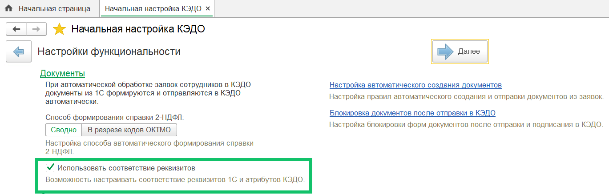
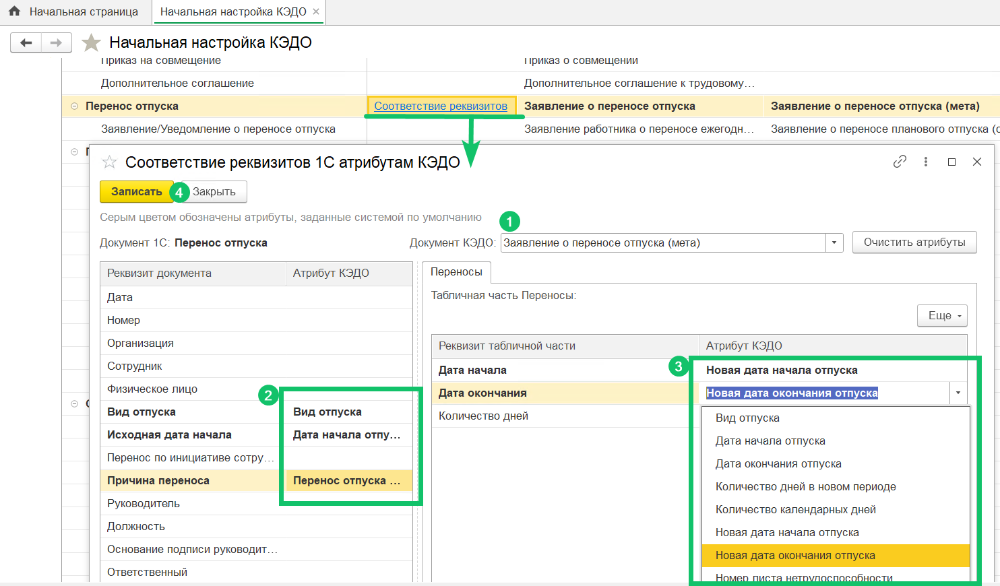
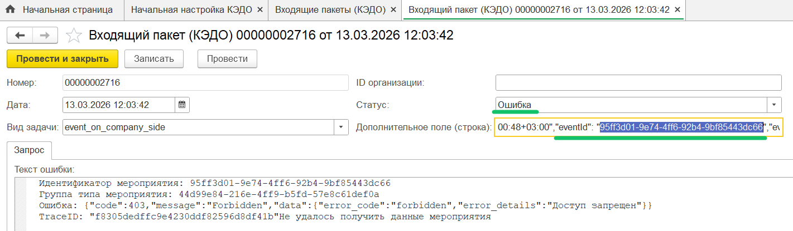

Соответствие реквизитов документов 1С и атрибутов КЭДО — это настройка, которая позволяет автоматически заполнять документы 1С по данным из заявки в КЭДО. 

Чтобы вручную настраивать соответствие реквизитов документа 1С и атрибутов заявки из КЭДО, в разделе в **КЭДО → Начальная настройка → Настройки функциональности** включите функцию **Использовать соответствие реквизитов**. 

 

После этого на форме **Соответствие документов** рядом со столбцом **Документ 1С** появится столбец, включающий ссылку **Соответствие реквизитов**. Нажмите на эту ссылку в необходимом бизнес-процессе, например, **Перенос отпуска**.

 

В форме **Соответствие реквизитов 1С атрибутам КЭДО** выполните действия: 
1. В поле **Документ КЭДО** выберите наименование необходимого документа, если на этапе соответствия для документа 1С было указано несколько документов КЭДО. В данном примере — документ «Заявление о переносе отпуска (мета)». 
2. В таблице слева для нужных реквизитов основной части документа выберите атрибуты из заявки КЭДО. Важно, чтобы тип данных реквизита соответствовал типу данных атрибута, иначе заполнение поля в документе не сработает.
Для реквизитов **Вид отпуска**, **Дата начала отпуска**, **Причина переноса** это будут атрибуты **Вид отпуска**, **Дата начала отпуска**, **Перенос отпуска в связи с** соответственно.  
3. Если для документа предусмотрена табличная часть, то в таблице справа для нужных реквизитов выберите атрибуты из заявки КЭДО. Важно, чтобы тип данных реквизита соответствовал типу данных атрибута, иначе заполнение поля в документе не сработает.
Для реквизитов **Дата начала** и **Дата окончания** это будут атрибуты **Новая дата начала отпуска** и **Новая дата окончания отпуска** соответственно. Все возможные новые периоды с переносом отпуска из заявки КЭДО будут добавлены в табличную часть документа 1С. 
4. Сохраните изменения. 

В случае возникновения ошибки при передаче данных после настройки маппинга документов:
1. Проверьте работу регламентного задания **Обмен данными с сервисом "КЭДО"** в **Журнале регистрации** (подробнее о включении регламентного задания в [статье](/ru/1C/admin/initial_setup#proverka_reglamentnogo_zadaniya_dlya_obmena_s_servisom_vk_hr_tek)). 
2. В регистре **Входящие пакеты (КЭДО)** найдите пакет по идентификатору мероприятия (заявки). Проверьте, что в пакете нет статуса с ошибкой. 

 

3. Проверьте токен ответственного, от лица которого происходит автосоздание документа 1С. Возможно истёк срок действия токена или его перегененировали. Список ответственных по документам доступен в настройке [Документы для автосоздания в 1С](/ru/1C/user/functionality_settings#avto_obrabotka_i_otpravka_dokumentov_v_servis_vk_hr_tek).
4. Если все выше перечисленные действия не помогли выявить или устранить проблему, обратитесь в [поддержку VK HR Tek](/ru/hr/support/contact_channels).