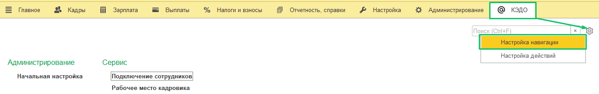
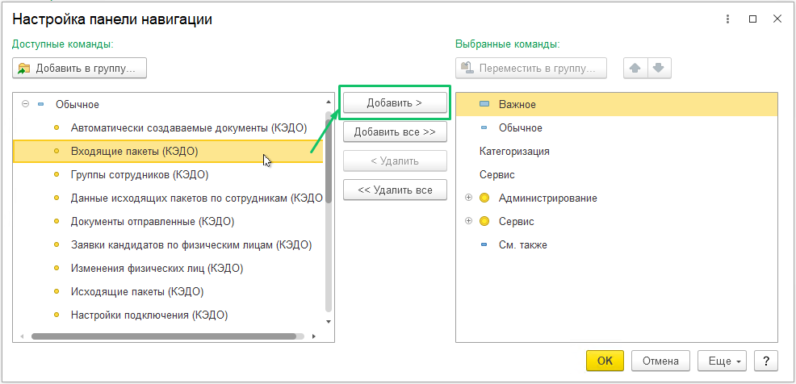
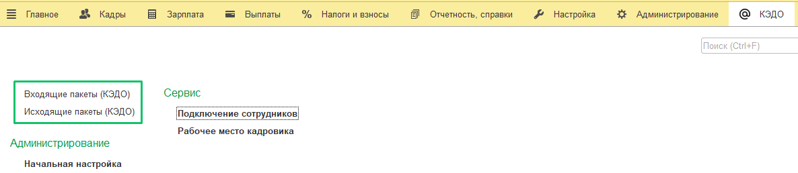
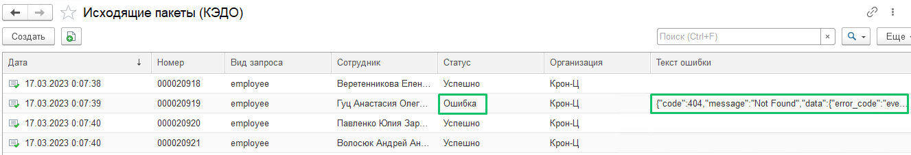
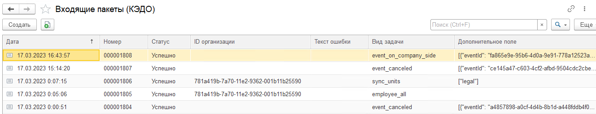

Разделы **Входящие пакеты (КЭДО)** и **Исходящие пакеты (КЭДО)** позволяют посмотреть статус отправки данных в КЭДО или получения данных из КЭДО (возможные статусы: успешно, ошибка).

Для добавления в панель быстрого доступа выполните следующие действия:

1. Перейдите в раздел **КЭДО** → **Настройки** → **Настройка навигации**.

2. В форме **Настройка панели навигации**, в левом блоке раскройте категорию **Обычное** и выделите строки **Входящие пакеты КЭДО** и **Исходящие пакеты (КЭДО)**. Нажмите кнопку **Добавить**.

Строки **Исходящие пакеты (КЭДО)**  и **Входящие пакеты (КЭДО)** отобразятся в правом блоке. Нажмите кнопку **ОК**. 

После добавления разделы **Исходящие пакеты (КЭДО)** и **Входящие пакеты (КЭДО)** появятся в быстром доступе в разделе **КЭДО**.

В разделе **Исходящие пакеты (КЭДО)** можно оперативно посмотреть статус отправки данных в КЭДО (**Успешно**/**Ошибка**). В случае если при отправке произошла ошибка, можно проверить текст ошибки и найти возможную причину в данном разделе или обратиться в техническую поддержку VK HR Tek, направив им текст ошибки.

Данные сотрудника, которые передаются из 1С в КЭДО:

* Телефон;  

* Email;  

* ФИО;  

* СНИЛС;  

* Подразделение;  

* Должность;  

* Табельный номер;  

* Позиция штатного расписания;  

* Дата увольнения;  

* ИНН;  

* Руководитель;  

* Дата приёма;  

* Группа доступа физлица (если используются);  

* График работы;  

* Остатки отпусков по видам отпусков; 

* Дата рождения;  

* Данные, которые указываются внутри КЭДО в 1С при подключении сотрудников: сегмент, функц.руководители, подразделение в управленческой структуре, группа сотрудника, тип подписи, признак подтверждения личности;  

* Остальные данные в зависимости от включенных в КЭДО модулей персональных данных: паспорт, загранпаспорт, военный билет, кадровая история, данные трудового договора, образование, рабочие контакты, перс.контакты, доп.соглашения и пр.;  

* Вид документа: паспорт гражданина РФ или иностранный паспорт. При передаче паспортных данных гражданина РФ или иностранного гражданина  в исходящем пакете отправляется вид документа **russian** или **foreig**. При выборе иного вида документа в исходящем пакете будет передаваться значение **other**. Если в ошибку при подключении сотрудника попадает значение **other** — значит выбран неподходящий вид документа.

В разделе **Входящие пакеты (КЭДО)** отображается статус успешной или ошибочной выгрузки информации из 1С в КЭДО (оргструктуры, профили доступа, кандидаты и т.д.).

