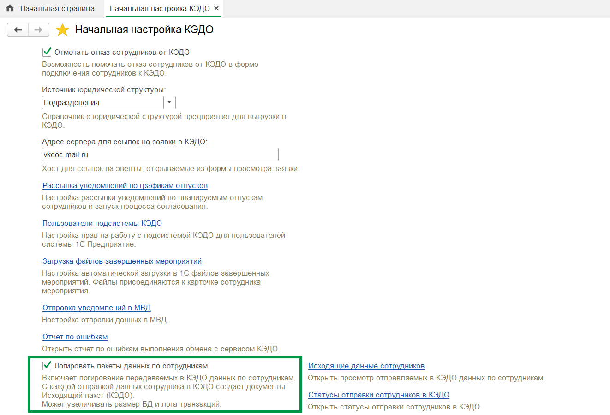
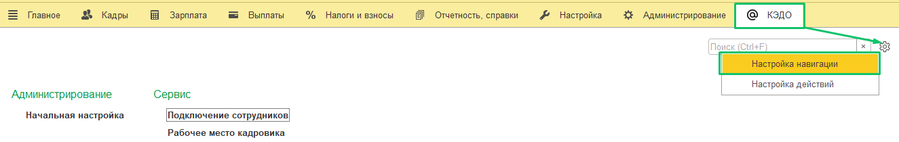
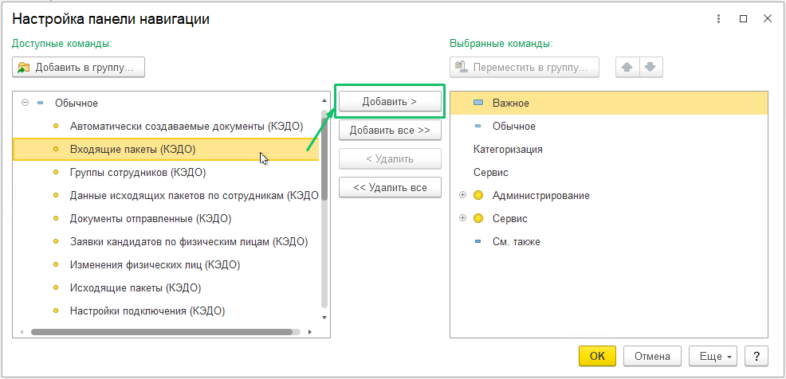
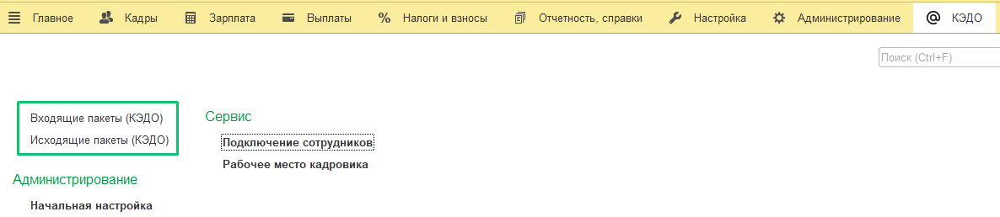
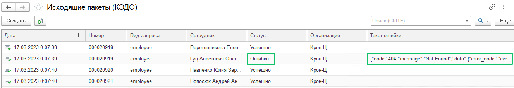
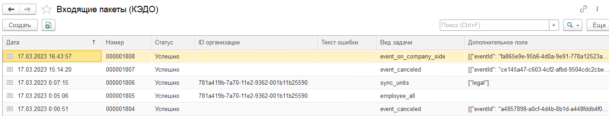

Разделы **Входящие пакеты (КЭДО)** и **Исходящие пакеты (КЭДО)** позволяют посмотреть статус отправки данных в КЭДО или получения данных из КЭДО (возможные статусы: успешно, ошибка).

Чтобы включить логирование исходящих данных, выполните следующие действия:

1. Перейдите в раздел **КЭДО** → **Начальная настройка** → **Настройки функциональности**.

2. Для формирования документов **Исходящий пакет (КЭДО)** включите настройку **Логировать пакеты данных по сотрудникам**.  

3. Нажмите **Далее** → **Завершить настройки**.

Для добавления в панель быстрого доступа разделов **Входящие пакеты (КЭДО)** и **Исходящие пакеты (КЭДО)** выполните следующие действия:

1. Перейдите в раздел **КЭДО** → **Настройки** → **Настройка навигации**.

2. В форме **Настройка панели навигации**, в левом блоке раскройте категорию **Обычное** и выделите строки **Входящие пакеты КЭДО** и **Исходящие пакеты (КЭДО)**. Нажмите кнопку **Добавить**.

Строки **Исходящие пакеты (КЭДО)** и **Входящие пакеты (КЭДО)** отобразятся в правом блоке. Нажмите кнопку **ОК**. 

После добавления разделы **Исходящие пакеты (КЭДО)** и **Входящие пакеты (КЭДО)** появятся в быстром доступе в разделе **КЭДО**.

 

<warn>

Исходящие и входящие пакеты данных создаются автоматически. Самостоятельно создавать пакеты не требуется.

</warn>

## Исходящие пакеты

В разделе **Исходящие пакеты (КЭДО)** можно оперативно посмотреть статус отправки данных в КЭДО (**Успешно**/**Ошибка**). В случае если при отправке произошла ошибка, можно проверить текст ошибки и найти возможную причину в данном разделе или обратиться в техническую поддержку VK HR Tek, направив им текст ошибки.

Данные сотрудника, которые передаются из 1С в КЭДО:

* Телефон;  

* Email;  

* ФИО;  

* СНИЛС;  

* Подразделение;  

* Должность;  

* Табельный номер;  

* Позиция штатного расписания;  

* Дата увольнения;  

* ИНН;  

* Руководитель;  

* Дата приёма;  

* Группа доступа физлица (если используются);  

* График работы;  

* Остатки отпусков по видам отпусков; 

* Дата рождения;  

* Склонения ФИО и должностей по падежам. Склонения хранятся в типовом регистре «Склонения представлений объектов»;

* Данные, которые указываются внутри КЭДО в 1С при подключении сотрудников: сегмент, функц.руководители, подразделение в управленческой структуре, группа сотрудника, тип подписи, признак подтверждения личности;  

* Остальные данные в зависимости от включенных в КЭДО модулей персональных данных: паспорт, загранпаспорт, военный билет, кадровая история, данные трудового договора, образование, рабочие контакты, перс.контакты, доп.соглашения и пр.;  

* Вид документа: паспорт гражданина РФ или иностранный паспорт. При передаче паспортных данных гражданина РФ или иностранного гражданина  в исходящем пакете отправляется вид документа **russian** или **foreign**. При выборе иного вида документа в исходящем пакете будет передаваться значение **other**. Если в ошибку при подключении сотрудника попадает значение **other** — значит выбран неподходящий вид документа.

## Входящие пакеты

В разделе **Входящие пакеты (КЭДО)** отображается статус успешной или ошибочной выгрузки информации из 1С в КЭДО (оргструктуры, профили доступа, кандидаты и т.д.).

 

Детальный анализ по видам задач (колонка **Вид задачи**):

1. **employee_all** (Выгрузка всех сотрудников).

Вызывается процедура `ОбработатьЗадачуПоСотрудникам()`. Эта процедура добавляет всех подключенных сотрудников в очередь отправки в сервис VK HR Tek. Учитываются уволенные сотрудники, которые перестают отправляться через неделю после увольнения.

Последовательность выполняемых действий:
- из регистра «Сотрудники, подключенные к сервису (КЭДО)» через запрос система получает всех подключенных сотрудников. У сотрудников не должно быть записей в регистре «Ошибки заполнения физического лица (КЭДО)» об ошибках подключения к сервису. Возможные условия отбора: организация, список подразделений, список сотрудников, группа сотрудника.
- каждый подключенный сотрудник добавляется в очередь отправки в регистр «Очередь сотрудников к отправке (КЭДО)».

 

2. **event_on_company_side** (Переход мероприятия на сторону компании).

Вызывается процедура `ОбработатьЗадачуПоПереходуМероприятияНаСторонуКомпании`. Эта процедура обрабатывает мероприятия, которые должны быть созданы или изменены на стороне компании в 1С. 

В зависимости от настроек `АвтоматическиСоздаватьДокументыИзЗаявок` или `ИспользоватьБизнесПроцессыИЗадачи`, происходит автоматическое создание документов или бизнес-процессов в 1С. Если включен маппинг реквизитов, используется `vkd_РаботаСМаппингомСервер.СоздатьМероприятияНаСторонеКомпании()`, иначе `vkd_АвтоматическоеСозданиеДокументов.СоздатьМероприятияНаСторонеКомпании()`.

Последовательность выполняемых действий:
- Из настроек система получает ответственного по типам документов.
- Заполняется таблица данными по каждой заявке.
- Создаются документы по настройкам или обновляются данные сотрудника. Создаваемые документы: Отпуск, Отпуск без сохранения заработной платы, Справка НДФЛ, Кадровый перевод, Кадровый перевод списком, Справка с места работы, Перенос отпуска, Произвольный кадровый приказ, Прикрепление к программам медицинского страхования и др.

 

3. **event_canceled** (Отмена мероприятия).

Вызывается процедура `ОбработатьЗадачуПоОтменеМероприятия()`. Эта процедура обрабатывает отмену мероприятий в системе 1С, синхронизируя их статус с сервисом VK HR Tek.

 

4. **sync_units** (Синхронизация оргструктуры).

Вызывается процедура `ОбработатьЗадачуПоОргструктуре()`. Эта процедура отвечает за синхронизацию организационной структуры (подразделений, должностей и т.д.) между 1С и VK HR Tek. Дополнительное поле содержит `unitType`, указывающий тип структуры для синхронизации.

Последовательность выполняемых действий:

4.1. Отправка оргструктуры с типом «operational»:
- из регистра «Управленческая организационная структура (КЭДО)» через запрос система получает заполненную пользователем организационную структуру с отбором по организации.

4.2. Отправка оргструктуры с типом «legal»:
- из справочника «Подразделение» выбираются все элементы с отбором по организации,
- с помощью функции общего модуля «РуководителиПодразделений. ДанныеРуководителей» система получает всех руководителей выбранных ранее подразделений,
- данные подготавливаются к отправке,
- выполняется POST запрос к **«/api/v1/unit/sync**», выгружаются подразделения,
- выполняется POST запрос к **«/api/v1/employee/unit/sync**», выгружаются сотрудники в подразделениях,
- если в начальных настройках в качестве источника юридической структуры выбрана «Структура предприятия», то из справочника «Структура предприятия» выбираются все элементы с отбором по организации.

 

5. **candidate_created** (Создание кандидата).

Вызывается процедура `ОбработатьЗадачуПоКандидату()`. Эта процедура обрабатывает информацию о новых кандидатах, созданных в VK HR Tek, и создает физическое лицо в 1С.

Последовательность выполняемых действий:
- для получения данных кандидата из заявки выполняется GET запрос к «**/api/v1/candidate/event/{id заявки}**»,
- выполняется поиск физического лица по СНИЛС,
- если физическое лицо найдено, то новый элемент в справочнике «Физические лица» не создается,
- если физическое лицо не найдено, то создается новый элемент в справочнике «Физические лица». Из заявки могут быть заполнены следующие поля у нового элемента справочника «Физические лица»:
    - Дата рождения,
    - Пол,
    - ИНН,
    - СНИЛС,
    - Место рождения,
    - Контактная информация: 
        - телефон (тип: телефон, вид КИ: телефон мобильный), 
        - email (тип: адрес электронной почты, вид КИ: email), 
        - домашний телефон (тип: телефон, вид КИ: телефон домашний), 
        - адрес (тип: адрес, вид КИ: адрес места проживания), 
        - адрес (тип: адрес, вид КИ: адрес за пределами РФ), 
        - адрес (тип: адрес, вид КИ: адрес для информирования), 
        - адрес (тип: адрес, вид КИ: адрес регистрации), 
    - Указывается группа доступа по умолчанию из начальных настроек, 
    - Заполняются документы физического лица: 
        - Паспорт РФ (данные добавляются в регистр «Документы физических лиц»), 
        - Заграничный паспорт (данные добавляются в регистр «Документы физических лиц»), 
        - Водительское удостоверение (данные добавляются в регистр «Документы физических лиц»), 
        - Свидетельство о браке (данные добавляются в регистр «Состояния в браке физических лиц»), 
        - Свидетельство о рождении (данные добавляются в справочник «Родственники сотрудников»), 
        - Сертификат об образовании (данные добавляются в справочник «Образование физических лиц». Учебное заведение и специальность будут созданы если не найдены в соответствующих справочниках). 

 
        
6. **event_type_disabled** (Отключение неактивных типов мероприятий).

Вызывается процедура `ОбработатьЗадачуПоОчисткеМаппингаОтНеактивныхТиповМероприятий()`. Эта процедура удаляет маппинг для типов мероприятий, которые были отключены в VK HR Tek, обеспечивая актуальность настроек интеграции.

Последовательность выполняемых действий:

- система получает неактивные группы типов мероприятий из реквизита «Дополнительное поле (строка)» входящего пакета,
- выполняется GET запрос к «**/api/v1/event/type_groups**» и система получает все доступные группы типов мероприятий,
- сравниваются идентификаторы неактивных групп типов мероприятий с доступными,
- из регистра сведений «Соответствие документов 1С и КЭДО (КЭДО)» удаляются записи на уровне **Документ 1С / Группа в КЭДО** и записи на уровне **Печатная форма 1С / Документ в КЭДО**.

 

7. **load_custom_types** (Выгрузка групп сотрудников).

Вызывается процедура `ОбработатьЗадачуПоВыгрузкеГруппСотрудниковВКЭДО()`. Эта процедура запускает выгрузку [групп сотрудников](/ru/1C/user/employees/groups) из 1С в VK HR Tek.

Последовательность выполняемых действий:
- проверяется, включена ли настройка «Использовать разные процессы в зависимости от группы сотрудника». Настройка даёт возможность создавать разные типы заявок в зависимости от группы сотрудника. Группа заполняется при подключении сотрудников к КЭДО.
- система получает непомеченные на удаление элементы справочника «vkd_ГруппыСотрудников».
- выполняется POST запрос к «**/api/v1/custom_type**», выгружаются группы сотрудников.

 

8. **sync_employee_profiles** (Синхронизация профилей сотрудников).

Вызывается процедура `ОбработатьЗадачуПоВыгрузкеПрофилейДоступаСотрудниковВКЭДО()`. Эта процедура синхронизирует профили доступа сотрудников между 1С и VK HR Tek.

Последовательность выполняемых действий:
- через запрос в базу данных выбираются все группы доступа физических лиц с отбором «Это Группа = Ложь», «Пометка удаления = Ложь»,
- подготовленные данные отправляются POST запросом к «**/api/v1/employee/profiles**».

 

9. **set_vacation_days** (Выгрузка положенных дней отпуска).

Вызывается процедура `ОбработатьЗадачуПоВыгрузкеПоложенныхОтпусковСотрудникаВКЭДО()`. Эта процедура выгружает информацию о положенных днях отпуска сотрудников из 1С в VK HR Tek.

Последовательность выполняемых действий:

- система получает данные из поля «ДополнительноеПоле» входящего пакета:
    - Остатки отпусков на конец года,
    - Плановые отпуска до конца года (их будем вычитать из общего итога),
    - Фактические отпуска до конца года (не больше количества дней плановых отпусков до конца года),
    - Общий итог = Положенные отпуска + Остатки на конец года - Плановые отпуска от текущей даты до конца года + Фактические отпуска до конца года,
    - 2-й, 3-й и 4-й показатели — только если передан флаг "С учетом неиспользованных",

- подготовленные данные отправляются в «**/api/v1/event/{id мероприятия}/{id активного этапа}/set_vacation_days**».

 

10. **sync_scheduled_vacations** (Синхронизация запланированных отпусков).

Вызывается процедура `ОбработатьЗадачуПоЗагрузкеЗапланированныхОтпусковСотрудниковИзКЭДО()`. Эта процедура загружает информацию о запланированных отпусках сотрудников из VK HR Tek в 1С.

Последовательность выполняемых действий:
- система получает данные заявок из поля «ДополнительноеПоле» входящего пакета,
- по каждому мероприятию система получает из КЭДО данные графика POST запросом к «**/api/v1/event/{id мероприятия}/{id активного этапа}/sync_vacations**»,
- система создает или изменяет документ «График отпусков» по данным планирования из КЭДО,
- 1С оповещает КЭДО о результатах обработки: отправляет результат создания графика и текст ошибки POST запросом к «**/api/v1/event/{id мероприятия}/{id активного этапа}/sync_vacations**».

 

&nbsp;11. **sync_region_calendar** (Синхронизация регионального календаря).

Вызывается процедура `ОбработатьЗадачуПоВыгрузкеПроизводственныхКалендарейВКЭДО()`. Эта процедура синхронизирует производственные календари (с учетом региональных особенностей) между 1С и VK HR Tek.

Последовательность выполняемых действий:
- через запрос к справочнику «Производственные календари» система получает непомеченные на удаление элементы из базы данных,
- запросом к регистру «Данные производственного календаря» система получает данные календаря,
- подготовленные данные отправляются POST запросом к «**/api/v1/calendar**».

 

&nbsp;12. **competency_event_completed** (Загрузить результаты оценки по компетенциям).

Вызывается процедура `ЗагрузитьРезультатыОценкиСотрудниковПоКомпетенциям()`. Эта задача загружает результаты оценки сотрудников по компетенциям из VK HR Tek в 1С.

Последовательность выполняемых действий:
- система получает данные заявок из поля «ДополнительноеПоле» входящего пакета,
- по каждой заявке система получает результаты оценки GET запросом к «**/api/v1/event/{id мероприятия}/competencies**»,
- результат оценки записывается в регистры:
    - «Оценки сотрудников по компетенциям в КЭДО», если в ответе есть свойство «employee_id»,
    - «Компетенции и позиции штатного расписания в КЭДО», если в ответе есть свойство «staff_position_id».
    
 

&nbsp;13. **sync_competencies** (Синхронизация компетенций).

Вызывается процедура `ОбработатьЗадачуПоВыгрузкеКомпетенцийПерсоналаВКЭДО()`. Эта процедура выгружает информацию о компетенциях персонала из 1С в VK HR Tek.

Выгружаются в следующей последовательности:
- **шкалы:**
    - система получает данные из регистра «Шкалы компетенций (КЭДО)»,
    - подготовленные данные отправляются «POST» запросом к «**/api/v1/competency/scale/sync**»,
- **компетенции:**
    - система получает данные из регистра «Компетенции персонала (КЭДО)», «Компетенции и уровни шкалы (КЭДО)»,
    - подготовленные данные отправляются POST запросом к «**/api/v1/competency/sync**»,
- **компетенции и подразделения:**
    - система получает данные из регистра «Компетенции и подразделения (КЭДО)»,
    - подготовленные данные отправляются POST запросом к «**/api/v1/competency/unit/sync**»,
- **компетенции и позиции:**
    - система получает данные из регистра «Компетенции и позиции штатного расписания (КЭДО)»,
    - подготовленные данные отправляются POST запросом к «**/api/v1/competency/positions/sync**»,
- **уровни по сотрудникам:**
    - система получает данные из регистра «Уровни компетенций сотрудников (КЭДО)»,
    - подготовленные данные отправляются POST запросом к «**/api/v1/competency/employee/sync**».

 

&nbsp;14. **sync_group_users** (Синхронизация групп доступа).

Вызывается процедура `ВыгрузитьДанныеГруппДоступа1СвКЭДО()`. Эта процедура синхронизирует данные групп доступа из 1С в VK HR Tek.

Последовательность выполняемых действий:
- собираются ограничения по искомым группам доступа,
- данные отправляются POST запросом к «**/api/v1/group/users/sync**».

 

&nbsp;15. **sync_forbidden_periods** (Синхронизация запрещенных периодов).

Вызывается процедура `ВыгрузитьДатыЗапретовПоОрганизацииВКЭДО()`. Эта процедура выгружает информацию о датах запретов (например, на командировки) по организации из 1С в VK HR Tek.

Последовательность выполняемых действий:
- система получает данные из регистра «Запрещенные даты по сотрудникам и типам заявок (КЭДО)»,
- подготовленные данные отправляются POST запросом к «**/api/v1/forbidden_periods**».

 

&nbsp;16. **Неизвестная задача**.

Если вид задачи не соответствует ни одному из перечисленных, входящему пакету устанавливается статус «Ошибка», и в журнал регистрации записывается сообщение об ошибке «Поступил запрос по неизвестному ресурсу».