## Отправка печатных форм из справочника «Сотрудники»

Из 1С в КЭДО можно отправлять печатные формы из справочника **Сотрудники**. Для этого в **КЭДО** → **Начальная настройка** → **Соответствие документов** установите соответствие строки **Сотрудники** с типами мероприятий в КЭДО и печатных форм с типами документов в КЭДО.

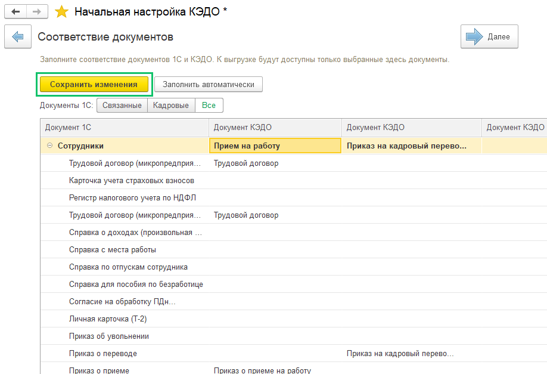 

Далее в справочнике **Сотрудники** (**Кадры** → **Сотрудники**) выделите сотрудника, который подключен к КЭДО (см. статью [Работа с сотрудниками](/ru/1C/user/employees)). При нажатии кнопки **КЭДО** будет предложен выбор типа мероприятия в КЭДО, который был установлен на этапе соответствия документов (если в соответствии документов настроено несколько типов мероприятий), и отправка печатной формы в КЭДО после выбора типа мероприятия. При отправке в КЭДО файлы в формате .docx будут автоматически конвертироваться в формат .pdf.

Обязательное условие для документов в формате .docx: документ нужно формировать типовой функцией печати офисного документа или возвращать структуру, как возвращает типовая функция печати.

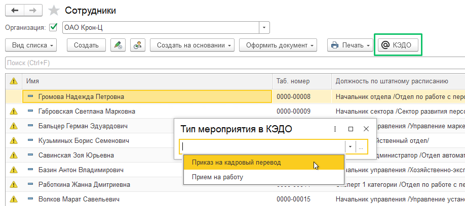

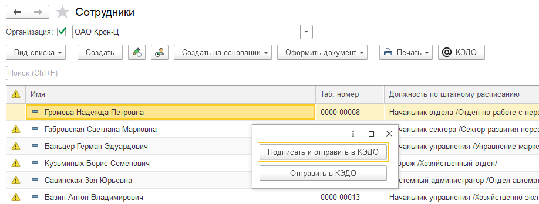

## **Отправка печатных форм из конструктора печатных форм**

Из расширения в сервис VK HR Tek можно отправлять печатные формы, сформированные конструктором печатных форм (внешняя печатная форма, открывающая форму настройки печатной формы).   
Для этого в **КЭДО** → **Начальная настройка** → **Соответствие документов** установите соответствие внешних печатных форм-конструкторов с типами документов в КЭДО. Форма-конструктор должна соответствовать требованиям: при закрытии возвращать структуру с двоичными данными файла в формате .pdf или .docx. При отправке в КЭДО файлы в формате .docx будут автоматически конвертироваться в формат .pdf.

Обязательное условие для документов в формате .docx: документ нужно формировать типовой функцией печати офисного документа или возвращать структуру, как возвращает типовая функция печати.

Информация для 1С-специалистов клиента: пример такой внешней обработки можно скачать из расширения в **Общие макеты** → **vkd_ШаблонВызоваКонструктораПечатныхФорм**. 

## **Отправка документа «Материальная помощь» в сервис VK HR Tek**

Проверьте, что для бизнес-процесса **Материальная помощь** настроен маппинг документов 1С и документов КЭДО в разделе **КЭДО** → **Начальная настройка** → **Соответствие документов** (см. статью [Настройка соответствия документов 1С и документов КЭДО](/ru/1C/user/mapping)). 

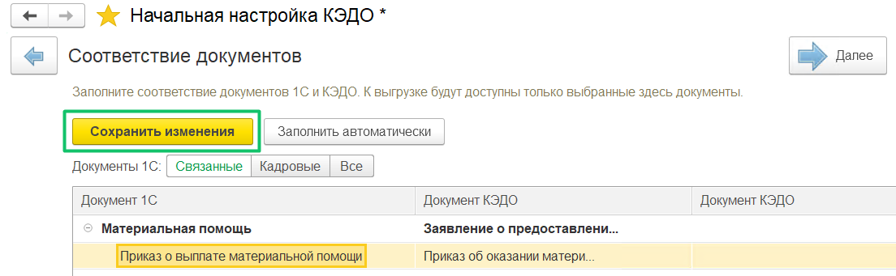

Из расширения в сервис VK HR Tek теперь можно отправлять документ **Материальная помощь**, созданный на одного сотрудника. Для этого в документе **Материальная помощь** требуется добавить сотрудника и нажать кнопку **Провести**. Затем нажать кнопку **КЭДО** для отправки документа в КЭДО. 

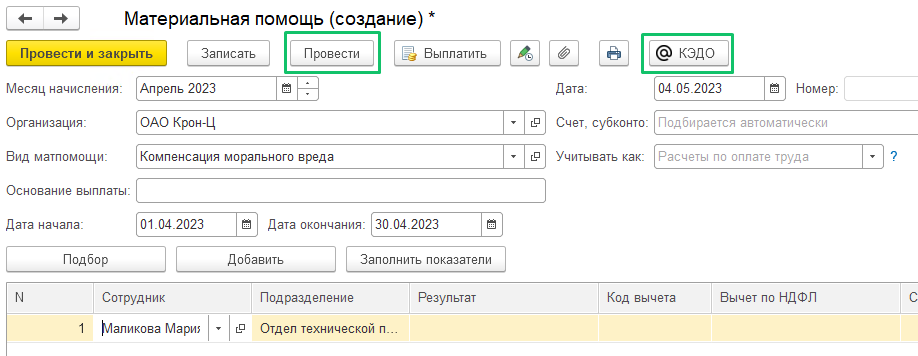

## **Отправка документа «Разовое начисление» в сервис VK HR Tek**

Из расширения в сервис VK HR Tek можно отправлять документ **Разовое начисление**, созданный на одного сотрудника. 

<warn>

Так как в 1С:ЗУП не предусмотрена печатная форма на документ **Разовое начисление**, то у компании должна быть своя внешняя печатная форма. Если печатная форма есть, то сотрудник с ролью Администратор сможет создать универсальный процесс, и тогда документ **Разовое начисление** можно будет отправлять в КЭДО.

</warn>

Чтобы открыть документ **Разовое начисление**, требуется создать начисление в разделе **Настройка** → **Начисления**.

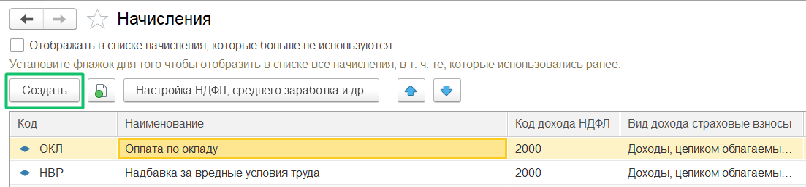

После сохранения начисления откройте **Зарплата** → **Разовые начисления** и нажмите кнопку **Создать**.

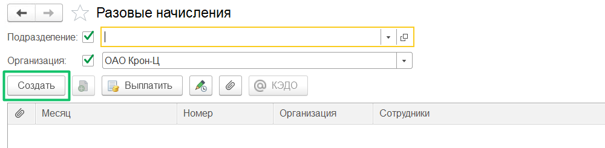

Далее в документ **Разовое начисление** требуется добавить сотрудника, сумму начисления (результат) и нажать кнопку **Провести**. Затем нажать кнопку **КЭДО** для отправки документа в КЭДО. 

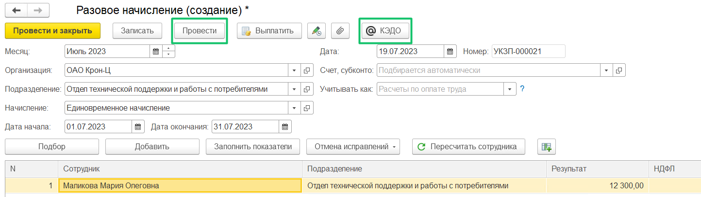

## **Отправка документа «Работа сверхурочно» в сервис VK HR Tek**

Из расширения в сервис VK HR Tek можно отправлять документ **Работа сверхурочно**, созданный на одного сотрудника.

Проверьте, что в разделе **КЭДО** → **Начальная настройка КЭДО** → **Соответствие документов** добавлен 1С документ **Работа сверхурочно**, с которым можно настроить сопоставления процессов КЭДО. Документ сопоставляется только с процессами, стартующими с этапа загрузки документа от компании. 

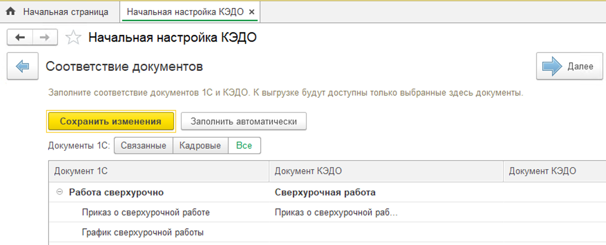

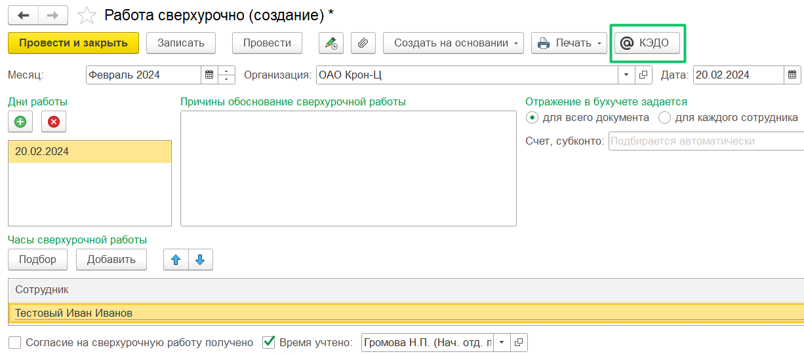

## **Отправка документа без проведения в сервис VK HR Tek**

Из расширения в сервис VK HR Tek можно отправлять документы, по которым запрещено проведение (в формах этих документов отсутствует кнопка **Провести**). Примеры документов без проведения — **Отпуск сотрудников** и **Командировка группы**.

Перед отправкой проверьте, что в разделе **КЭДО** → **Начальная настройка** → **Соответствие документов** добавлен документ 1С, например, **Отпуск сотрудников**, с которым можно настроить сопоставление процессов КЭДО.  

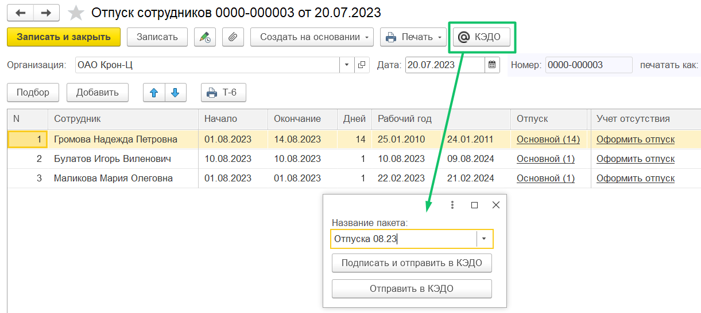

## **Отправка документа «Совмещение должностей» в сервис VK HR Tek**

Из 1С:ЗУП в КЭДО можно отправлять документ **Совмещение должностей**, созданный на одного сотрудника.

Перед отправкой проверьте, что в разделе **КЭДО** → **Начальная настройка** → **Соответствие документов** добавлен документ 1С **Совмещение должностей**, с которым можно настроить сопоставление процессов КЭДО. 

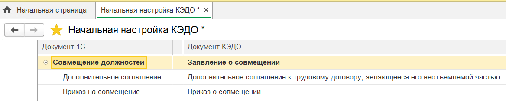

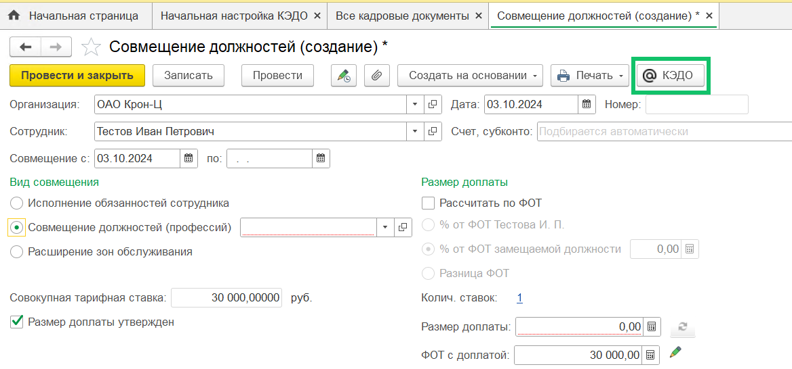