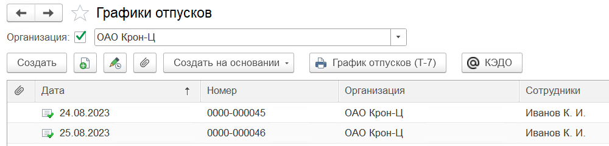
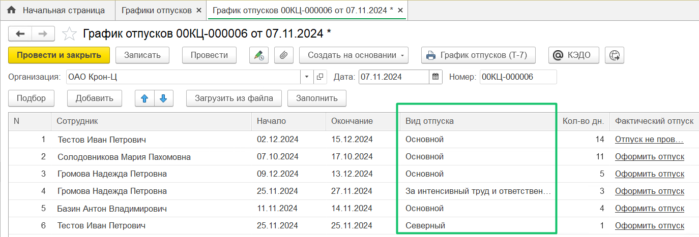

## **Графики отпусков**

В разделе **Графики отпусков** добавлено автоматическое заполнение графиков отпусков в расширении по данным планирования из веб\-сервиса VK HR Tek. Подробнее о создании планирования графиков отпусков можно узнать в [инструкциях](/ru/hr/company/vacation). 

Для просмотра документа **График отпусков** у сотрудника нажмите на нужную строку дважды. Специалист отдела кадров сможет увидеть разбивку по видам отпусков в 1С документе **График отпусков**, который сформируется в конце планирования графика отпусков на всех сотрудников.

