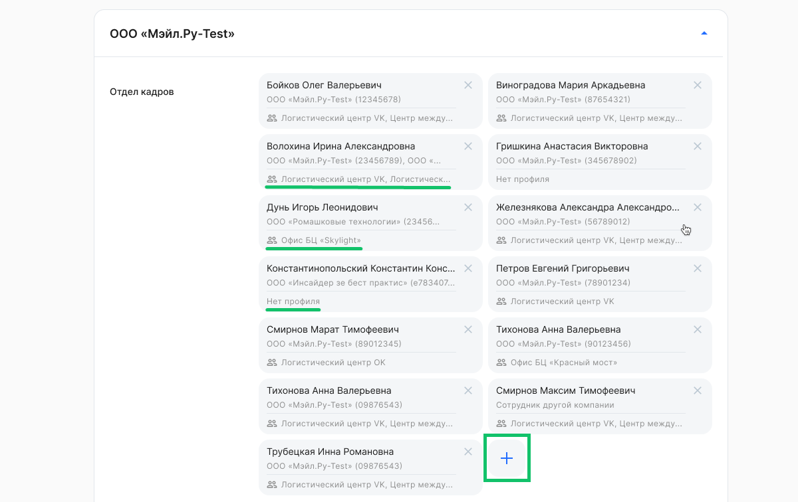
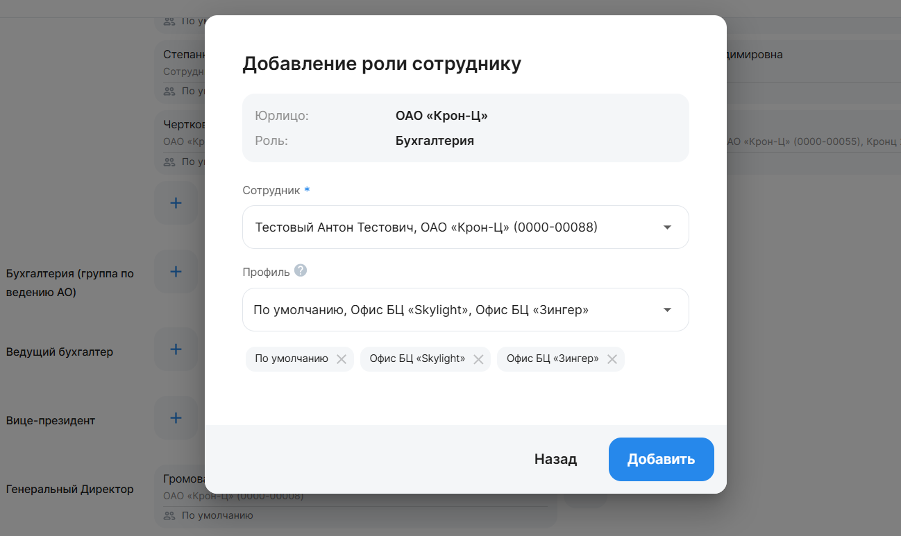

В веб-сервисе сотрудник с ролью «Администратор» назначает пользователю с определенной ролью необходимые профили доступа. 

Чтобы добавить роль и профиль сотруднику, нажмите на кнопку  для нужной роли. 

Далее заполните поля:

- **Сотрудник**. Введите ФИО сотрудника и выберите из списка подходящего сотрудника.
- **Профиль**. Из списка выберите один или несколько доступных для сотрудника профилей. После этого пользователь будет видеть только данные и заявки сотрудников с такими же профилями. 

Нажмите на кнопку **Добавить**.

Если профиль предусмотрен для роли, но не был установлен при добавлении роли, то в карточке сотрудника будет отмечено «Нет профиля».