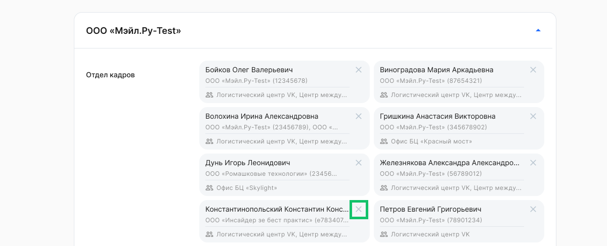
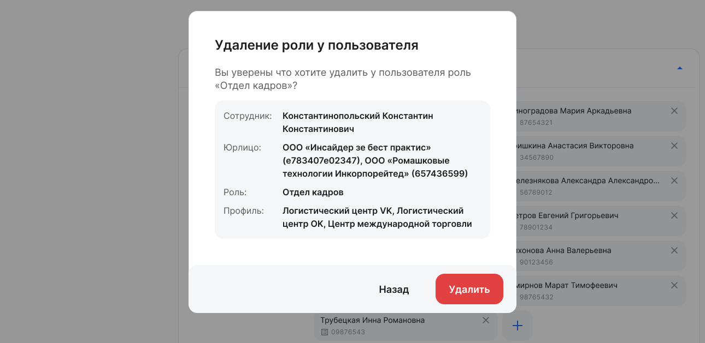

Если необходимо изменить профили доступа у пользователя, то сначала удалите роль у сотрудника, а затем заново добавьте роль и профили для сотрудника. 

Для удаления роли у пользователя нажмите кнопку  в карточке сотрудника.

 

Подтвердите удаление в форме **Удаление роли у пользователя**.

