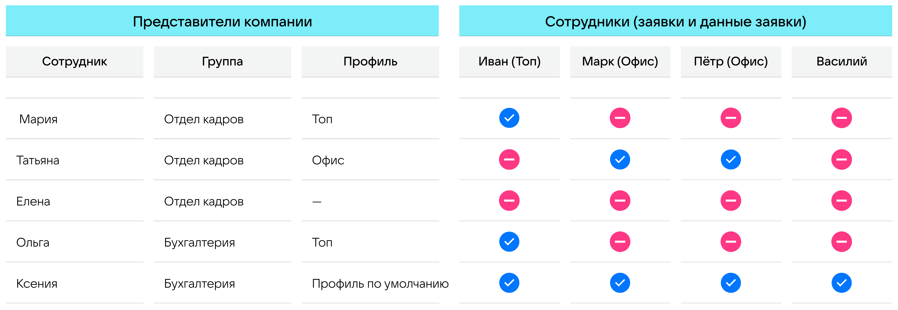

У представителей компании может разделяться доступ к данным и заявкам сотрудников. Например, в рамках одного бизнес-процесса одна группа кадровиков должна иметь доступ к группе сотрудников А, другая — к группе сотрудников B, третья — к группе С.

В сервис VK HR Tek добавлена возможность разделять доступы к списку заявок и данным сотрудников в соответствии с профилями доступа. Профиль — признак, который указывается сотруднику и связывается с ролью представителя компании. В результате доступ к данным сотрудника с определенным профилем имеют только те пользователи, у которых есть роли, связанные с тем же профилем.

К примеру, разные пользователи с ролью «Отдел кадров» будут иметь доступ к разным множествам сотрудников в зависимости от того, какие профили будут связаны с этой ролью у конкретного пользователя.

Роль каждого пользователя может быть связана с несколькими профилями, при этом у него могут быть роли и без связки с профилем.

Значение профиля доступа влияет на доступ представителей компании только:

- к заявкам сотрудника (раздел **Заявки**);

- к просмотру сотрудника в списке сотрудников (раздел **Сотрудники**).

Ограничения по профилю не влияют на доступ к просмотру данных в разделах **Корпоративные документы**, **Компания**, **Настройки**, **Кандидаты**.

При изменении старого значения профиля на новый:

- у сотрудника — доступ представителей компании, у которых есть связь только с прошлым профилем, пропадает сразу;
- у представителя компании — пропадает доступ к данным сотрудников с прошлым профилем и появляется к данным сотрудников с новым профилем. 

Чтобы выдать профиль для ограничения доступа к заявкам и данным сотрудников, необходимо:

1. Для включения настройки использования профилей доступа обратиться к своему менеджеру VK.
1. [Распределить сотрудников](/ru/1C/user/access_groups/division) по группам доступа в 1С (базовый функционал 1С).
1. В веб-сервисе, в **Сервисах компании → Настройки → Роли сотрудников** [назначить профили доступа](/ru/admin_actions/access_profiles/add_role) представителям компании. 

Компания может получать уведомления с информацией о включении настройки профилей.

## **Работа с профилем доступа**
Для работы с ограничением доступа в зависимости от профиля сотрудников должна быть задана настройка включения. Для включения настройки обратитесь к своему менеджеру VK.

1. Если настройка <u>не включена</u>, то представители компании имеют профиль доступа «По умолчанию», который разрешает доступ ко всем сотрудникам и их заявкам в рамках роли. Например, Отдел кадров ООО «Ромашка» видит заявки всех сотрудников юрлица.
1. Если настройка <u>включена</u>, то:
- Всем сотрудникам проставляются значения группы доступа, полученные из 1С (проставленным им в рамках базового функционала **Группы доступа физических лиц**), при этом профиль «По умолчанию» остается у каждого сотрудника и автоматически добавляется новым при подключении.
- При первом включении настройки можно выбрать опцию сброса связи представителей компании с профилем «По умолчанию». В таком случае представители компании не получат доступ к сотрудникам, пока Администратор не добавит их ролям связь с нужными профилями.
- После включения настройки представителям компании можно [назначать профили](/ru/admin_actions/access_profiles/add_role), список которых получен из 1С.
- Представители компании имеют доступ к сотрудникам только в рамках указанного им профиля доступа. Например, Отдел кадров с профилем доступа «Топ» видит заявки тех сотрудников, которым присвоен профиль «Топ».

После включения ограничения доступа:

1. Пользователи, имеющие роль и связь с актуальными профилями, видят сведения и заявки сотрудников с такими же профилями.
1. Пользователи, которым добавят связь с профилем «По умолчанию», смогут видеть всех сотрудников и их заявки, так как каждый сотрудник помимо профиля из 1С будет иметь профиль «По умолчанию».
1. Пользователи с ролями без связей с профилями не увидят никого.

## **Доступ к заявкам сотрудников**
В сервисе предусмотрены два способа, определяющих доступ к заявкам:

1. Участие в конкретном бизнес-процессе. Если пользователь обладает группой-исполнителем в бизнес-процессе (БП), то он будет иметь доступ ко всем заявкам, созданным в рамках этого БП.
1. Профиль доступа. Если пользователь обладает группой-исполнителем в бизнес-процессе и одним или несколькими значениями профиля, то он будет иметь доступ ко всем заявкам, созданным в рамках этого БП только по сотрудникам, имеющим соответствующее значение профиля.

Пример. Матрица доступа к заявкам и данным сотрудников в зависимости от группы и значений профиля доступа.

