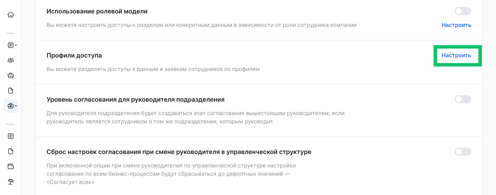
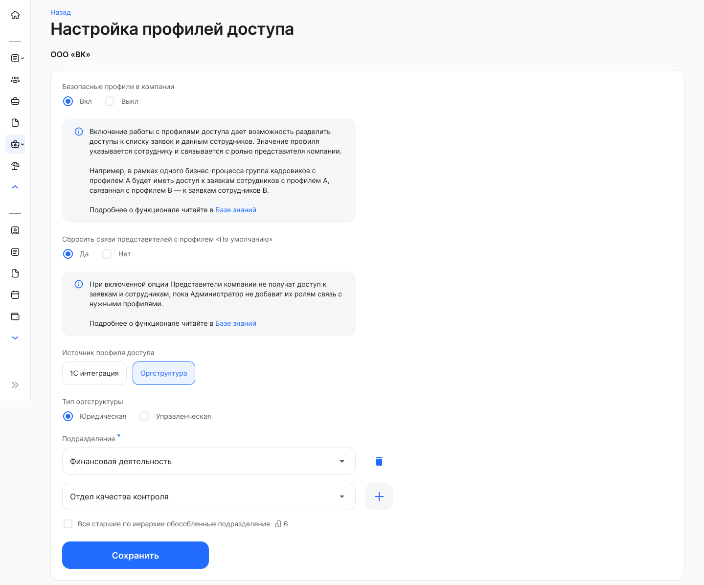

Профили доступа можно создать на основе подразделений организационной структуры (управленческой или юридической).

Профили доступа позволяют ограничить доступ специалистов со стороны компании к заявкам и данным сотрудников. Функционал актуален для компаний, где в рамках одного бизнес-процесса несколько специалистов работают с разными группами сотрудников. Разделение доступов в таком случае не только решает вопросы безопасного доступа к данным, но и добавляет удобство — специалист видит только тех сотрудников, с заявками которых он должен работать.

Для настройки выполните действия:

1\. Откройте раздел **Настройки КЭДО → Настройки** **компании**, настройку **Профили доступа**. 

2\. Выберите и сохраните настройки, подходящие для вашей компании.  

