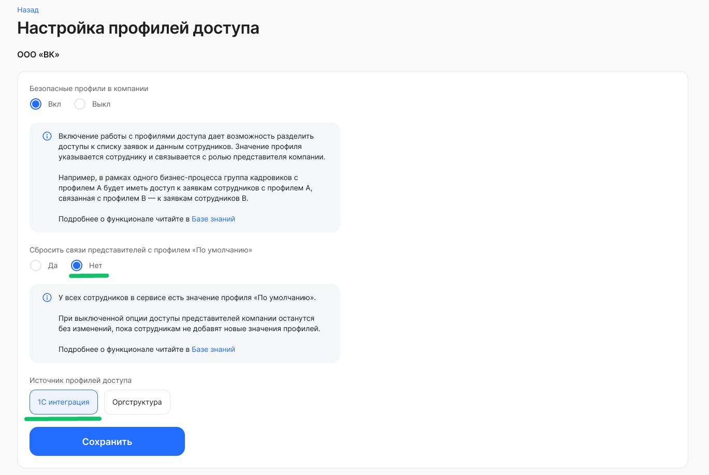
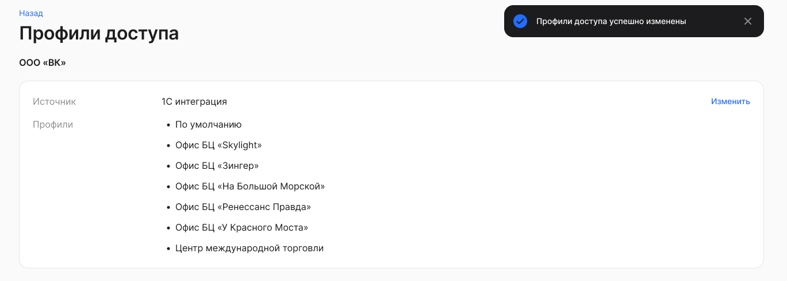
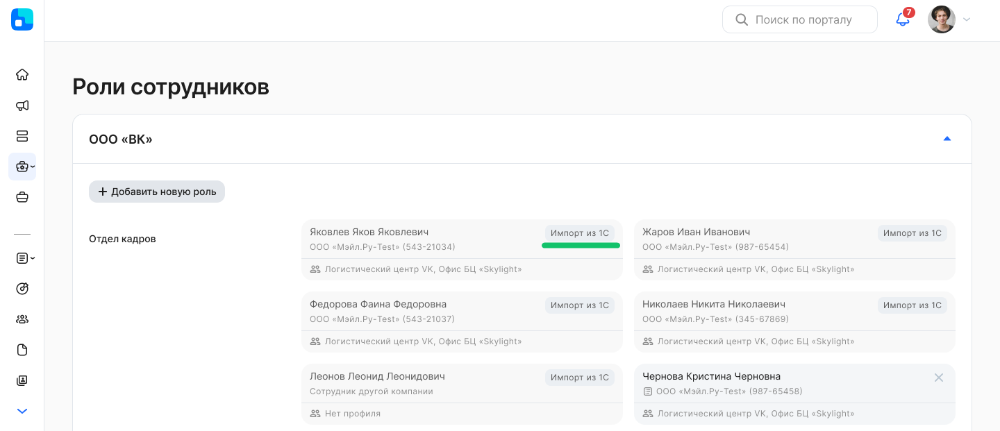
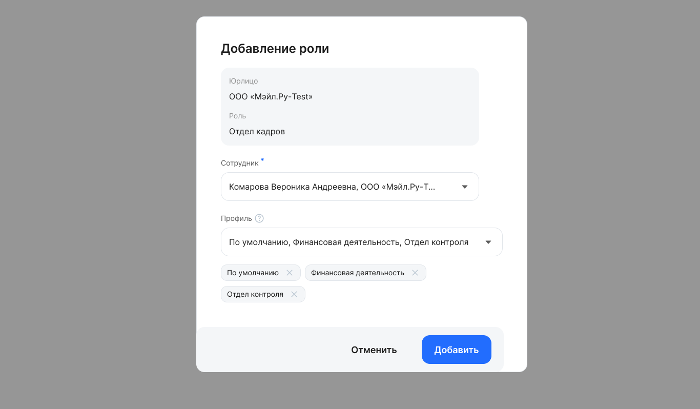
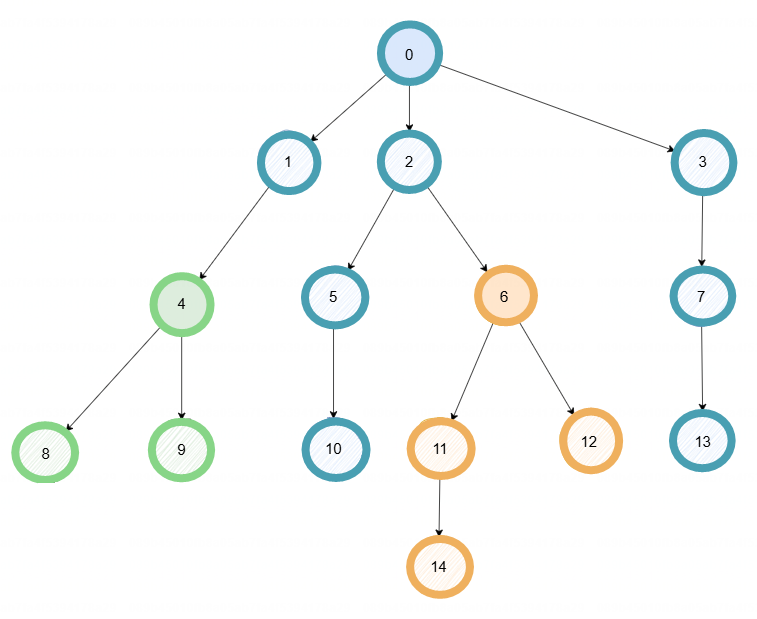

<info>

Перед началом настройки в веб-сервисе обратитесь к менеджеру VK HR Tek, чтобы он включил настройки импорта групп и использования профилей доступа для вашей компании

</info>

Профили доступа можно создать на основе одного из источников:
- импорта из 1С (подробнее в [статье](/ru/admin_actions/access_profiles/setting_1C)),
- подразделений организационной структуры (управленческой или юридической).

Профили доступа позволяют ограничить доступ специалистов со стороны компании к заявкам и данным сотрудников. Функционал актуален для компаний, где в рамках одного бизнес-процесса несколько специалистов работают с разными группами сотрудников. Разделение доступов в таком случае не только решает вопросы безопасного доступа к данным, но и добавляет удобство — специалист видит только тех сотрудников, с заявками которых он должен работать.

Пользователь с ролью **Администратор** может настроить разграничения процессов внутри компании для представителей компании. Для этого Администратору необходимо перейти в **Настройки компании** и настроить опцию **Профили доступа**.

Для настройки выполните действия:

1. В списке профилей доступа нажмите кнопку **Изменить**.  
2. Включите безопасные профили в компании.  
3. Включите/отключите сброс связи представителей с профилем «По умолчанию». При включенной опции представители компании не получат доступ к заявкам и сотрудникам, пока Администратор не добавит их ролям связь с нужными профилями.

При выключенной опции доступы представителей компании останутся без изменений, пока сотрудникам не добавят новые значения профилей. 

4. Выберите источник для формирования списка профилей: **1С интеграция** или **Оргструктура**.

## Профили доступа из 1С

1. Для импорта профилей доступа из 1С выберите источник **1С интеграция**.

2. Сохраните изменения. 

После импорта групп и профилей доступа из 1С в разделе **Настройки** → **Роли сотрудников** будут указаны, каким сотрудникам были назначены профили, которые представители компании ведут в 1С.

Чтобы в 1С назначить профили доступа для сотрудников, [распределите сотрудников](/ru/1C/user/access_groups/division) по группам доступа (базовый функционал 1С).

Чтобы назначить профили доступа для пользователей с ролями, перейдите в раздел **КЭДО → Начальная настройка**, к настройке **Управление профилями доступов**. Далее следуйте инструкции, начиная с шага 2 из статьи [Настройка для импорта профилей из 1С](/ru/admin_actions/access_profiles/setting_1C).

## Профили доступа по подразделениям

1. Если в качестве источника профилей доступа была выбрана **Оргструктура**, то выберите тип оргструктуры для своей компании: **Юридическая** или **Управленческая**.

2. При выборе любого типа оргструктуры добавьте одно или несколько подразделений. Также можно выбрать все старшие по иерархии обособленные подразделения, если такие есть. 

3. Сохраните настройки. Названия профилей в списке будут совпадать с именами подразделений. Если потребуется перенастроить профили доступа нажмите кнопку **Изменить**. 

4. Распределите пользователей с ролями по профилям доступа в разделе **Роли сотрудников**. Чтобы добавить роль сотруднику, нажмите кнопку  в нужной группе. 

5. Выберите одного сотрудника, один или несколько профилей и нажмите кнопку **Добавить**.

Правила учёта профилей аналогичны текущей реализации при получении профилей из 1С.

## **Назначение профилей сотрудникам**

Профиль *«Имя подразделения»* назначается сотрудникам выбранных и дочерних подразделений. Для дочерних подразделений можно задать отдельный профиль, если добавить их в настройки.

Если у сотрудника нет профиля подразделения, его данные видны только пользователям с группой и профилем *«По умолчанию».* Такие пользователи видят все данные, включая сотрудников с профилями подразделений.

## **Пример по формированию списка профилей и присвоению их сотрудникам с учётом настроек**

Подразделения пронумерованы от 0 до 14. Список профилей = список выбранных подразделений с учётом дочерних в рамках одного юрлица.

1. **Выбранные подразделения**: 0, 4 и 6.  
2. **Список профилей**: 0, 4 и 6.  
3. **Профили сотрудников:**  
- Для сотрудников подразделения 4, 8 и 9 к профилю сотрудника *«По умолчанию»* добавляется профиль 4.  
- Для сотрудников подразделения 1,2,3,5,7,10, 13 к профилю сотрудника *«По умолчанию»* добавляется профиль 0.  
- Для сотрудников подразделения 6, 11, 12, 14 к профилю сотрудника *«По умолчанию»* добавляется профиль 6.  
4. **Представители компании**:  
- Представитель компании с профилем 4 получит доступ к сотрудникам и заявкам подразделений 4,8,9.  
- Представитель компании с профилем 0 получит доступ к сотрудникам и заявкам подразделений 0,1,2,3,5,7,10, 13.  
- Представитель компании с профилем 6 получит доступ к сотрудникам и заявкам подразделений 6,11,12,14.  
- Представитель компании с профилем *«По умолчанию»* получит доступ к сотрудникам и заявкам всех подразделений.  
- Представитель компании без профиля не будет видеть никого.