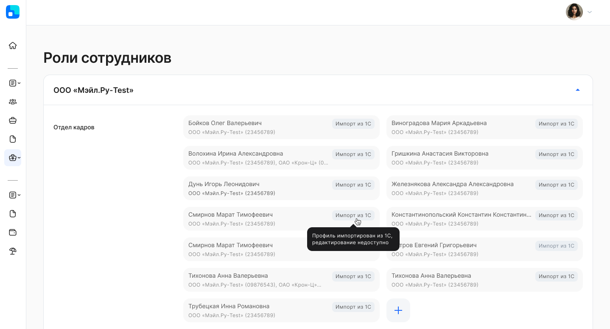
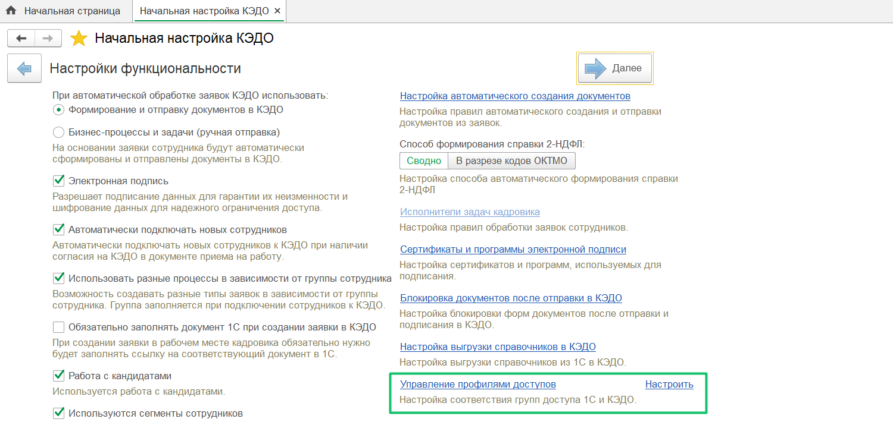
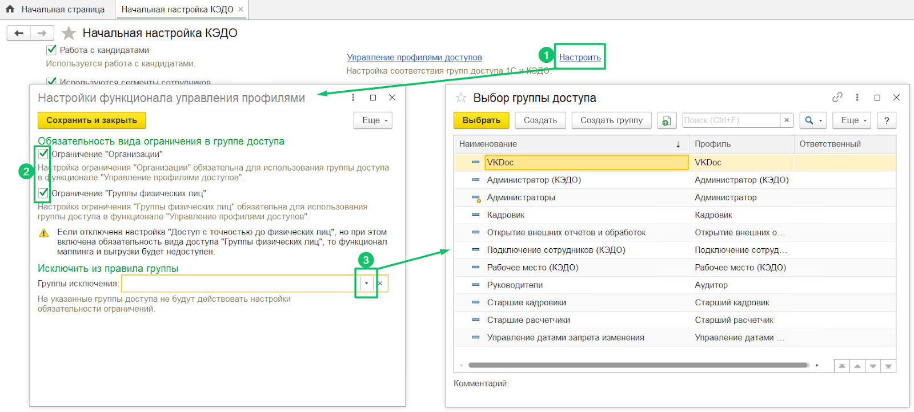
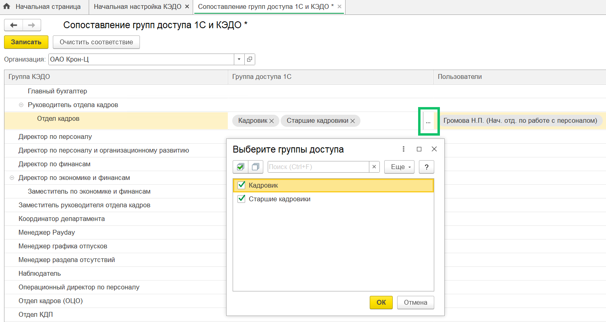
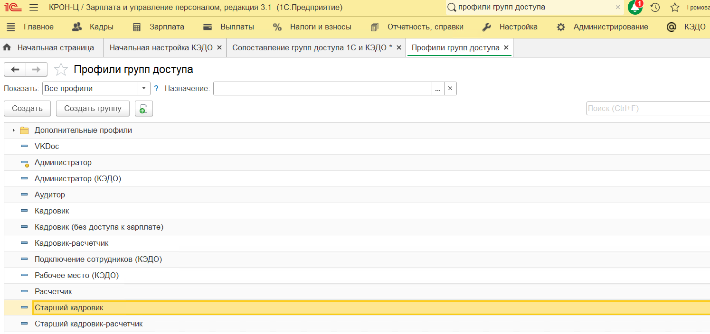
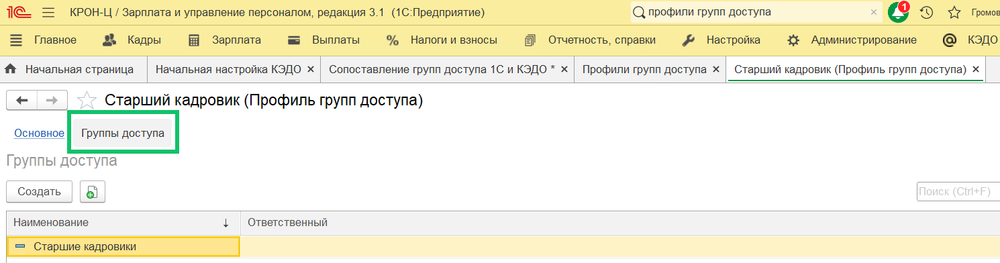
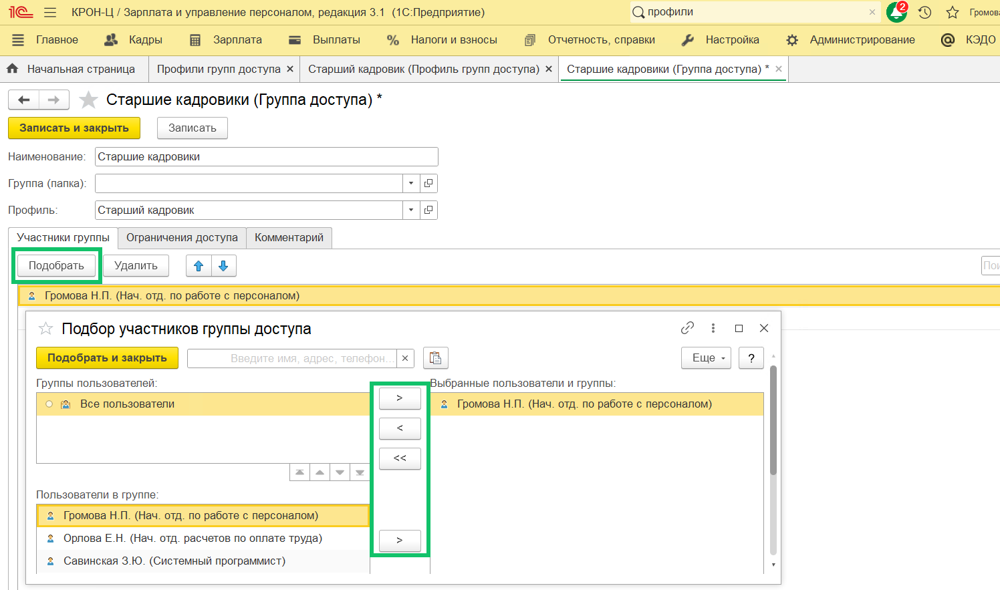
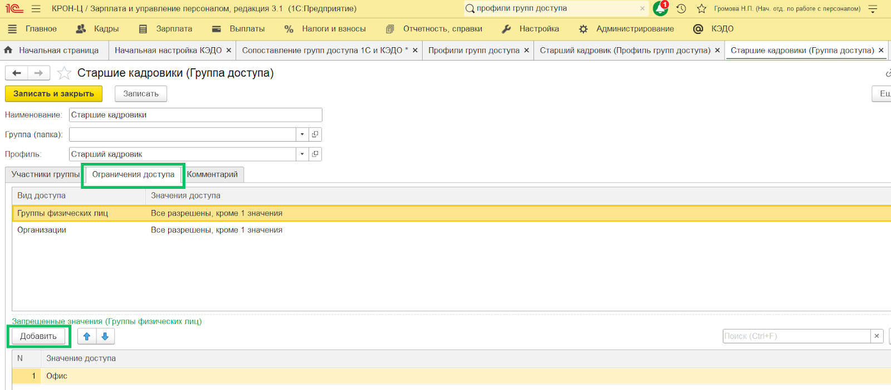
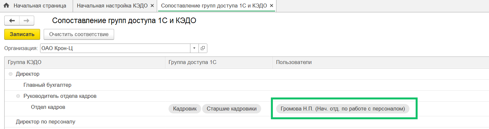

В сервис VK HR Tek добавлена возможность импортировать профили доступа из 1С в КЭДО (Группы физлиц в 1С = Профили доступа в КЭДО).

Цель импорта профилей из 1С — ускорить работу представителям компании с назначением большого количества профилей, которые они и так ведут и назначают в 1С.

После импорта групп доступа из 1С в разделе **Настройки → Роли сотрудников** будут указаны, каким сотрудникам были назначены профили.

Подробнее о работе с профилями доступа в сервисе VK HR Tek см. в [статьях](/ru/admin_actions/access_profiles).

Для общего понимания в таблице приведено соответствие терминов в КЭДО и 1С.

| Термин в КЭДО | Термин в 1С |
| :---- | :---- |
| Группа, роль  | Группа доступа |
| Профиль доступа | Группа физических лиц, группа доступа физических лиц, ГРДФЛ  |
| Пользователь с группой в компании  и связью с профилем | Пользователь группы доступа, у которой в ограничениях разрешен доступ к организации и группе физических лиц |
| Профиль «По умолчанию»  | «Разрешены все» в значении ограничений доступа  |

Процесс настройки импорта профилей из 1С включает шаги:

1. Обратитесь к вашему менеджеру VK HR Tek, чтобы он включил настройки импорта групп и использования профилей доступа в административной панели сервиса.
 
2. Перейдите в модуль 1С, в раздел **КЭДО → Начальная настройка** → **Настройки функциональности**. Настройка **Управление профилями доступов** станет активной. 

3. В настройке управления профилями доступов нажмите кнопку **Настроить**. Установите флажки для включения видов ограничений «Организация» и «Группы физических лиц» в форме группы доступа (см. пп. 7 и 8). Также можно исключить выбранные группы доступа (роли) из правил действия ограничений, отмеченных флажками. Нажмите кнопку **Сохранить и закрыть**.

Если включена обязательность вида доступа, то группа доступа, не имеющая данный вид доступа в настройках ограничения (установлено значение доступа «Все запрещены», см. п. 8), не должна попадать в список маппинга и выгрузки. Настройки видов доступа проверяются и по профилям доступа, и по группам доступа. Если настройка обязательности отключена (сняты флажки), то при отсутствии вида доступа считаем настройку по виду доступа как «Все разрешены».

Если группа доступа добавлена в список исключений, то условия обязательности на нее не срабатывают и, при отсутствии вида доступа, считаем настройку по виду доступа как «Все разрешены».

Если настройка «Ограничения с точностью до физических лиц» отключена и при этом включена обязательность вида доступа «Группы физических лиц», то функционал маппинга и выгрузки становится недоступным, т.к. ограничения до физических лиц не используются и ни одна группа доступа не имеет данного вида доступа в списке ограничений. Если же обязательность ограничения «Группы физических лиц» выключена, то все группы имеют настройку по виду доступа группы физических лиц «Все разрешены».

4. Откройте настройку **Управление профилями доступов**. Для каждой организации выполняется сопоставление **Группы КЭДО** (роли) с теми **Группами доступа 1С**, которые включают группы доступа физических лиц (ГРДФЛ) — профили, необходимые для разделения зон ответственности в КЭДО. Возможен выбор всех **Групп доступа 1С** сразу. 

5. Чтобы группы доступа отображались в форме **Выберите группы доступа**, перейдите в раздел **Профили групп доступа** и выберите необходимый профиль, например, «Старший кадровик».

6. Перейдите в подраздел **Группы доступа** и дважды нажмите на группу «Старшие кадровики».

7. Для группы доступа «Старшие кадровики» можно подобрать пользователей 1С из списка доступных на вкладке **Участники группы**.

8. Также для группы доступа настройте ограничение на вкладке **Ограничения доступа**. Чтобы назначить все **Группы физических лиц** для группы доступа «Старшие кадровики», в колонке **Значение доступа** выберите вариант **Все разрешены**. В запрещенные значения можно добавить отдельные группы физических лиц, например, «Офис», тем самым исключив для роли «Старшие кадровики» доступ к профилю «Офис». Нажмите кнопку **Записать**.

9. Напротив каждой **Группы КЭДО** можно дополнительно указать конкретных пользователей 1С, которым данная группа необходима. К выбору доступны сотрудники, подключенные к КЭДО и являющиеся **Участниками групп** доступа 1С, по которым выполнен маппинг. 

Если колонка **Пользователи** не заполнена и остается пустой, то всем пользователям 1С, подключенным к КЭДО и обладающим сопоставленными **Группами доступа 1С**, будут автоматически назначены соответствующие **Группы КЭДО** (те, которые сопоставлены).

10\. Нажмите кнопку **Записать**.

11\. Далее в рамках каждой **Группы КЭДО** для указанных пользователей собираются ограничения по профилям (ГРДФЛ): если хотя бы одна **Группа доступа 1С** дает доступ ко всем профилям (ограничение «Все разрешены»), то устанавливается профиль «По умолчанию», иначе каждая запись отправляется в КЭДО по отдельности (ограничение «Все разрешены, кроме…»).  

После первичной настройки импорта профилей происходит автоматический обмен данных раз в сутки или при внесении изменений: 

* 1С:   
  * в сопоставление групп доступа 1С и КЭДО;  
  * в связи пользователя с группой доступа (и соответственно с профилями (ГРДФЛ));  
  * в настройки группы доступа и доступа к организациям;  
  * в связи группы доступа и ГРДФЛ.  
* сервис VK HR Tek (КЭДО):   
  * список ролей сотрудников;
  * список профилей доступа.