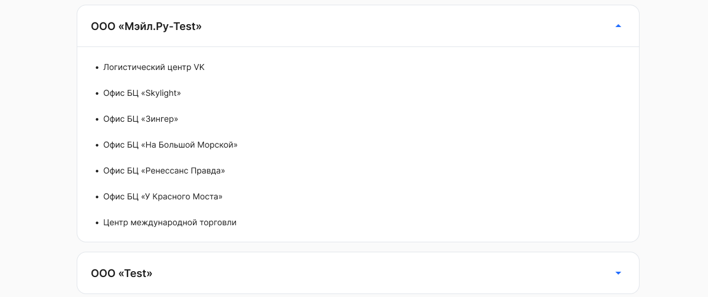
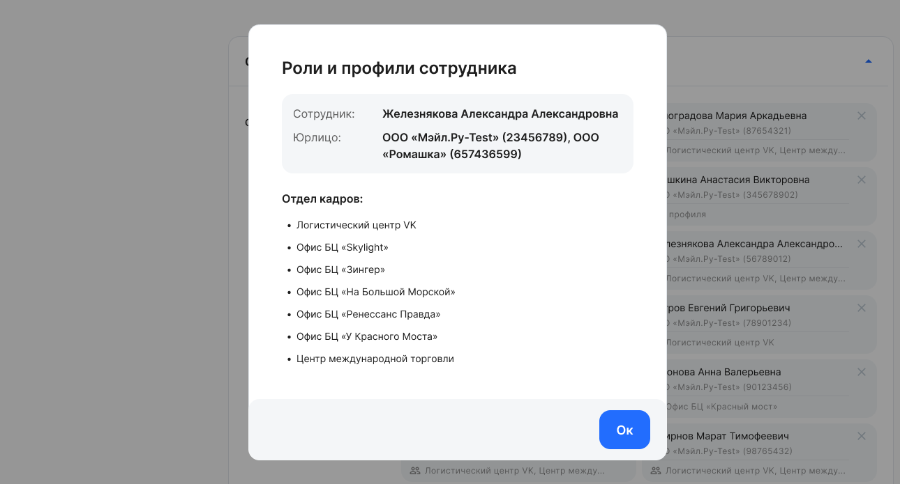
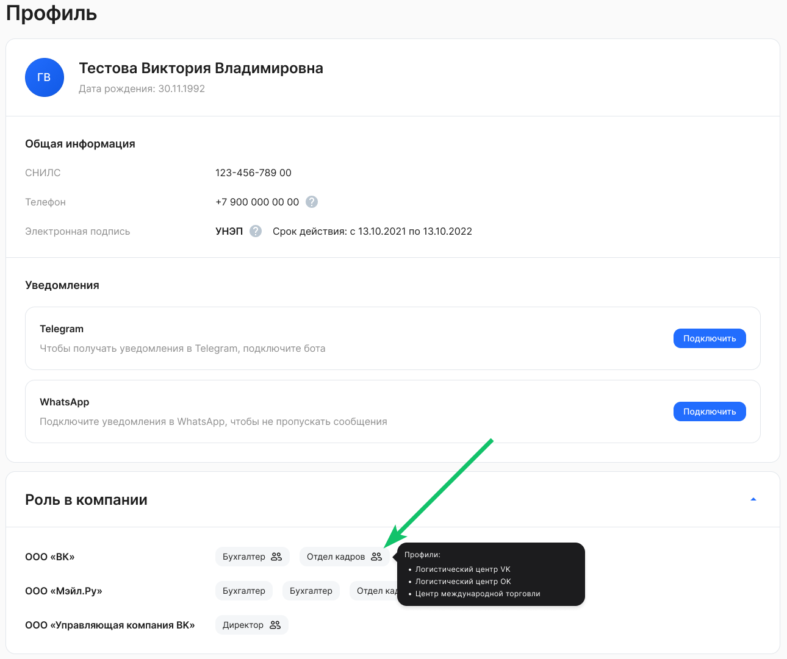

## **Просмотр в разделе «Профили сотрудников»**

Чтобы посмотреть список всех профилей, доступных в компании, перейдите в **Сервисах компании → Настройки → Профили сотрудников**. 

## **Просмотр в разделе «Роли сотрудников»**

Чтобы просмотреть профили, установленные сотруднику с ролью, перейдите в **Сервисах компании → Настройки → Роли доступа** и нажмите на карточку сотрудника. Откроется форма **Роли и профили сотрудника**, в которой перечислены все назначенные сотруднику профили в рамках указанной роли. 

Например, сотрудник Отдела кадров Железнякова А.А. имеет доступ к заявкам и данным сотрудников с профилями «Логистический центр VK», «Офис БЦ “Skylight”» и др.

## **Просмотр в профиле пользователя**

В своем профиле пользователя сотрудник может посмотреть, какие профили доступа ему заданы в рамках каждой компании.

В разделе **Профиль** для компаний, к которым прикреплен пользователь, заданы настройки ограничений в блоке **Роль в компании**.

Для просмотра назначенных профилей доступа в компании наведите указатель мыши на название роли со значком .

