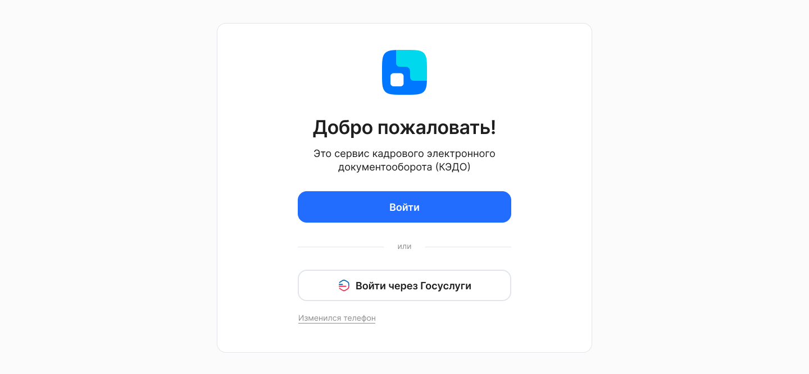
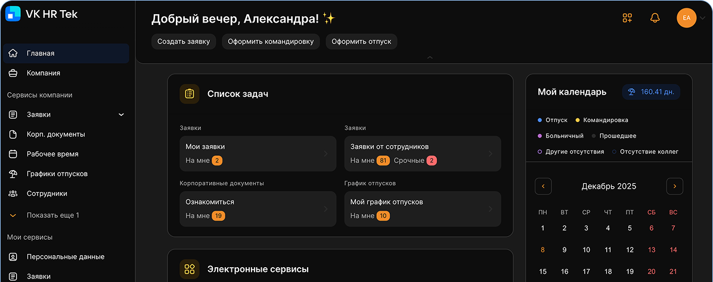

В сервисе VK HR Tek предусмотрена возможность дополнительных настроек авторизации:
- аутентификация по протоколу OAuth 2.0 (собственная доменная авторизация компании);
- авторизация через сервис Госуслуги (ЕСИА);
- авторизация VK Team.

Пример дополнительной настройки авторизации:

В данном случае пользователь может выбрать способ аутентификации: либо через сервис VK HR Tek по кнопке **Войти**, либо через Гослуслуги. 

При использовании собственной авторизации возможно создание поддомена с адресом вида `xx.vkdoc.mail.ru`, где значение `xx` согласовывается при подключении авторизации.

В рамках поддомена пользователю будут доступны только данные тех компаний, которые связаны с этим поддоменом.

Пользователь может войти в сервис VK HR Tek с ограничением по поддомену:
- по ссылке с поддоменом, размещенной на портале компании;
- по ссылке с поддоменом из приглашения в КЭДО, уведомления о выпуске УНЭП или заявке.

<info>

Настройка дополнительных способов авторизации и поддомена компании является платной услугой. Для подключения обратитесь к вашему менеджеру VK HR Tek

</info>

Для поддомена можно настроить дизайн интерфейса КЭДО с учётом набора установленных правил и параметров, чтобы сделать дизайн системы визуально согласованным стилю компании.

В интерфейсе можно изменить стили текстовых блоков, радиусы скругления компонентов, цветовую схему (текста, брендовых цветов), акцентные цвета.

<info>

Изменение элементов в дизайне КЭДО возможно только при использовании поддомена в компании и является платным. Для подключения обратитесь в [службу поддержки VK HR Tek](/ru/hr/support/contact_channels)

</info>

Пример интерфейса с изменённой цветовой схемой: 

