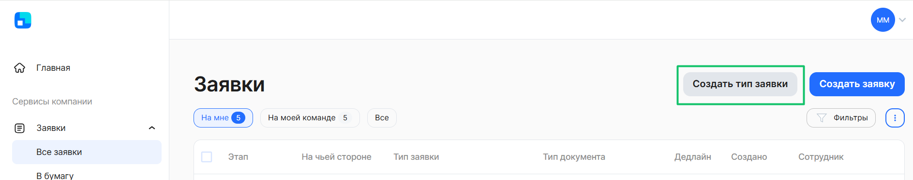
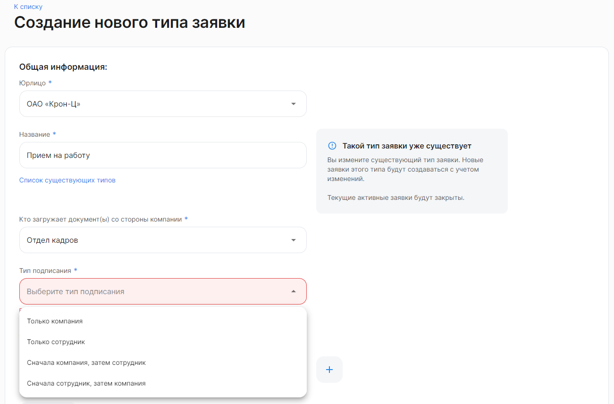
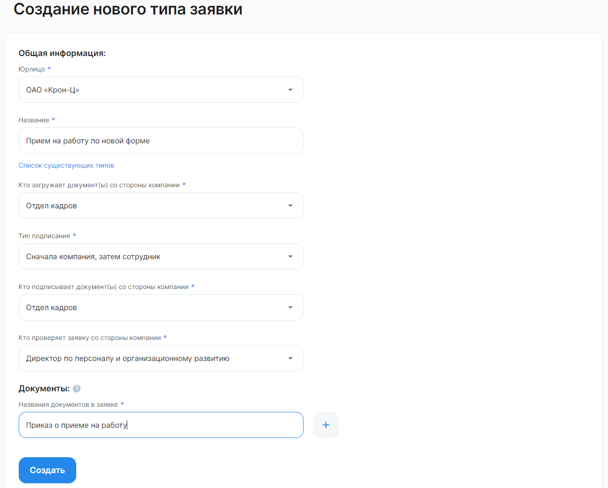
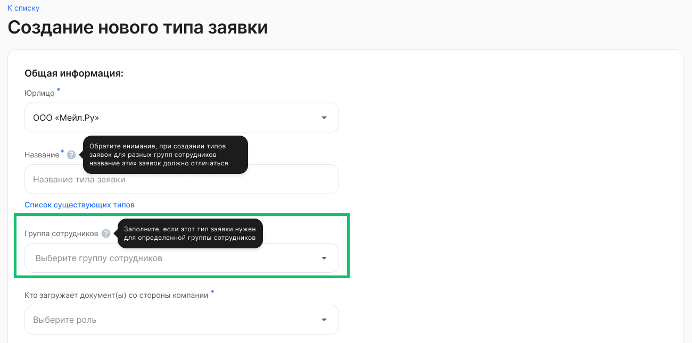
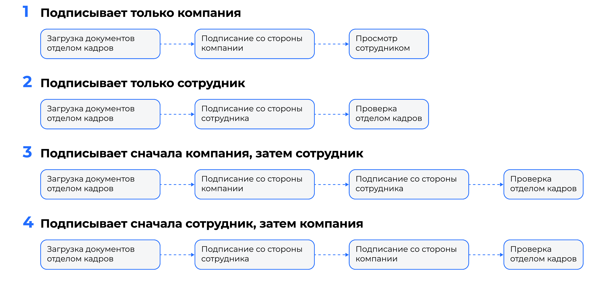

Если компании не подходит готовый бизнес-процесс (тип заявки) из [списка преднастроенных](/ru/hr/company/events_list), возможно создать новый процесс, используя одну из конфигураций.

1. Для создания универсального процесса перейдите в **Сервисы компании → Заявки → Все заявки** и нажмите на кнопку **Создать тип заявки**. 

2. В форме **Создание нового типа заявки** заполните следующие поля:
- **Юрлицо**. Выберите название компании, если у Администратора есть доступ к нескольким компаниям аккаунта. 
- **Название**. Введите название процесса. Если указанное название процесса совпадет с названием уже существующего типа заявки, то новые заявки этого типа будут создаваться с учетом изменений.
- **Кто загружает документ(ы) со стороны компании**. Из списка выберите роль, под которой сотрудник компании будет загружать документы в заявке.
- **Тип подписания**. Выберите [маршрут подписания](/ru/admin_actions/events_types/create_event_types#marshruty_podpisaniya_v_tipe_zayavki) документов в заявке. 

- Если в поле **Тип подписания** был выбран вариант «Только компания», «Сначала компания, затем сотрудник» или «Сначала сотрудник, затем компания», то заполните поля:
    - **Кто подписывает документ(ы) со стороны компании**. Выберите роль представителя компании, который будет подписывать документ в заявке;
    - **Кто проверяет заявку со стороны компании**. Выберите роль представителя компании, который будет проверять сведения в заявке.
- **Названия документов в заявке**. Укажите название документа, который должен быть загружен и подписан в рамках заявки. Возможно добавить до 3-х названий документов в одном типе заявки.

3. Если в модуле 1С компания добавила группы сотрудников, то Администратор сможет выбирать определенную группу сотрудников при создании универсального процесса.

Группы сотрудников предназначены для разграничения процессов у сотрудников.
Например, можно отдельно создать процессы для сотрудников офиса и склада, тогда в поле **Группа сотрудников** нужно выбрать группы «Офис» и «Склад».

Если для процесса добавить группу, то он будет доступен только сотрудникам, которым эта группа проставлена в 1С.

4. Нажмите на кнопку **Создать**.

Теперь при выборе типа заявки в форме создания заявки (**Сервисы компании** → **Заявки** → **Все заявки** → кнопка **Создать заявку**) будет доступен новый универсальный процесс.

<warn> 
 <li>После создания тип заявки нельзя удалить. Вы можете обратиться в поддержку VK HR Tek, чтобы сделать процесс неактивным.</li>
 <li>В активном процессе нельзя изменить порядок подписания. Чтобы изменить порядок подписания, необходимо пересоздать тип заявки с таким же названием и в нем поменять порядок подписания.</li>
 <li>Количество прикладываемых документов в заявке должно соответствовать количеству, указанному в типе заявки.</li>
 <li>Если вы создадите новый процесс, но с уже существующим названием, то ранее созданный процесс изменится. Текущие активные заявки по этому процессу будут закрыты.</li>
</warn>

Также при создании универсального процесса можно настроить **маппинг** — соответствие документов, используемых в процессе, с документами в 1С. Подробнее о сопоставлении документов в модуле 1С см. в [статье](/ru/1C/user/mapping/map).

Если необходимо перенести созданный универсальный процесс на другие компании или требуются донастройки/кастомизация с стороны VK, то процесс должен отобразится в админ-панели у менеджера VK HR Tek.

<info> 

Чтобы процесс отобразился у менеджера VK HR Tek для дальнейшей донастройки или переноса на другие юрлица, добавьте в универсальный процесс хотя бы один дедлайн в разделе **Сервисы компании** → **Настройки** → **Типы заявок**. Подробнее о дедлайнах в [статье](/ru/admin_actions/events_types/managing_event_types/deadline).

</info> 

 

## **Маршруты подписания в типе заявки**
Схематичное представление маршрутов подписания: 

## **Изменение универсального процесса**

После создания универсальный процесс нельзя удалить. Вы можете обратиться в поддержку VK HR Tek support@hrtek.ru, чтобы сделать процесс неактивным.

В активном процессе нельзя изменить порядок подписания. Чтобы изменить порядок подписания, необходимо пересоздать тип заявки с таким же названием и в нем поменять порядок подписания. Количество прикладываемых документов в заявке должно соответствовать количеству, указанному в типе заявки.

Если создать новый процесс, но с уже существующим названием, то ранее созданный процесс перезапишется. Текущие активные заявки по этому процессу будут закрыты, предыдущий вариант процесса отменится у сотрудников и им поступят новые заявки с изменениями.

Изменение исполнителя на этапе универсального процесса производится в **Сервисах компании → Настройки → Типы заявок**. Исполнители этапов обновятся в активных этапах текущих заявок. Подробнее в [статье](/ru/admin_actions/events_types/managing_event_types/executors). 