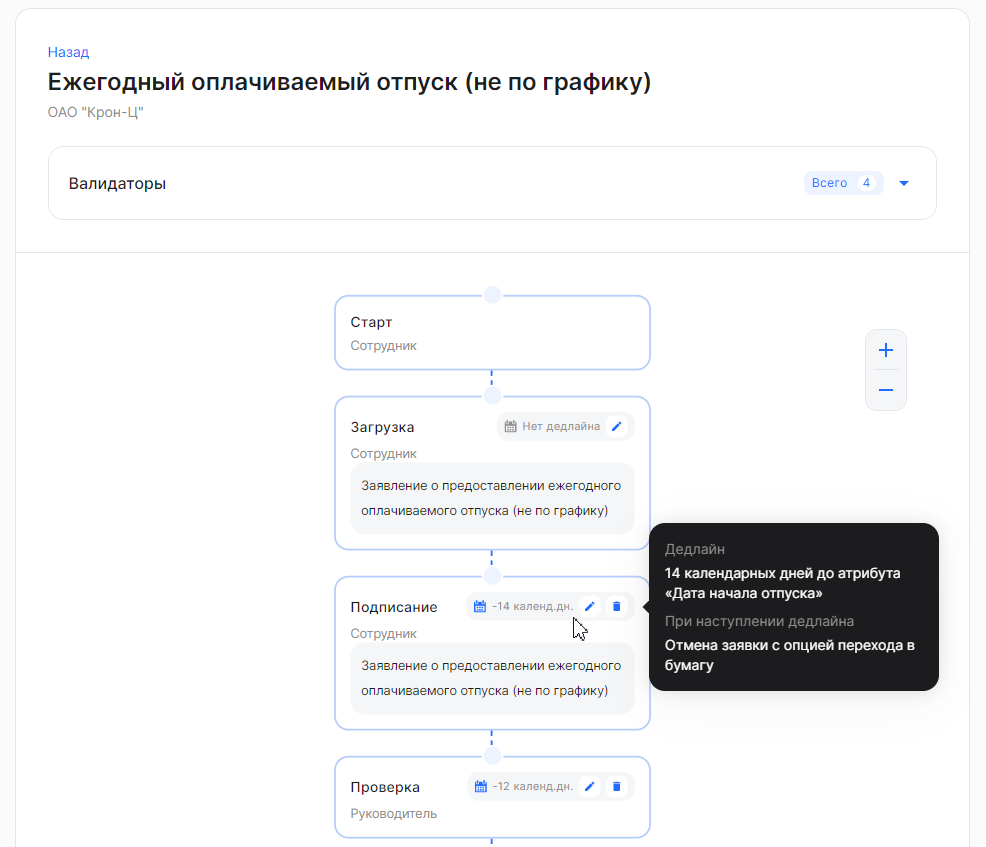
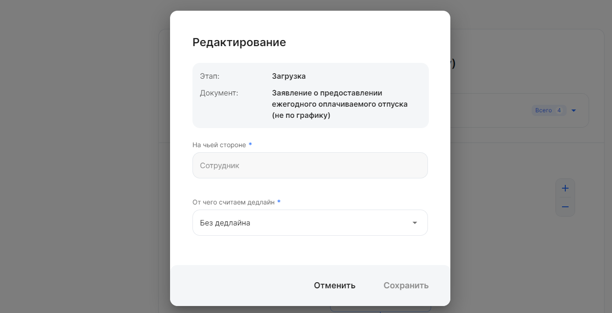
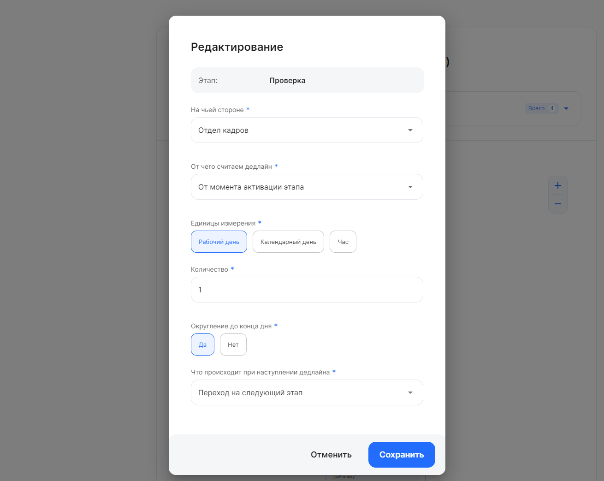
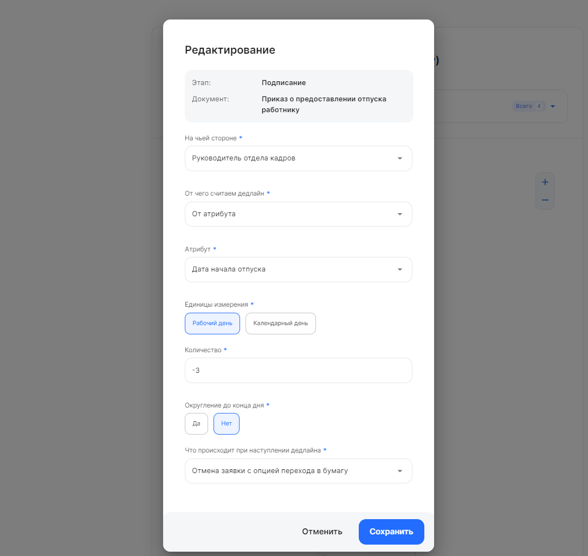
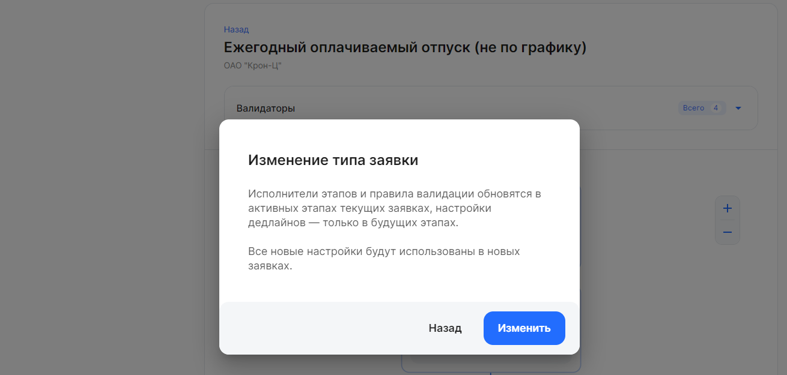
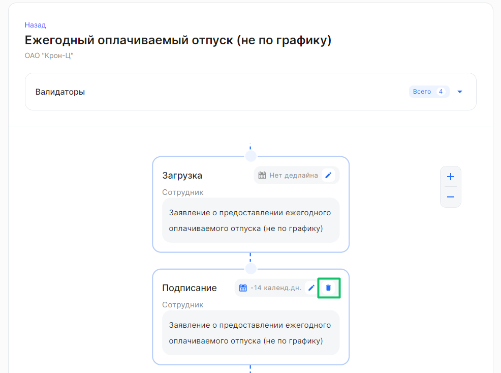
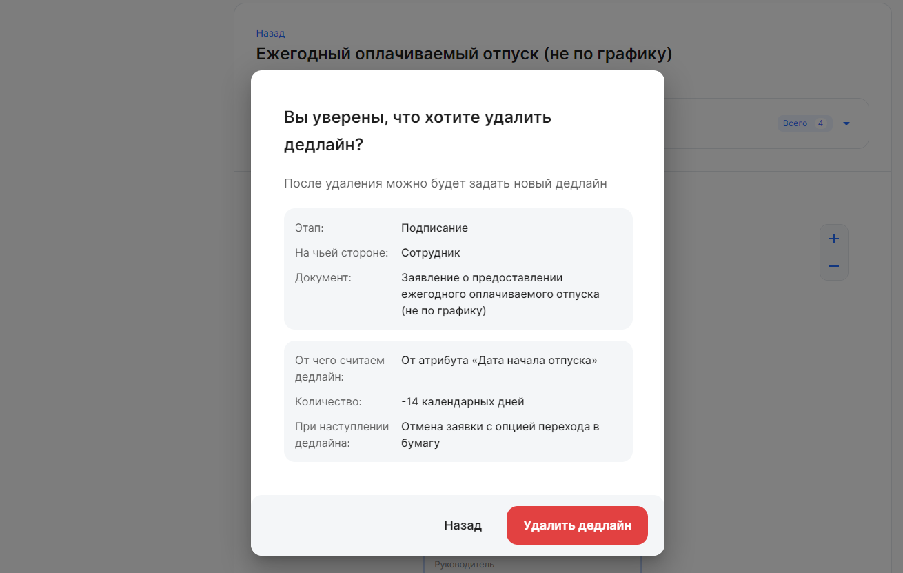

У определённых типов заявок могут быть проставлены ограничения по времени, до которого документ должен быть подписан. По истечении этого срока заявка автоматически отменится и её можно будет подписать только в бумажном виде. 

<warn>
Важно отслеживать дедлайны, чтобы заявка не отменилась
</warn>

Для добавления и редактирования дедлайна на этапах бизнес-процесса перейдите в **Сервисы компании → Настройки → Типы заявок**. 

Если в **Сервисах компании** заведено несколько юрлиц, раскройте тот блок компании, в котором необходимо обработать типы заявок. Откройте необходимый тип заявки.

<warn>
При редактировании дедлайнов в бизнес-процессах с валидаторами важно проверять соответствие дедлайнов и валидаторов.
Иначе сотрудник сможет выбрать ближайшую дату при подаче заявления, но заявка сразу отменится, т.к. дедлайн будет отличаться
</warn>

## **Добавление и редактирование дедлайна**
При наведении курсора на любой этап процесса появляются подсказки о сроке и событии при наступлении дедлайна.

Чтобы отредактировать настройки этапа, нажмите кнопку  в этапе процесса.

В форме **Редактирование** заполните поля:

- **На чьей стороне**. Из списка выберите одного из представителей компании, например, *Отдел кадров*. Подробнее об исполнителях на этапах процесса описано в [статье](/ru/admin_actions/events_types/managing_event_types/executors). 

<info> Заполнение поля **На чьей стороне** недоступно в случае, если указано значение **Сотрудник** или **Руководитель**. 
</info>

- **От чего считаем дедлайн**. Из списка выберите событие, от которого будет рассчитываться дедлайн: **От момента активации этапа**, **От атрибута**, **От момента создания заявки**. Примеры расчёта дедлайна см. в [статье](/ru/hr/company/application/deadline).

<info> Дальнейшее заполнение формы **Редактирование** невозможно, пока в поле **От чего считаем дедлайн** указан пункт «Без дедлайна»
</info>

 

## **Редактирование дедлайна от момента активации этапа и от момента создания заявки**

<info> Редактирование дедлайна **от момента создания заявки** проходит аналогично процедуре редактирования дедлайна **от момента активации этапа**. </info>

В поле **От чего считаем дедлайн** выберите событие **От момента активации этапа** и заполните следующие поля: 

- **Единицы измерения**. Единицы измерения времени, в которых отсчитывается дедлайн. Выберите одно из значений: *Рабочий день*, *Календарный день*, *Час*. 
- **Количество**. Количество единиц измерения (рабочих или календарных дней, часов) для расчёта дедлайна. 
Укажите одно из допустимых значений:
  - Положительные целые числа. Пример: 2 дня. Руководитель должен согласовать документ в течение двух суток с момента перехода заявки на него.
  - Нулевое значение. Пример: 0 дней. Сотрудник должен выполнить этап до конца текущего дня с момента активации этапа. 
- **Округление до конца дня**. Выберите *Да*, если требуется назначить дедлайн в конце суток (23:59). Иначе дедлайн произойдёт по истечении указанного количества единиц измерения. 
  Если в поле **Количество** задано 0 дней, то автоматически установится округление до конца дня.
- **Что происходит при наступлении дедлайна**. Из списка выберите одну из настроек: 
    - **Отмена заявки с опцией перехода в бумагу**. При наступлении дедлайна заявка будет отменена, получит статус *В бумагу* и перейдёт на этап *В бумагу*.
    - **Отмена заявки**. При наступлении дедлайна заявка будет отменена.
    - **Переход на следующий этап**. При наступлении дедлайна на этапе *Согласование/подтверждение* заявка перейдёт на следующий этап. На этапах загрузки и подписания этого не произойдёт. 

<info> Настройка **Отмена заявки с опцией перехода в бумагу** установлена по умолчанию </info>

 

## **Редактирование дедлайна от атрибута**
В поле **От чего считаем дедлайн** выберите событие **От атрибута** и заполните следующие поля:

- **Атрибут**. Наступление события, от которого рассчитывается дедлайн, например, *Дата начала отпуска*, *Дата перевода*.
- **Единицы измерения**. Единицы измерения времени, в которых отсчитывается дедлайн. Выберите одно из значений: *Рабочий день*, *Календарный день*, *Час*. 
- **Количество**. Количество единиц измерения (рабочих или календарных дней) для расчёта дедлайна.
  Укажите одно из допустимых значений:
  - Положительные числа. Пример: 1 день. Сотрудник должен подписать документ за 1 день, отсчитывая от даты перевода на другую должность.
  - Нулевое значение. Пример: 0 дней. Отдел кадров должен проверить документ до конца текущего дня, отсчитывая от даты начала перевода.  
  - Отрицательные числа. Пример: -3 дня. Сотрудник должен подписать приказ за 3 дня (не включительно) до даты начала отпуска.
- **Округление до конца дня**. Выберите *Да*, если требуется назначить дедлайн в конце суток (23:59). Иначе дедлайн произойдёт по истечении указанного количества единиц измерения. 
  Если в поле **Количество** задано 0 дней, то автоматически установится округление до конца дня.
- **Что происходит при наступлении дедлайна**. Из списка выберите одну из настроек: 
    - **Отмена заявки с опцией перехода в бумагу**.  При наступлении дедлайна заявка будет отменена, получит статус *В бумагу* и перейдёт на этап *В бумагу*.
    - **Отмена**. При наступлении дедлайна заявка будет отменена.
    - **Переход на следующий этап**. При наступлении дедлайна на этапе *Согласование/подтверждение* заявка перейдёт на следующий этап. На этапах загрузки и подписания этого не произойдёт. 

<info> Настройка **Отмена заявки с опцией перехода в бумагу** установлена по умолчанию </info>

 

## **Сохранение дедлайна**
На форме **Редактирование** нажмите кнопку **Сохранить**. 

<info> Кнопка **Сохранить** станет доступна после заполнения всех обязательных полей на форме **Редактирование** </info>

Чтобы подтвердить изменение дедлайна в этапе заявки, нажмите кнопку **Изменить**.

В блоке этапа процесса обновится срок на исполнение этапа.

## **Удаление дедлайна**
Для удаления дедлайна нажмите кнопку  в блоке этапа процесса.

Чтобы подтвердить удаление дедлайна, нажмите кнопку **Удалить дедлайн**.

После удаления дедлайна в блоке этапа больше не будет назначен дедлайн (надпись *Нет дедлайна*).  

Дедлайн можно пересоздать снова, повторив действия из статьи [Добавление и редактирование дедлайна](#dobavlenie-i-redaktirovanie-dedlayna). 