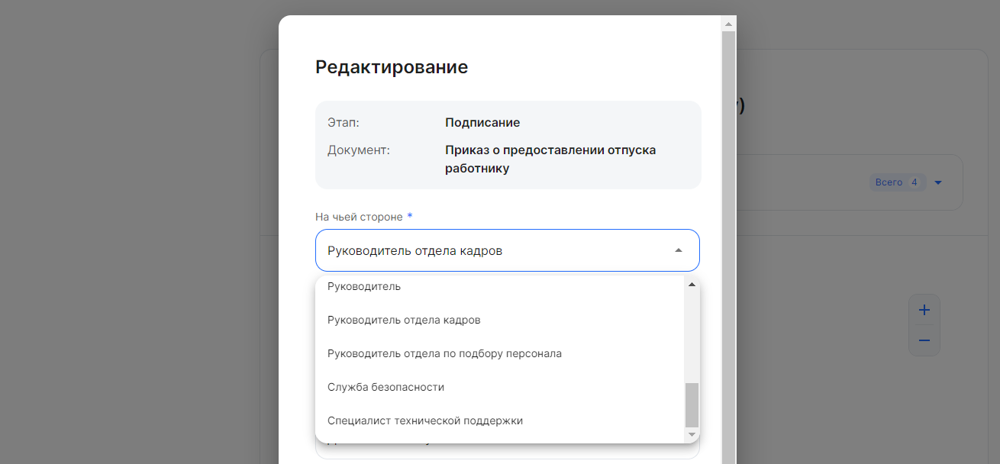

На этапах процесса с типом «Проверка» (этап не должен быть на руководителе), «Подписание» и «Загрузка» можно менять подписанта/согласующего.

Чтобы назначить исполнителя на этапе:
1. Перейдите в **Сервисы компании → Настройки → Типы заявок**.
2. Откройте нужный тип заявки из списка бизнес-процессов компании.
3.  Нажмите на кнопку  в этапе процесса.
4. В форме **Редактирование** заполните поле **На чьей стороне**. 

Изменить исполнителя можно на роль, доступную в списке **На чьей стороне**. Главное условие – сотруднику, который должен будет подписать или согласовать документ на этапе, должна быть выдана соответствующая роль (например, Отдел кадров, Бухгалтерия и т.д.).

Пользователь с правами Администратора присваивает роли в разделе **Сервисы компании → Настройки → Роли сотрудников** (см. [статью](/ru/admin_actions/settings/groups)).

