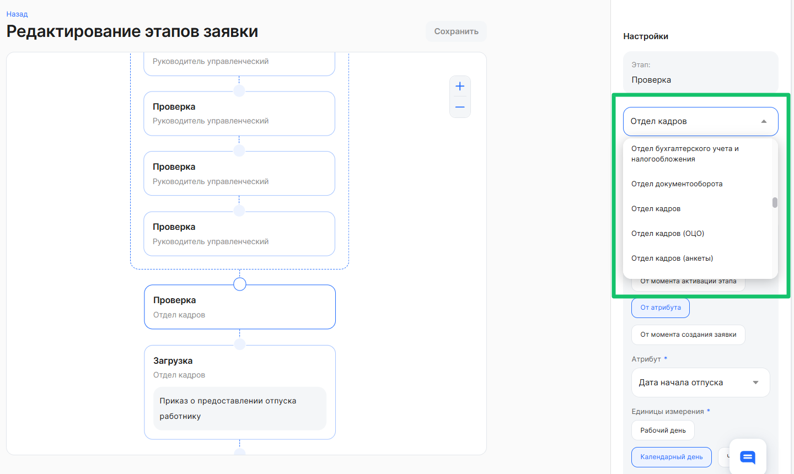

На этапах процесса с типом «Проверка» (этап не должен быть на руководителе), «Подписание» и «Загрузка» можно менять подписанта/согласующего.

Чтобы назначить исполнителя на этапе:
1. Перейдите в **Сервисы компании** → **Настройки** → **Типы заявок**.
2. Откройте нужный тип заявки из списка бизнес-процессов компании.
3. Нажмите на кнопку **Редактировать** в блоке **Этапы заявки**.
4. В блоке **Настройки** выберите исполнителя этапа из выпадающего списка. 

Изменить исполнителя можно на роль, доступную в списке. Главное условие – сотруднику, который должен будет подписать или согласовать документ на этапе, должна быть выдана соответствующая роль (например, Отдел кадров, Бухгалтерия и т.д.).

Пользователь с правами Администратора присваивает роли в разделе **Сервисы компании** → **Настройки** → **Роли сотрудников** (см. [статью](/ru/admin_actions/settings/groups)).

<warn>

При изменении данных этапов заявки правила валидации обновятся в активных этапах текущих заявок. Новые настройки исполнителей этапов, дедлайнов и оргструктуры применятся только в новых заявках.

Корректировать типы заявок может только пользователь с ролью **Администратор**

</warn>
