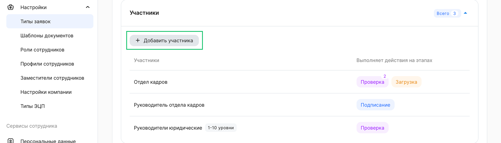
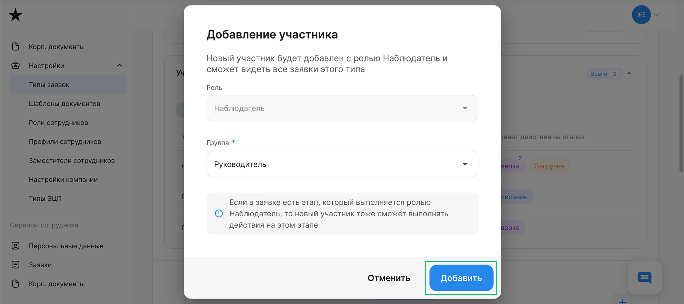
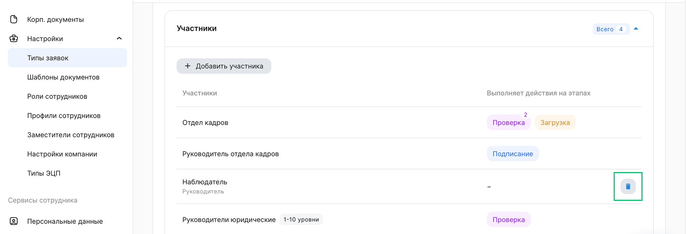

## Добавление участника

В блоке **Участники** перечислены роли и группы пользователей, которые выполняют определённые действия на этапах заявки, относящейся к конкретному типу заявки (бизнес-процессу). 

Для добавления наблюдателя в бизнес-процесс нажмите кнопку **+ Добавить участника**. 

 

Новый участник будет добавлен с ролью **Наблюдатель** и сможет видеть все заявки этого типа.

В форме **Добавление участника** в поле **Группа**  выберите одну группу пользователей из списка. Список групп в компании приведён в разделе [**Роли сотрудников**](/ru/admin_actions/settings/groups).

<warn>

Если в заявке есть этап, который выполняется ролью **Наблюдатель**, то новый участник сможет выполнять действия на этом этапе. 

</warn>

После выбора группы нажмите кнопку **Добавить**. Наблюдатель отобразится в блоке **Участники**.

 

## Удаление участника

<warn>

В блоке **Участники** можно удалить только наблюдателей. Удаление исполнителей на этапах бизнес-процесса недоступно.

</warn>

Чтобы удалить наблюдателя, нажмите кнопку  в блоке участников.

