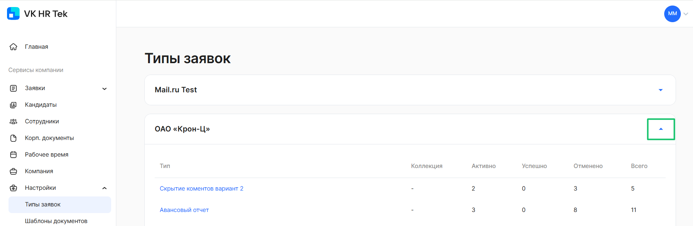
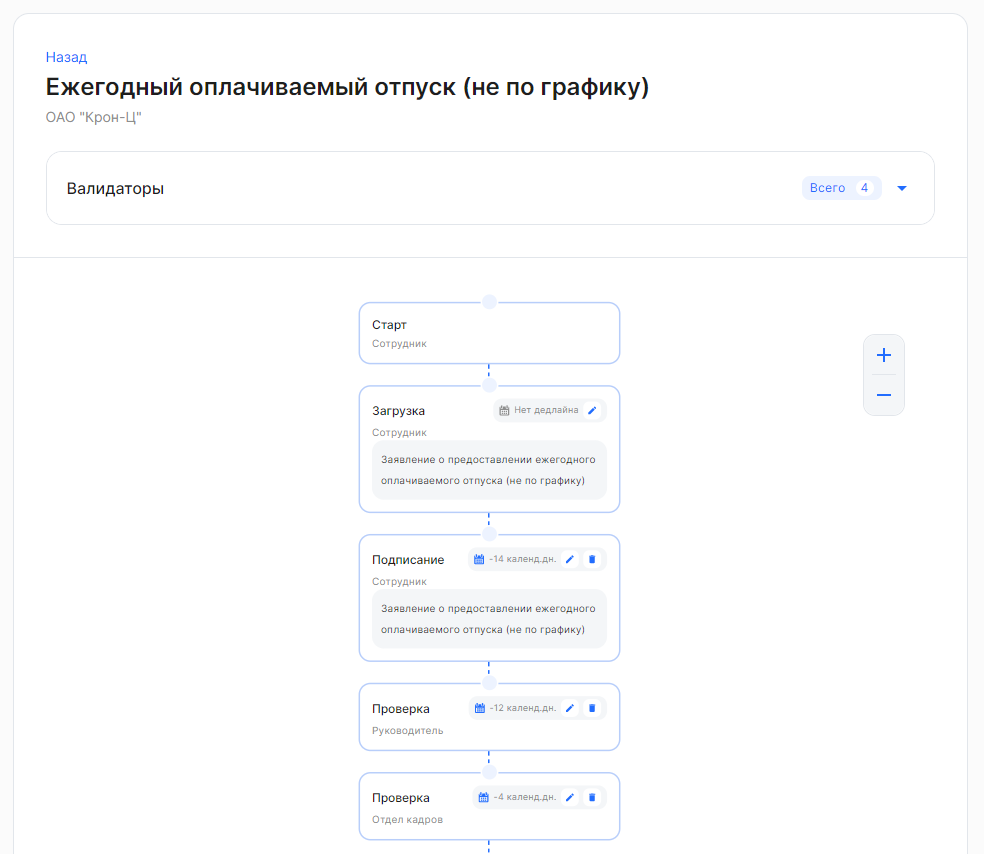

Для управления дедлайнами, валидаторами и исполнителями на этапах бизнес-процесса перейдите в **Сервисы компании → Настройки → Типы заявок**. 

Если в **Сервисах компании** заведено несколько юрлиц, раскройте тот блок юрлица, в котором необходимо обработать типы заявок.

Откройте необходимый тип заявки:

Каждый блок этапа состоит из элементов:

1. Название этапа. Доступны этапы с названиями: **Загрузка**, **Подписание**, **Проверка**.
1. Исполнитель. Доступны этапы с исполнителями: **Сотрудник**, **Руководитель**, представитель или группа компании — например, **Отдел кадров**.
1. Название документа. Например, заявление о предоставлении ежегодного отпуска.

Чтобы изменить масштаб схемы, нажмите на кнопку  или  справа от схемы процесса.
