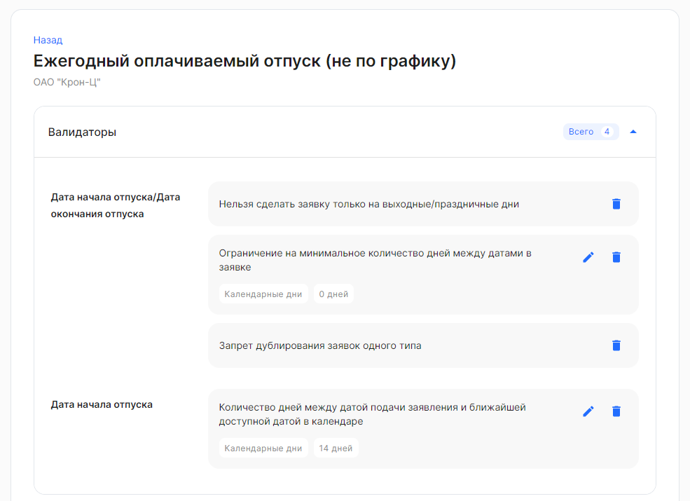
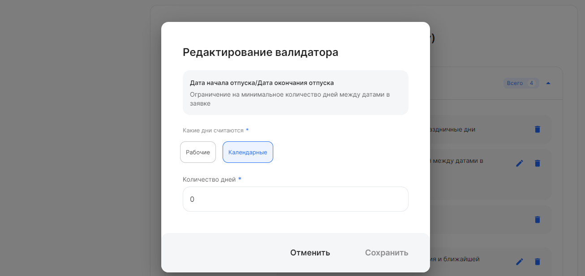
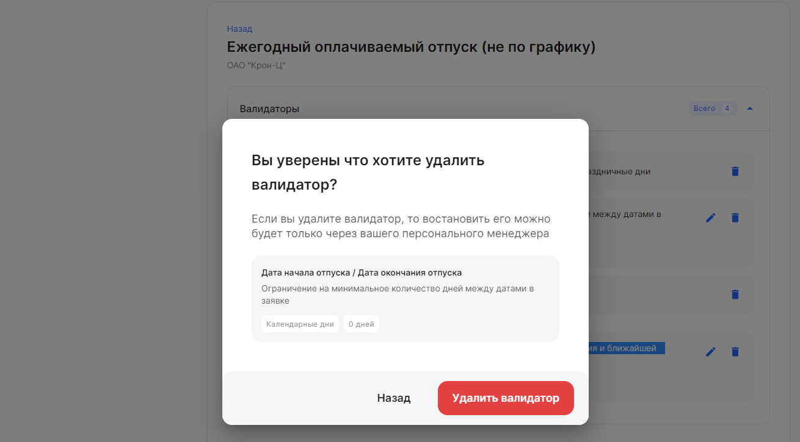

Валидаторы – это настройки, позволяющие указать те или иные ограничения при заполнении атрибутов в этапе бизнес-процесса. 

Чтобы отредактировать или удалить валидатор:

1. Перейдите в **Сервисы компании → Настройки → Типы заявок**. Откройте необходимый тип заявки из приведенного списка. 
1. Раскройте блок с валидаторами. В некоторых блоках могут отсутствовать валидаторы, т.к. они не предусмотрены для выбранных типов заявок.

<warn>
При редактировании дедлайнов в бизнес-процессах с валидаторами важно проверять соответствие дедлайнов и валидаторов.
Иначе сотрудник сможет выбрать ближайшую дату при подаче заявления, но заявка сразу отменится, т.к. дедлайн будет отличаться.
</warn>

## **Доступные валидаторы для определенных типов заявок** 
- Настройка минимального количества дней между датой подачи заявления и датой N.
- Нельзя взять отпуск только на выходные дни.
- Нельзя взять отпуск только на праздничные дни.
- Нельзя взять отпуск по одному дню перед и после выходных/праздников исключая нерабочие дни между ними.
- Ограничение на минимальное количество дней между разными датами в заявке.
- Запрет дублирования заявок одного типа.
- Настройка максимального количества дней между датой подачи заявления и датой N.
- Разные даты в заявке должны быть в рамках одного месяца.
- Нельзя взять больше дней, чем накоплено на дату подачи заявки на отпуск.
- Нельзя взять кол-во дней отпуска, не кратное 7 дням.

## **Как правильно настроить валидатор**
Некоторые валидаторы можно редактировать. Для этого нажмите на кнопку  в блоке валидаторов.

В форме **Редактирование валидатора** заполните поля:

- **Какие дни считаются**. Выберите один из вариантов: 
  - Рабочие (исключают подсчет выходных дней);
  - Календарные (включают в себя подсчет выходных).
- **Количество дней**. Возможно задать:
  - отрицательные значения («-1» — возможность подать заявление день в день);
  - нулевое значение («0» — возможность подать заявление начиная с завтрашнего дня);
  - положительные значения («14» — количество дней между датой подачи заявления и ближайшей доступной датой в календаре). 

Нажмите на кнопку **Сохранить**.

<warn> Валидаторы можно удалить. Возвращение валидатора — это платная донастройка. </warn>

Чтобы удалить валидатор, нажмите кнопку  в блоке валидаторов.

