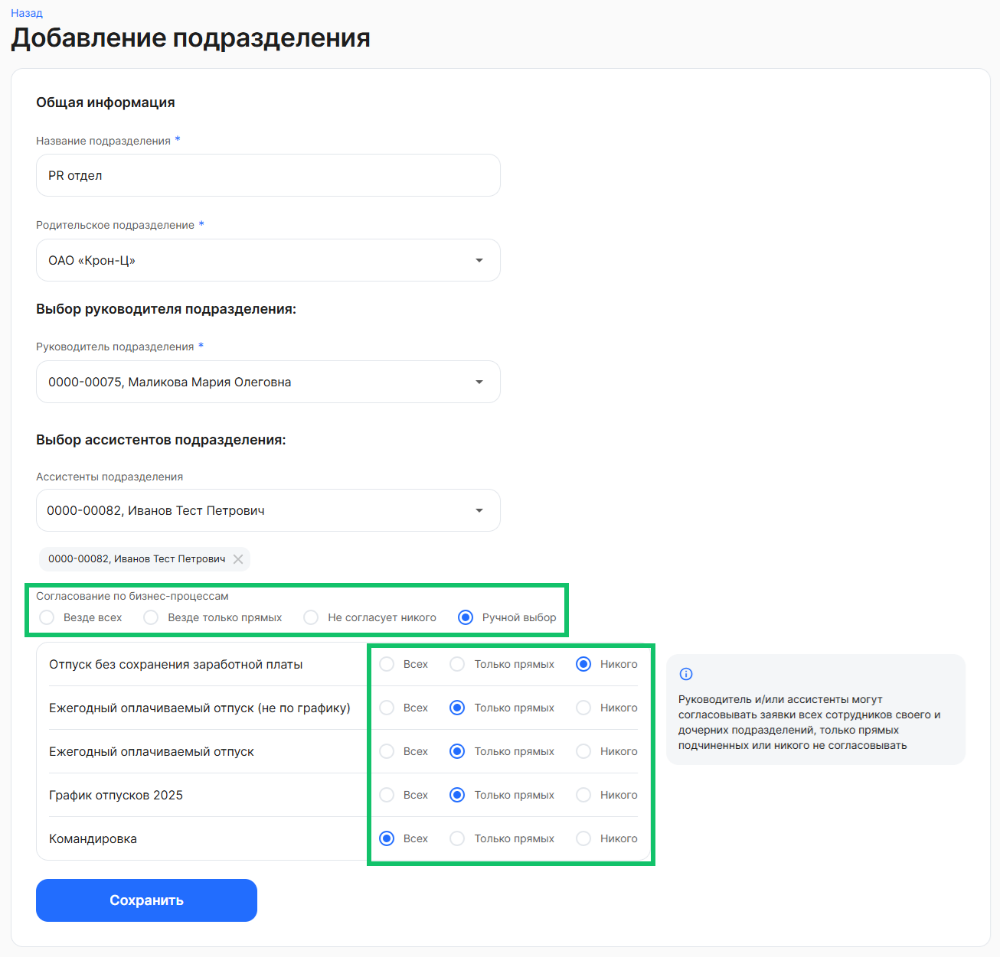
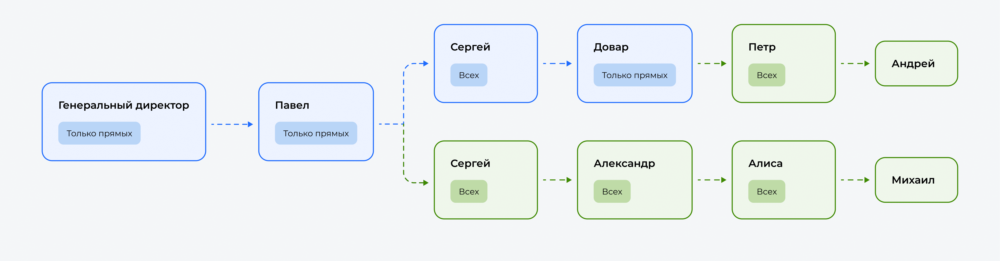

Цепочка согласований рассчитывается и фиксируется в момент создания заявки по выбранному бизнес-процессу.

При изменении руководителя подразделения согласующие в активных заявках не изменятся.

При увольнении руководителя подразделения:

- подразделение остается без руководителя;
- цепочка согласований будет рассчитываться без участия руководителя этого подразделения;
- если для руководителя был назначен заместитель, то вместо уволенного руководителя в активной заявке отобразится его заместитель (подробнее в статье [Выбор заместителей для руководителей](/ru/admin_actions/management_structure/substitutes)).

Если необходимо сменить согласующих в активных заявках, требуется:

1. Отменить активные заявки с участием предыдущего руководителя.
1. Сменить руководителя и указать необходимые настройки согласования по бизнес-процессу.
1. Стартовать новые заявки. Они создадутся с новым руководителем.

Настройка согласования по бизнес-процессам происходит при создании подразделения в управленческой структуре, в разделе **Сервисы компании → Организационная структура**. Подробнее в статье [Создание подразделений](/ru/admin_actions/management_structure/create_edit_division).

В разделе согласования по бизнес-процессам выберите один из пунктов:

- **Везде всех**. Руководитель и/или ассистенты смогут согласовывать заявки всех сотрудников своего и дочерних подразделений.
- **Везде только прямых**. Руководитель и/или ассистенты смогут согласовывать заявки только прямых подчиненных.
- **Не согласует никого**. Руководитель и/или ассистенты не смогут согласовывать заявки ни от каких сотрудников.
- **Ручной выбор**. Руководитель и/или ассистенты смогут согласовывать часть заявок всех сотрудников, часть заявок только прямых подчиненных или никого не согласовывать. При ручном выборе установите нужную настройку напротив бизнес-процесса.

 

## **Пример согласования по управленческой структуре**
Для каждого руководителя по каждому бизнес-процессу, где есть согласование руководителем, указывается настройка:

1. Согласует всех сотрудников своего подразделения и дочерних подразделений.
1. Согласует только прямых подчиненных.

**Пример настроек цепочек согласования**

| Руководитель | Бизнес-процесс (БП) | Настройка |
| :---        | :---         | :---         |
| Генеральный директор | Все бизнес-процессы | Согласует только прямых | 
| Павел | Все бизнес-процессы | Согласует только прямых | 
| Сергей | Отпуск, Командировка | Согласует только прямых |
| Сергей | Кадровый перевод, Изменение оклада | Согласует всех |
| Довар | Все бизнес-процессы | Согласует только прямых |
| Александр | Все бизнес-процессы | Согласует всех |
| Петр | Все бизнес-процессы | Согласует всех |
| Алиса | Все бизнес-процессы | Согласует всех |

 

 

**Пример рассчитанных цепочек согласований**

|**Сотрудник**|**Бизнес-процесс**|**Согласующие**|
| :- | :- | :- |
| Павел | Любой | Генеральный директор **→** ✅ |
| Сергей | Любой | Павел **→** ✅ |
| Петр | Любой | Довар **→** ✅ |
| Андрей | Любой | Петр **→** ✅ |
| Михаил | Отпуск | Алиса **→** Александр **→** ✅ |
| Михаил | Изменение оклада | Алиса **→** Александр **→** Сергей **→** ✅ |