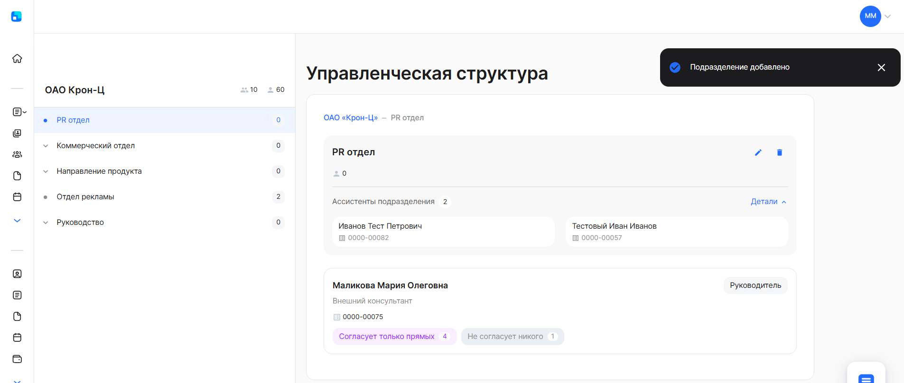

## **Создание подразделений**

Сначала можно создать не все подразделения, а только те, которые будут подключены в ближайшее время.

Для создания подразделений в управленческой структуре компании перейдите в **Сервисы компании → Компания**.

1\. Чтобы создать новое подразделение, нажмите на кнопку **Подразделение +**.

2\. В разделе общей информации заполните поля:
- **Название подразделения**. Введите наименование подразделения компании.
- **Родительское подразделение**. Раскройте родительское подразделение, если требуется выбрать подразделение внутри другого подразделения. 

<info> Поле **Родительское подразделение** будет отсутствовать при добавлении первого подразделения. 
Первое подразделение будет корневым для остальных подразделений.
</info>

 

- **Руководитель подразделения**. Выберите сотрудника из списка или введите табельный номер или ФИО для быстрого поиска.
- **Ассистенты подразделения**. Выберите хотя бы одного сотрудника из списка или введите табельный номер или ФИО для быстрого поиска.

3\. В разделе согласования по бизнес-процессам выберите один из пунктов:
- **Везде всех**. Руководитель и/или ассистенты смогут согласовывать заявки всех сотрудников своего и дочерних подразделений.
- **Везде только прямых**. Руководитель и/или ассистенты смогут согласовывать заявки только прямых подчиненных.
- **Не согласует никого**. Руководитель и/или ассистенты не смогут согласовывать заявки ни от каких сотрудников.
- **Ручной выбор**. Руководитель и/или ассистенты смогут согласовывать часть заявок всех сотрудников, часть заявок только прямых подчиненных или никого не согласовывать. При ручном выборе установите нужную настройку напротив бизнес-процесса.

Подробнее смотрите в статье [Управление настройками согласования](/ru/admin_actions/management_structure/alignment_of_processes).

4\. Нажмите на кнопку **Сохранить**.

Новое подразделение появится в управленческой структуре компании.

При увольнении руководителя: 

- В уже созданных заявках ничего не меняется:
  - заместители смогут согласовать заявки; 
  - если заместитель не был назначен — заявка зависнет на этапе руководителя. Подробнее о добавлении заместителей описано в [статье](/ru/admin_actions/management_structure/substitutes). 
- Новые заявки будут создаваться, пропуская этап согласования руководителем, пока в подразделение не добавят нового сотрудника в качестве руководителя.

 

## **Редактирование подразделений**

Для редактирования данных подразделения перейдите в **Сервисы компании → Компания**.

Выберите подразделение в дереве подразделений. Нажмите на кнопку редактирования в карточке выбранного подразделения.

Чтобы изменить данные подразделения, требуется:

1. В разделе общей информации поменять значения в полях:
- **Название подразделения**. Изменить наименование подразделения компании.
- **Родительское подразделение**. Раскрыть родительское подразделение, если требуется изменить подразделение внутри другого подразделения. 
- **Руководитель подразделения**. Заменить сотрудника из списка или ввести табельный номер или ФИО для быстрого поиска.
- **Ассистенты подразделения**. Выберите другого сотрудника из списка либо введите табельный номер или ФИО для быстрого поиска, либо удалите уже ранее добавленных ассистентов из списка.
2. В разделе согласования по бизнес-процессам выбрать один из пунктов:
- **Везде всех**. Руководитель и/или ассистенты смогут согласовывать заявки всех сотрудников своего и дочерних подразделений.
- **Везде только прямых**. Руководитель и/или ассистенты смогут согласовывать заявки только прямых подчиненных.
- **Не согласует никого**. Руководитель и/или ассистенты не смогут согласовывать заявки ни от каких сотрудников.
- **Ручной выбор**. Руководитель и/или ассистенты смогут согласовывать часть заявок всех сотрудников, часть заявок только прямых подчиненных или никого не согласовывать. При ручном выборе установите нужную настройку напротив бизнес-процесса.

Подробнее смотрите в статье [Управление настройками согласования](/ru/admin_actions/management_structure/alignment_of_processes).

3. Нажать на кнопку **Сохранить**.

## **Удаление подразделений**

<warn>
Удалить подразделение можно, только когда в нём отсутствуют сотрудники и удалены подразделения нижнего уровня.

Если в подразделение уже добавили сотрудников, то перед его удалением распределите сотрудников по другим подразделениям. Только после этого можно удалить подразделение.

</warn>

Для удаления подразделения перейдите в **Сервисы компании → Компания**.

Выберите подразделение в дереве подразделений. Нажмите на кнопку удаления в карточке выбранного подразделения.

Подтвердите удаление подразделения, нажав на кнопку **Удалить**.

