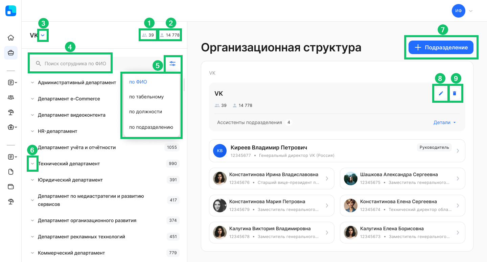
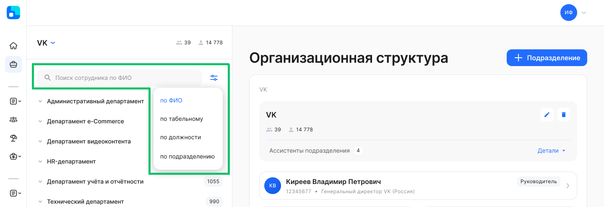
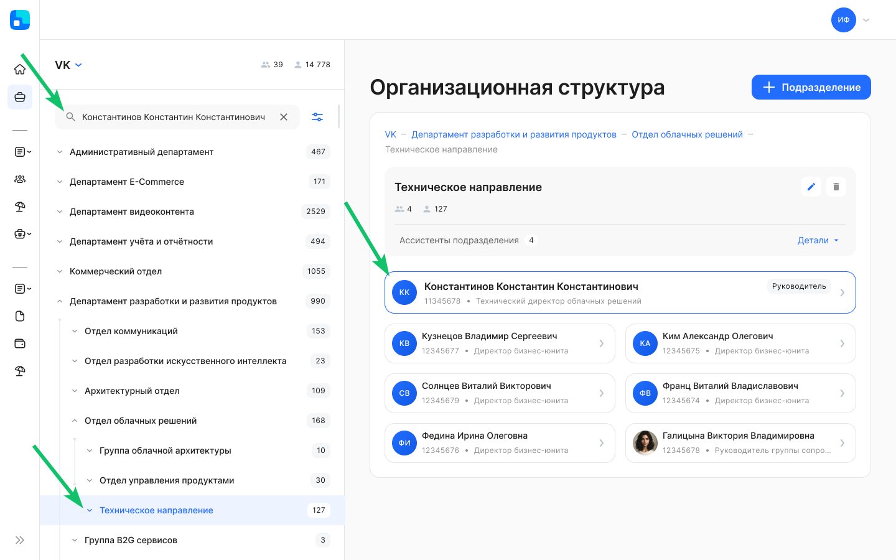
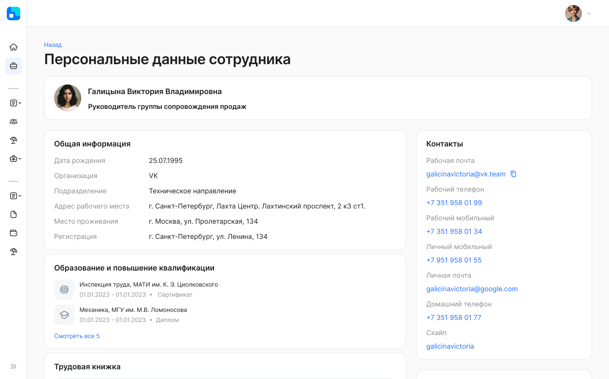
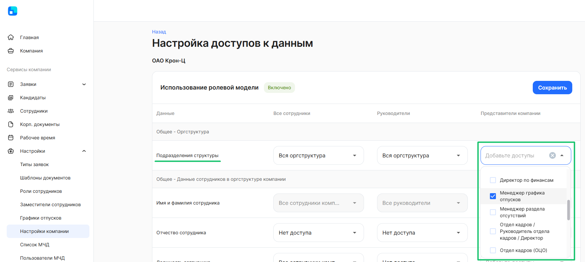

В сервисе VK HR Tek можно использовать как юридическую оргструктуру (которая заведена в штатном расписании в 1С), так и управленческую оргструктуру (которую можно создать в разделе **Сервисы компании → Организационная структура**).

Если юридическая оргструктура не подходит для компании, вы можете выстроить управленческую структуру. 

<info>
Если вы выберете тип согласования по управленческой оргструктуре, то сообщите об этом вашему менеджеру со стороны VK, т. к. потребуются изменения в бизнесс-процессах (типах заявок), которые вы используете.
</info>

Для настройки управленческой структуры компании необходимо выполнить следующие шаги:

1. Подключить всех руководителей в расширении КЭДО 1С (см. [статью](/ru/1C/organizational_structure/management_structure/connecting_managers)). 
2. Проверить наличие ошибок в разделах 1С [Исходящие пакеты и Входящие пакеты](/ru/1C/user/packages). Если возникли ошибки, необходимо проверить корректность заполненных данных о руководителях.
2. Создать или отредактировать подразделение в web-сервисе (см. [статью](/ru/admin_actions/management_structure/create_edit_division)).
4. Распределить сотрудников по подразделениям в расширении КЭДО 1С (см. [статью](/ru/1C/organizational_structure/management_structure/distribution_of_employees)).
5. Если возникли ошибки при подключении сотрудников подразделения к КЭДО, то проверить корректность заполненных [данных о сотрудниках](/ru/1C/user/employees/add_employees).

Для формирования управленческой структуры в сервисе HR Tek перейдите в **Сервисы компании → Организационная структура**.

Страница управленческой структуры содержит следующие элементы:

1. Количество подразделений в компании.
2. Общее количество сотрудников в компании.
3. Стрелка для выбора компании (если их несколько).
4. Строка поиска сотрудника по выбранному параметру, по умолчанию установлен поиск по ФИО.
5. Выбор параметра для поиска сотрудника. Доступные параметры: по ФИО, по табельному, по должности, по подразделению.
5. Стрелка для раскрытия подразделений нижнего уровня.
6. Кнопка для создания нового подразделения.
7. Кнопка для редактирования данных по подразделению. Название подразделения, руководителя и настройки согласования можно изменить в любое время.
8. Кнопка для удаления подразделения. Чтобы удалить подразделение, необходимо перевести сотрудников в другое и удалить все подразделения нижнего уровня.

Также на этой странице могут отображаться руководитель, ассистенты (административная роль в департаментах компании) и сотрудники подразделения.

## Поиск сотрудников в подразделениях компании

По организационной структуре возможен поиск сотрудника по следующим параметрам:
- по ФИО (установлен в строке поиска по умолчанию);
- по табельному номеру (поиск работает всегда, даже если пользователю не хватает прав на просмотр табельного);
- по должности;
- по подразделению.

Для выбора нужного параметра нажмите кнопку .

Чтобы найти сотрудника в подразделениях компании, введите хотя бы первые три символа ФИО, табельного номера, должности сотрудника или названия подразделения. В поисковых подсказках выберите данные найденного сотрудника.

После выбора сотрудника в поисковых подсказках выделяется подразделение сотрудника, и в оргструктуре появляется карточка найденного сотрудника с синей обводкой. 
Карточка с найденным сотрудником всегда перемещается 
в начало списка (после карточки руководителя), вне зависимости от места сотрудника в общем списке подразделения.

Из карточки сотрудника/руководителя в оргструктуре может быть доступен переход на страницу сотрудника — страницу **Персональные данные сотрудника**. 

<warn>

Ссылка на страницу сотрудника появляется, только если включена настройка **Использование ролевой модели**, так как доступ к странице сотрудника появляется только при её включении (см. [статью](/ru/admin_actions/settings/settings_comp//role_model)).

</warn>

Набор персональных данных на странице определяется доступами по ролевой модели относительно каждого сотрудника.

## Настройка доступов к данным организационной структуры

Для доступа к организационной структуре компании включите настройку **Использование ролевой модели** (**Сервисы компании → Настройки → Настройки компании**). На странице **Настройка доступов к данным** в строке **Подразделения структуры** по умолчанию добавлена группа «Менеджер графика отпусков». 

Если включена настройка ролевой модели и для группы «Менеджер графика отпусков» удалён доступ к оргструктуре, то в списке сотрудников на исключение из планирования графиков отпусков будут только те, к которым есть доступ у сотрудника или руководителя.

Для сотрудников и руководителей можно выбирать следующие доступы:

- Вся оргструктура — доступны все подразделения компании;
- Только своё подразделение — доступно подразделение, в котором у пользователя есть неуволенный сотрудник;
- Своё и дочерние подразделения — доступны подразделение, в котором у пользователя есть неуволенный сотрудник, и все подразделения вниз по иерархии от него.
- Нет доступа — раздел **Организационная структура** недоступен для пользователей.

