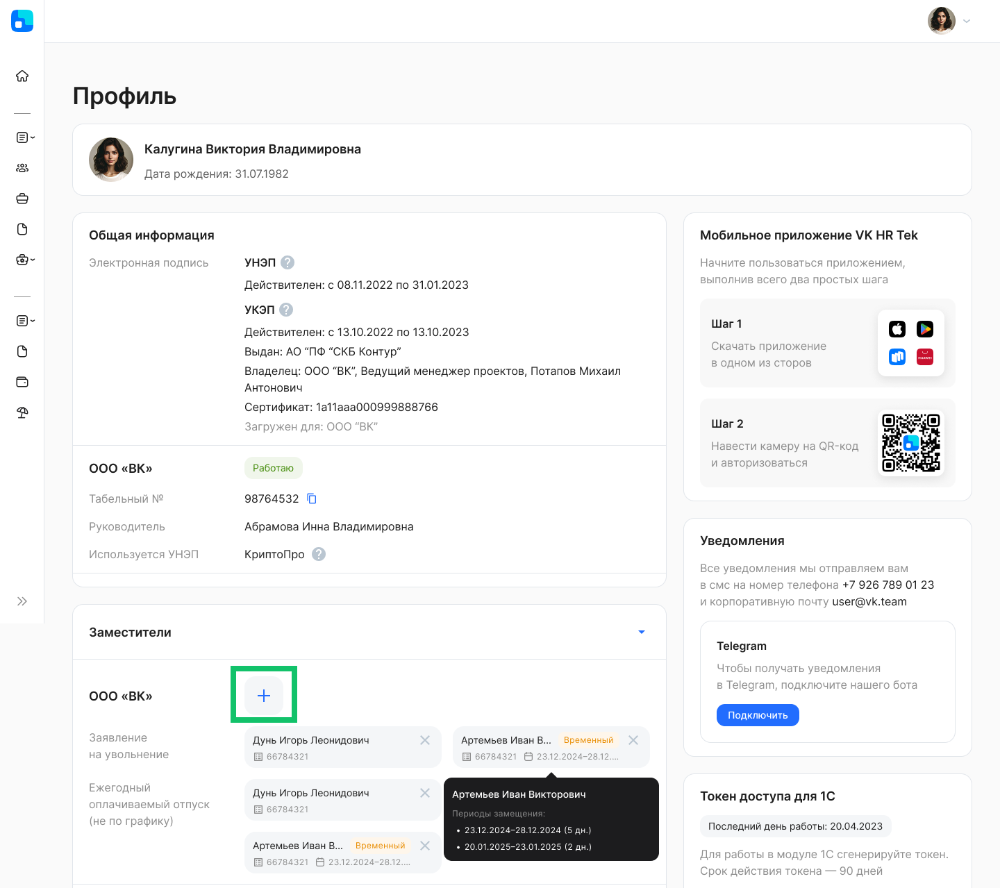

Каждому сотруднику, который является руководителем хотя бы в одном подразделении, можно назначить заместителей: 

- сразу на все бизнес-процессы;	 
- на определенные бизнес-процессы. 

Заместителей может быть несколько как на разных процессах, так и несколько на один процесс.

Заместителю всегда доступны действия руководителя по тем заявкам, которые ожидают действия руководителя. 

Если руководитель уволился, то в созданных заявках действие может быть выполнено заместителем.

<warn>

Заместитель может выполнять согласования или другие действия по заявке вместо своего руководителя по оргструктуре. Если пользователь-заместитель должен выполнить действие на этапе заявки от имени роли (например, Бухгалтерия), то для этого Администратор должен [выдать роль](/ru/admin_actions/settings/groups) пользователю согласно бизнес-процессу.

</warn>

В разделе **Сервисы компании → Настройки → Заместители сотрудников** отображаются руководители из юридической и управленческой оргструктуры. Каждому руководителю можно назначить заместителя.

 

Чтобы добавить заместителя к сотруднику, нажмите кнопку   в карточке сотрудника. 

Для добавления заместителя необходимо:

- В поле **Выберите сотрудника** указать табельный номер или ФИО сотрудника.
- Выбрать тип заместителя: **постоянный** (сотрудник будет замещать руководителя, пока не будет удалён из заместителей) или **временный** (сотрудник будет назначен заместителем на заданный срок, будет автоматически удалён из настроек по завершении сроков замещения).
- Выбрать все или отдельные типы заявок  руководителя, которого он будет замещать.
- Нажать на кнопку **Сохранить**.

 

В рамках «прохождения» заявки, при переходе документа на этап подтверждения к руководителю, уведомление придёт и к руководителю, и к его заместителю.

При выборе типа заместителя **Временный** выберите один период замещения:
- из отсутствия сотрудника;
- свой период.

После установки первого периода замещения можно добавить ещё несколько замещений. Замещение с периодом **Из отсутствия сотрудника** можно добавить только один раз.

При выборе периода **Из отсутствий сотрудника** выберите 
из выпадающего списка необходимые даты отсутствия, в которые сотрудник будет замещать руководителя.

 

Если требуется указать даты начала и окончания замещения, которые не совпадают с отсутствиями руководителя (отпуск, командировка и др.), то выберите **Свой период**.

 

В случае успешного сохранения сотрудник будет добавлен в список заместителей. Назначенный на период заместитель будет обозначен меткой **Временный**.

## **Добавление заместителя в Профиле руководителя**
Руководитель может самостоятельно указывать заместителей в своем **Профиле**. Для этого в **Профиле** необходимо:
1. Перейти в карточку компании, в блоке **Добавить заместителей** нажать на кнопку .

2. В поле **Выберите сотрудника** указать табельный номер или ФИО сотрудника.
3. Выбрать тип заместителя: **постоянный** (сотрудник будет замещать руководителя, пока не будет удалён из заместителей) или **временный** (сотрудник будет назначен заместителем на заданный срок, будет автоматически удалён из настроек по завершении сроков замещения).
3. Выбрать все или отдельные типы заявок  руководителя, которого он будет замещать.
4. Нажать на кнопку **Сохранить**.

