Настройка ролевой модели один раз для всех компаний в рамках аккаунта — упрощает администрирование крупных холдингов и сетевых структур. Вместо повторной настройки прав доступа в каждой компании, достаточно сконфигурировать модель на уровне аккаунта, и все компании автоматически унаследуют эти настройки.  Администратор может также отметить отдельные компании как исключения, для которых будут действовать собственные настройки ролевой модели.

Доступно для пользователей с ролью «Администратор», выданной на уровне аккаунта, в разделе **Настройки → Настройки аккаунта**.

В блоке **Настройка доступов к данным → Использование ролевой модели** можно выполнить следующие действия:

1. включить/отключить использование ролевой модели на аккаунт; 

2. настроить ролевую модель на аккаунт;

3. управлять исключениями — компаниями, которые имеют ролевую модель, отличимую от модели аккаунта. 

## Настройка доступов к данным

Чтобы настроить доступы к данным для всех компаний в аккаунте, кроме исключений, нажмите кнопку **Настроить**. Настройки можно редактировать, когда ролевая модель не используется (состояние **Выключено**), а затем включить уже настроенную модель. 

Доступы при выключенной ролевой модели установлены в соответствии с настройками доступа для ролей (групп) представителей компании.

На странице **Аккаунт: настройка доступов к данным** можно настроить доступ к разделам и данным сервиса для всех сотрудников, руководителей, представителей компании. 

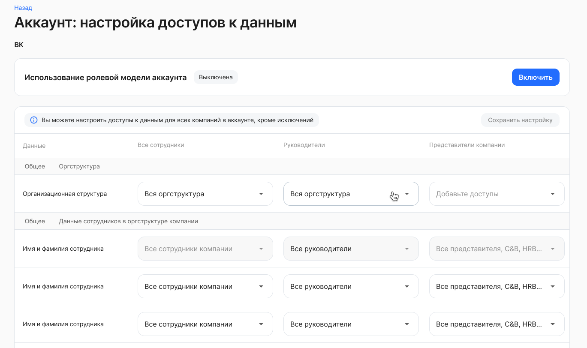

 

В таблице перечислены данные, к которым настраивается доступ, из следующих разделов сервиса VK HR Tek:

1. Общее — Оргструктура.
1. Общее — Данные сотрудников в оргструктуре компании.
1. Компания — Сотрудники (доступ целиком).
1. Компания — Корпоративные документы (доступ целиком).
1. Компания — Рабочее время (доступ целиком).
1. Сотрудник — Компетенции (доступ целиком).
1. Сотрудник — Персональные данные (доступ к отдельным данным: дата рождения, общая информация, документы, контакты, о семье).

Некоторые данные из перечисленных разделов полностью недоступны для редактирования. Это связано с тем, что у пользователя нет роли для доступа к разделам на стороне компании в аккаунте.  

В рамках аккаунта можно настроить доступ для следующих типов пользователей:

1. Сотрудники:
- все сотрудники компании — пользователи, у которых есть хотя бы один неуволенный сотрудник в компании;
- все сотрудники группы компаний — пользователи, у которых есть хотя бы один неуволенный сотрудник в любой компании аккаунта (если компания входит в группу компаний).

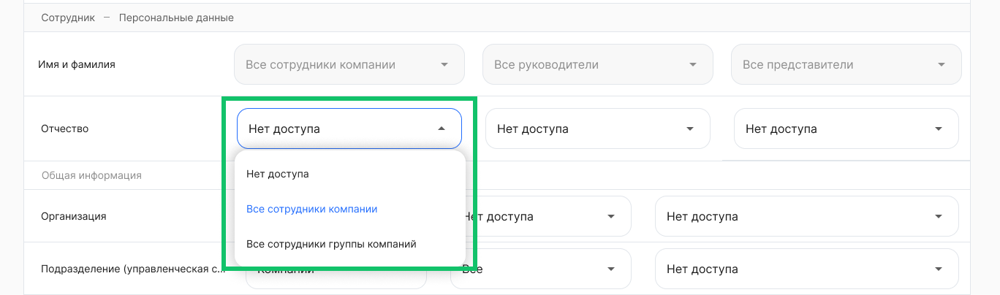

 

2. Руководители:
- все руководители — пользователи, которые являются руководителями по любому алгоритму;
- руководители сотрудника — пользователи, которые (по любому алгоритму) являются прямыми или выше по иерархии руководителями определенного сотрудника.

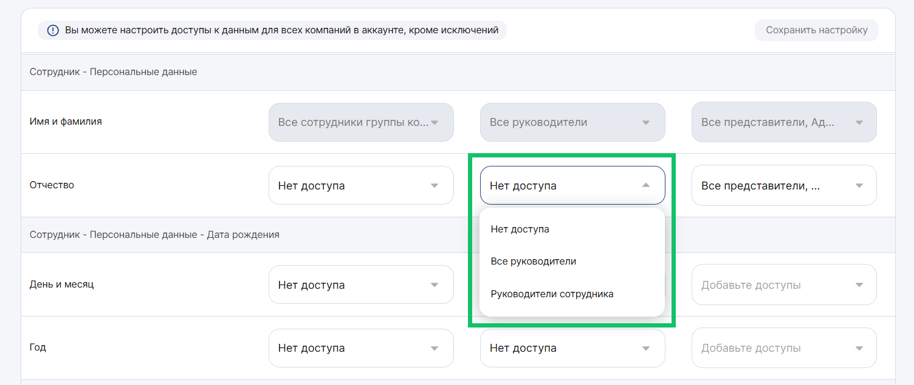

 

3. Представители компании:
- все представители компании — пользователи, у которых есть хотя бы одна роль в компании;
- представители определенной роли в компании. Если у роли есть родительская роль, то название роли в выпадающем списке выглядит: <Название группы / Название родительской группы>, например, Бухгалтер / Главный бухгалтер / Руководитель бухгалтерии. 

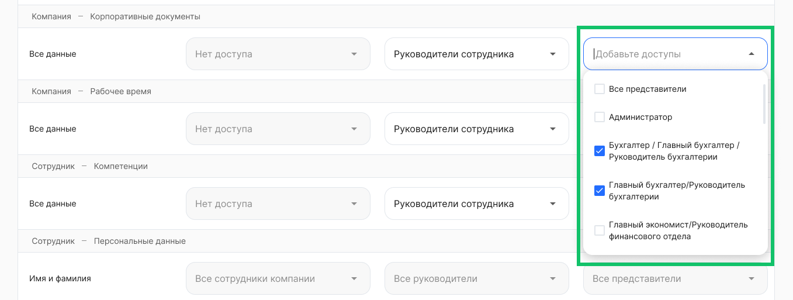

 

По завершении редактирования настроек нажмите кнопку **Сохранить настройку**.

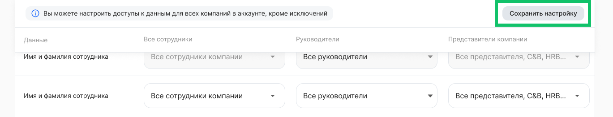

## Включение ролевой модели
Чтобы включить настроенную ролевую модель, активируйте переключатель на странице **Настройки аккаунта** или нажмите кнопку **Включить** на странице настройки ролевой модели, а затем подтвердите действие.

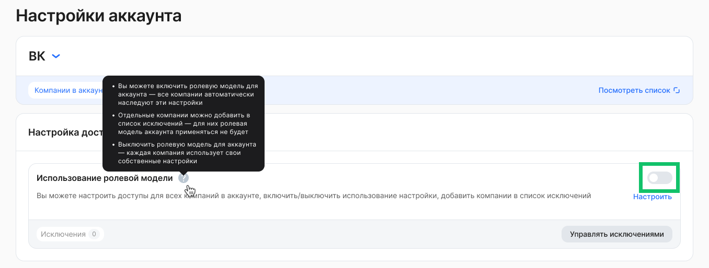

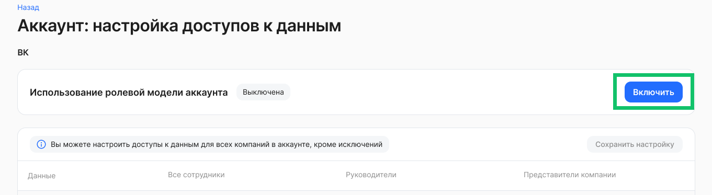

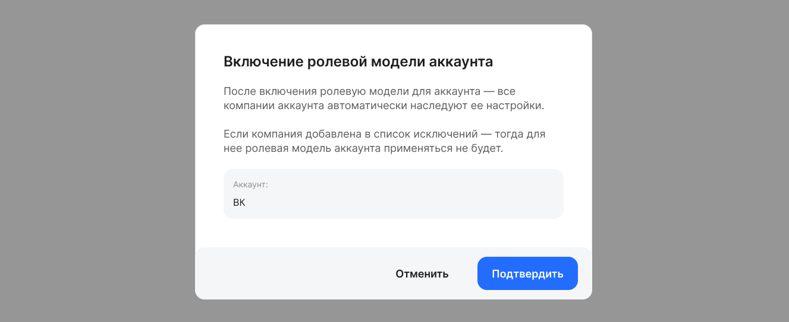

## Управление исключениями

Чтобы настроить ролевую модель для отдельной компании в аккаунте, нажмите кнопку **Управлять исключениями** на странице **Настройки аккаунта**.

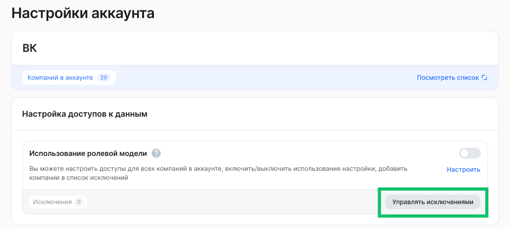

На странице **Управление исключениями**, если в список исключений ранее были добавлены компании, можно отредактировать настройки доступа для этих компаний. Для этого нажмите на строку с названием компании в списке. 

Для добавления компании в список исключений нажмите кнопку **Добавить исключение**.

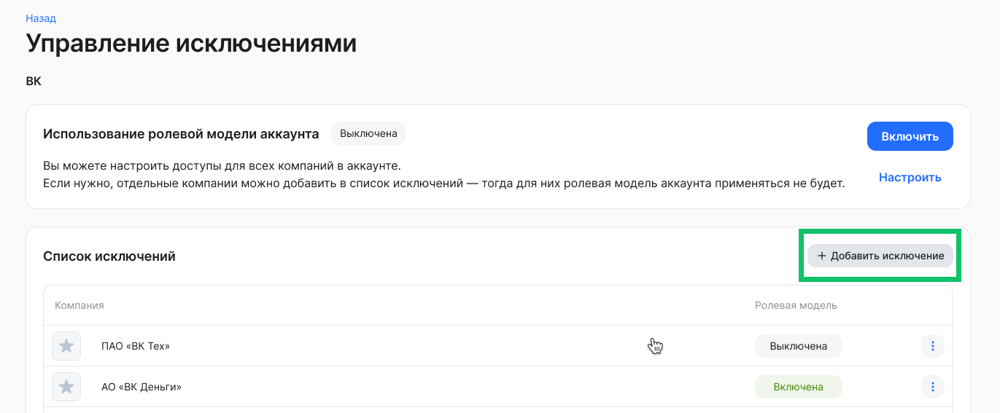

Добавьте компании из выпадающего списка и сохраните выбор. 

Чтобы настроить ролевую модель в компании, откройте необходимую компанию в списке исключений.

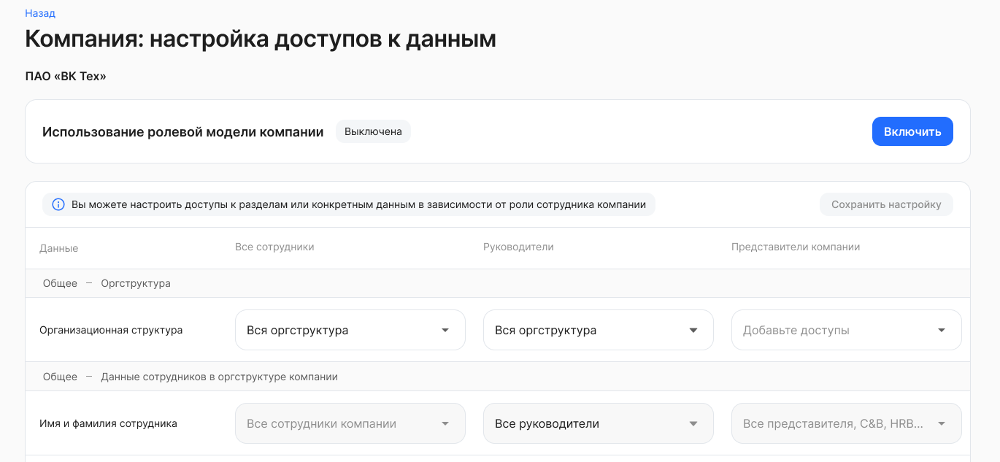

Настройка ролевой модели для компании описана в статье [Использование ролевой модели](/ru/admin_actions/settings/settings_comp/role_model#nastroyka_dostupov_k_dannym).

Чтобы удалить компанию из списка исключений, нажмите кнопку **Удалить компанию**.

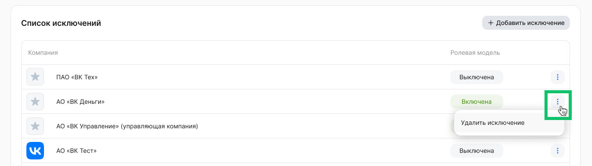

