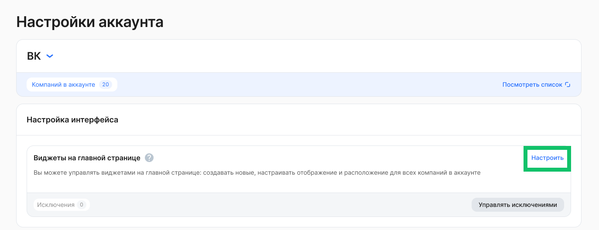
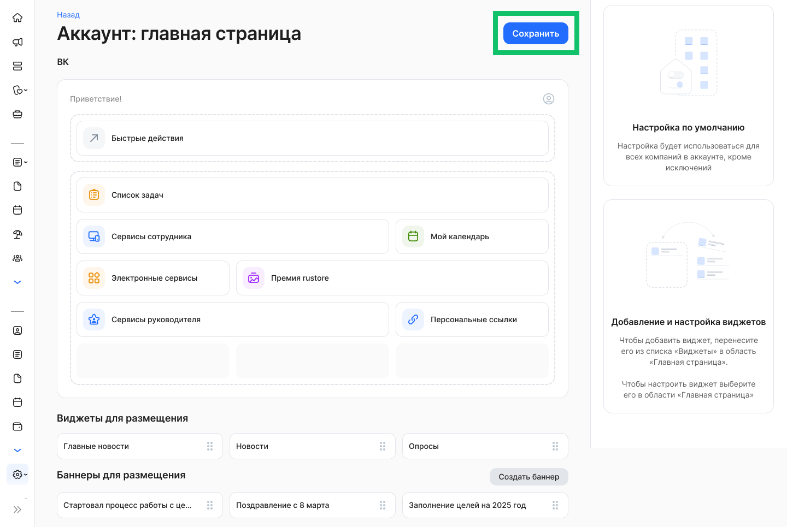
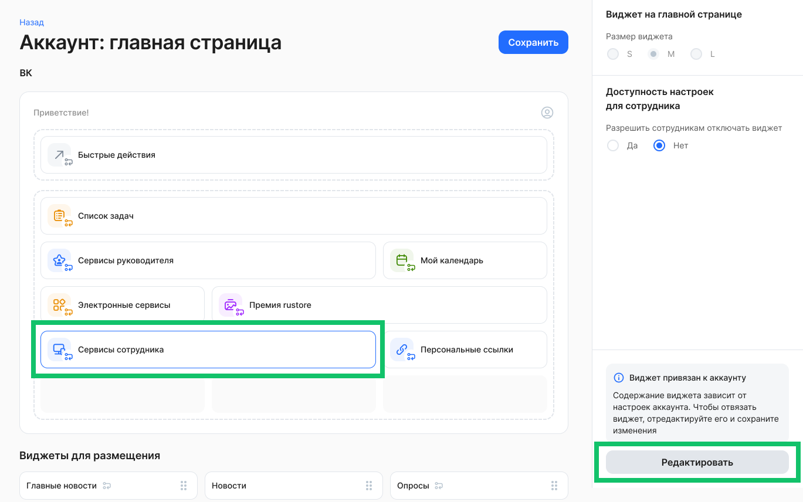
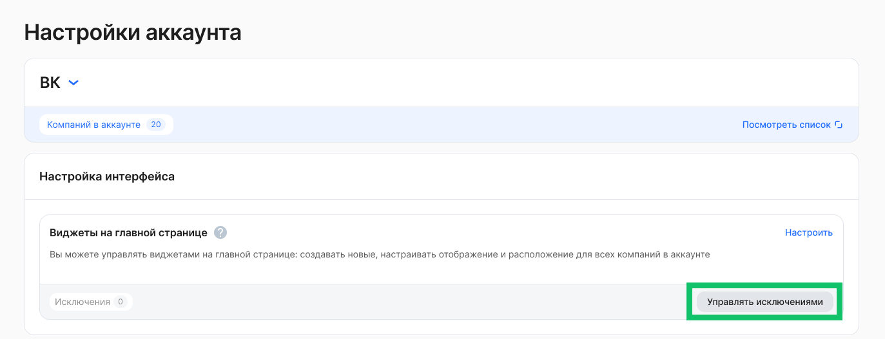
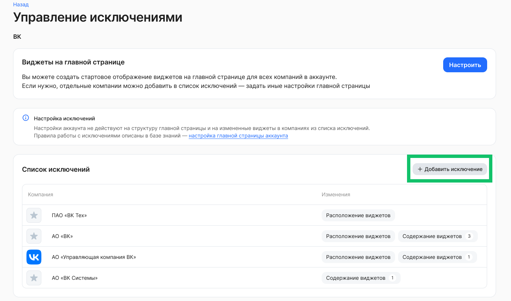
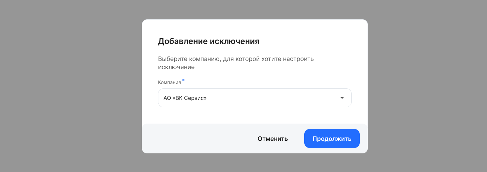
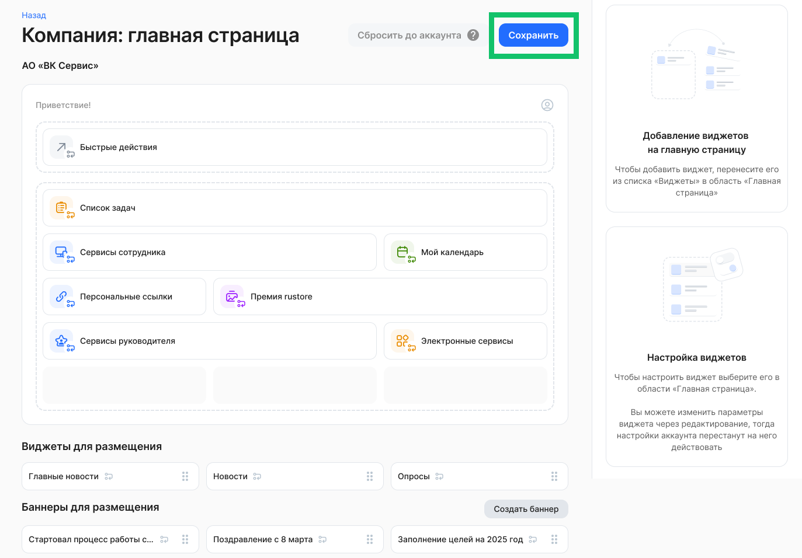
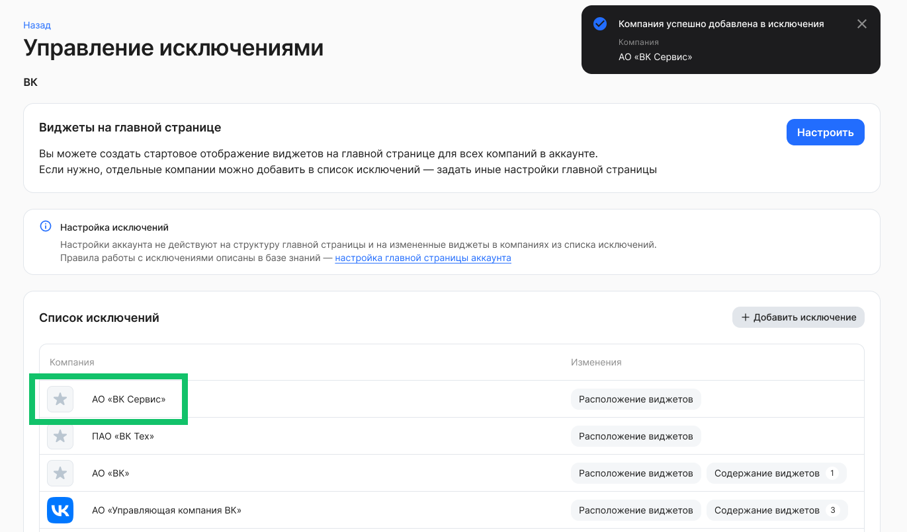
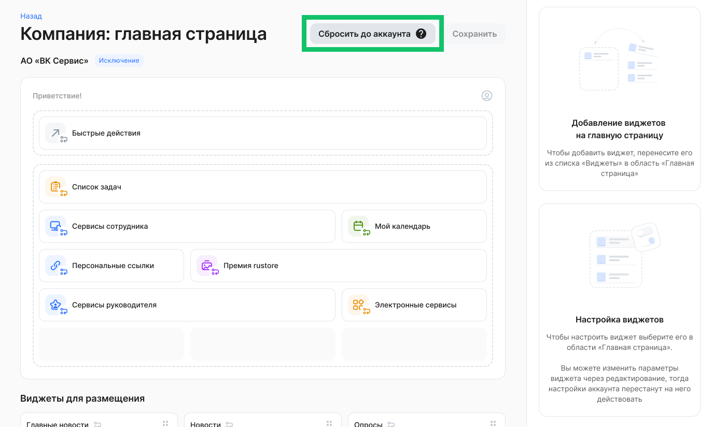

Настройки главной страницы аккаунта доступны для пользователя с ролью «Администратор» и «Администратор главной страницы» в разделе **Настройки →** **Настройки аккаунта**. 

## Настройка виджетов главной страницы

<info>

Если необходимые виджеты отсутствуют в разделе **Настройки аккаунта → Виджеты на главной странице**, обратитесь в [техническую поддержку VK HR Tek](/ru/hr/support/contact_channels) для их добавления

</info>

Чтобы добавить и настроить виджеты, которые будут отображаться на главной странице всех компаний в аккаунте, кроме компаний-исключений, выполните действия: 

1. Перейдите в раздел **Настройки → Настройки аккаунта**.   
2. В блоке **Настройка интерфейса → Виджеты на главной странице** нажмите кнопку **Настроить**.

 

3. Перенесите необходимые виджеты из блока **Виджеты для размещения** на верхнюю область размещения объектов.  
4. При необходимости перенесите баннеры из блока **Баннеры для размещения** на верхнюю область размещения объектов.  
5. Вы можете сохранить изменения, если настройка расположения объектов на главной странице завершена.

 

6. Чтобы настроить доступность виджета для сотрудника, а также размер виджета (настройка доступна не для всех виджетов из списка), нажмите на виджет в области размещения и установите нужные настройки в правой панели. Сохраните изменения.  
7. Чтобы настроить содержимое виджета или баннера, нажмите на этот объект в верхней области размещения и нажмите кнопку **Редактировать**.

 

8. Отредактируйте выбранный виджет и сохраните изменения.

## Добавление исключений

Чтобы добавить компанию, для которой настройки виджетов будут отличаться от настроек виджетов аккаунта, в список исключений:

1. Вернитесь в раздел **Настройки → Настройки аккаунта**.   
2. В блоке **Настройка интерфейса → Виджеты на главной странице** нажмите кнопку **Управлять исключениями**.

 

3. В списке исключений нажмите кнопку **Добавить исключение**.

 

4. Выберите одну компанию, которая входит в аккаунт.

 

5. Перенесите необходимые виджеты из блока **Виджеты для размещения** на верхнюю область размещения объектов.  
6. При необходимости перенесите баннеры из блока **Баннеры для размещения** на верхнюю область размещения объектов.  
7. Вы можете сохранить изменения, если настройка расположения объектов на главной странице завершена.

 

8. Чтобы отредактировать виджеты в компании-исключении, откройте необходимую компанию в списке.

 

9. Чтобы синхронизировать компанию, входящую в список исключений, с аккаунтом, нажмите кнопку **Сбросить до аккаунта** и сохраните действие. Функция будет доступна после выпуска обновления 2026.03.

