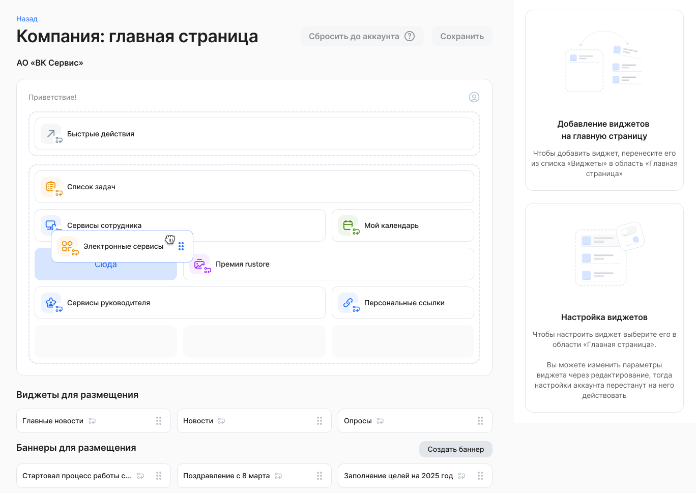
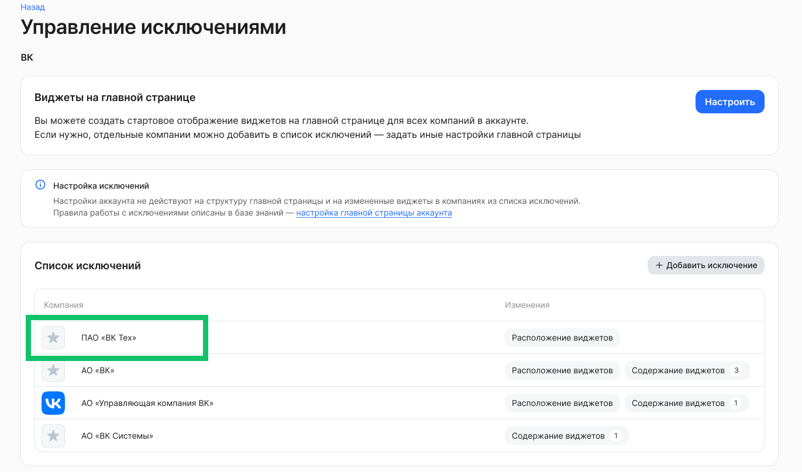
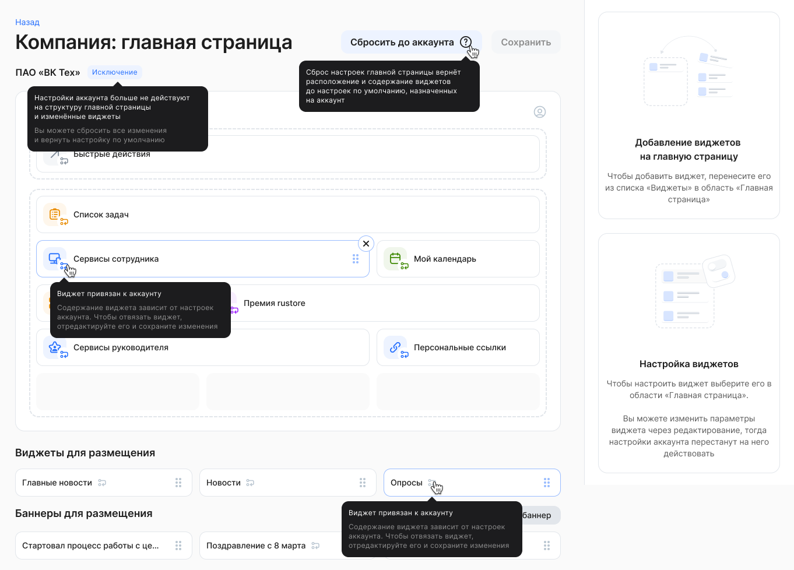
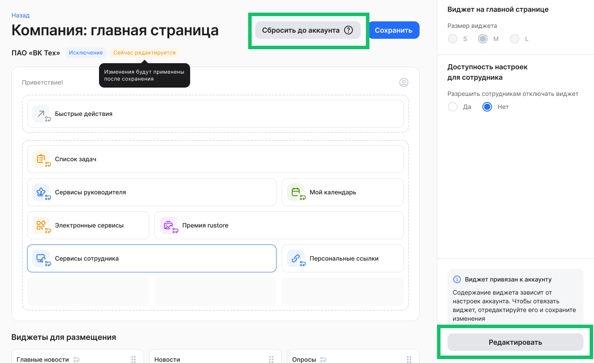
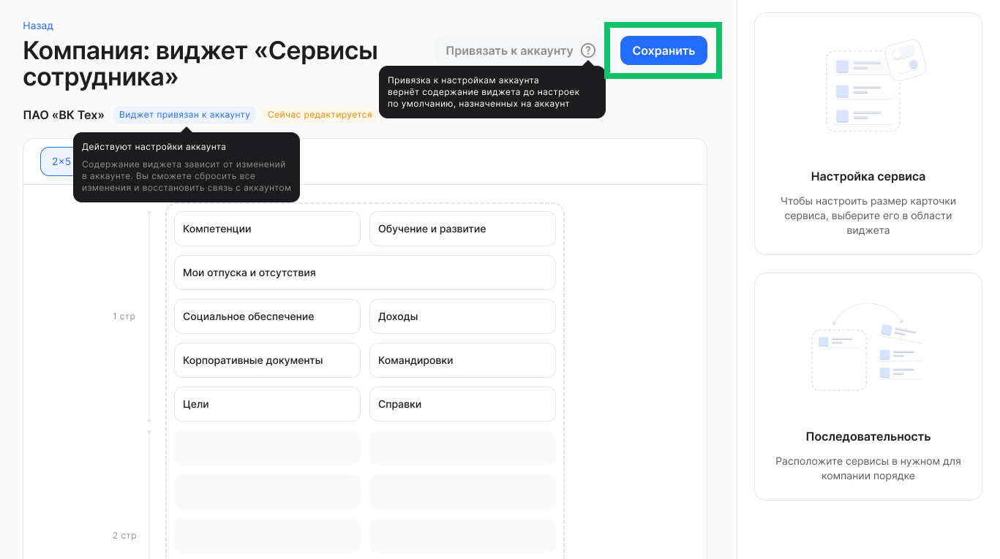
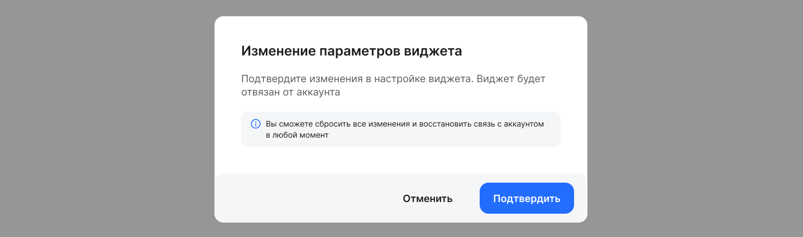
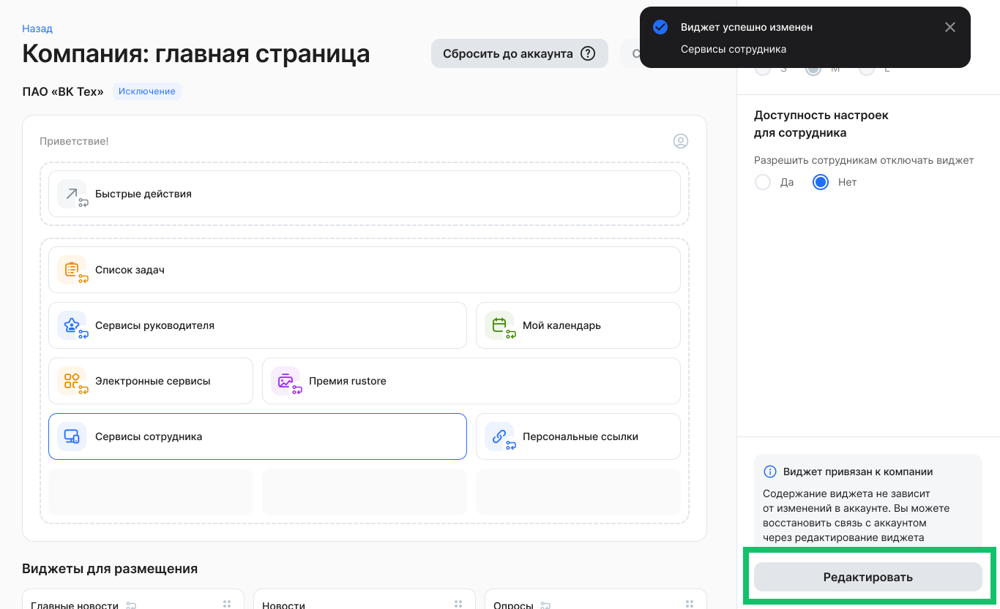
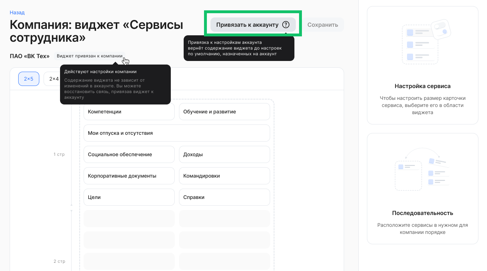
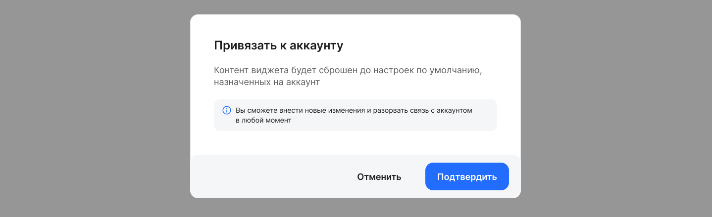

Настройки главной страницы аккаунта доступны для пользователя с ролью «Администратор» и «Администратор главной страницы» в разделе **Настройки →** **Настройки аккаунта**. 

## Настройка виджетов главной страницы

<info>

Если необходимые виджеты отсутствуют в разделе **Настройки аккаунта → Виджеты на главной странице**, обратитесь в [техническую поддержку VK HR Tek](/ru/hr/support/contact_channels) для их добавления

</info>

Чтобы добавить и настроить виджеты, которые будут отображаться на главной странице всех компаний в аккаунте, кроме компаний-исключений, выполните действия: 

1. Перейдите в раздел **Настройки → Настройки аккаунта**.   
2. В блоке **Настройка интерфейса → Виджеты на главной странице** нажмите кнопку **Настроить**.

 

3. Перенесите необходимые виджеты из блока **Виджеты для размещения** на верхнюю область размещения объектов.  
4. При необходимости перенесите баннеры из блока **Баннеры для размещения** на верхнюю область размещения объектов.  
5. Вы можете сохранить изменения, если настройка расположения объектов на главной странице завершена.

 

6. Чтобы настроить доступность виджета для сотрудника, а также размер виджета (настройка доступна не для всех виджетов из списка), нажмите на виджет в области размещения и установите нужные настройки в правой панели. Сохраните изменения.  
7. Чтобы настроить содержимое виджета или баннера, нажмите на этот объект в верхней области размещения и нажмите кнопку **Редактировать**.

 

8. Отредактируйте выбранный виджет и сохраните изменения.

## Добавление исключений

Чтобы добавить компанию, для которой настройки виджетов будут отличаться от настроек виджетов, которые синхронизированы с аккаунтом, в список исключений:

1. Вернитесь в раздел **Настройки → Настройки аккаунта**.   
2. В блоке **Настройка интерфейса → Виджеты на главной странице** нажмите кнопку **Управлять исключениями**.

 

3. В списке исключений нажмите кнопку **Добавить исключение**.

 

4. Выберите одну компанию, которая входит в аккаунт.

 

5. Перенесите необходимые виджеты из блока **Виджеты для размещения** на верхнюю область размещения объектов.  
6. При необходимости перенесите баннеры из блока **Баннеры для размещения** на верхнюю область размещения объектов.  

 

7. Вы можете сохранить изменения, если настройка расположения объектов на главной странице завершена.

 

8. Чтобы отредактировать контент виджета в компании-исключении, откройте необходимую компанию в списке.

 

9. Чтобы синхронизировать расположение и контент виджетов компании, входящей в список исключений, с аккаунтом, нажмите кнопку **Сбросить до аккаунта** и сохраните действие. Компания перестанет быть исключением. Структура главной страницы и параметры всех виджетов вернутся к настройке по умолчанию.
Функция будет доступна после выпуска обновления 2026.03.

## Настройка виджета для компании-исключения

Для настройки расположения виджетов на главной странице компании-исключения:

1. Перейдите в раздел **Настройки аакаунта → Виджеты на главной странице**.
2. В блоке **Настройка интерфейса → Виджеты на главной странице** нажмите кнопку **Управлять исключениями**. 
3. Чтобы настроить и отредактировать виджеты в компании-исключении, откройте необходимую компанию в списке.

 

Рассмотрим настройку контента виджета и синхронизации виджета компании-исключения с аккаунтом на примере виджета **Сервисы руководителя**.

Для настройки виджета **Сервисы руководителя**:

1. Перенесите виджет **Сервисы руководителя** из блока **Виджеты для размещения** на основную область размещения виджетов.

 

2. Нажмите на виджет **Сервисы руководителя** и выберите значение для настройки доступности сотрудникам.
1. При необходимости сохраните изменения.
1. Чтобы вернуть расположение и содержание виджетов до настроек по умолчанию, назначенных на аккаунт, нажмите кнопку **Сбросить до аккаунта**.
1. Для изменения контента виджета нажмите кнопку **Редактировать**.

 

5. Перенесите необходимый сервис из блока **Сервисы** на область размещения и установите любой размер карточки сервиса. Также можно менять порядок сервисов на странице или удалять сервисы со страницы, тогда они снова появятся в блоке **Сервисы**.

6. После произведенных перестановок сохраните изменения и подтвердите действие. После сохранения виджет будет отвязан от аккаунта.

Если виджет был изменен и отвязан от аккаунта, то иконка связи перед названием виджета пропадает. 

7. Чтобы повторно изменить контент виджета и/или настроить синхронизацию виджета компании с аккаунтом, нажмите кнопку **Редактировать**.

 

8. Чтобы вернуть содержание виджета до настроек по умолчанию, назначенных на аккаунт, нажмите кнопку **Привязать к аккаунту** и подтвердите действие.

