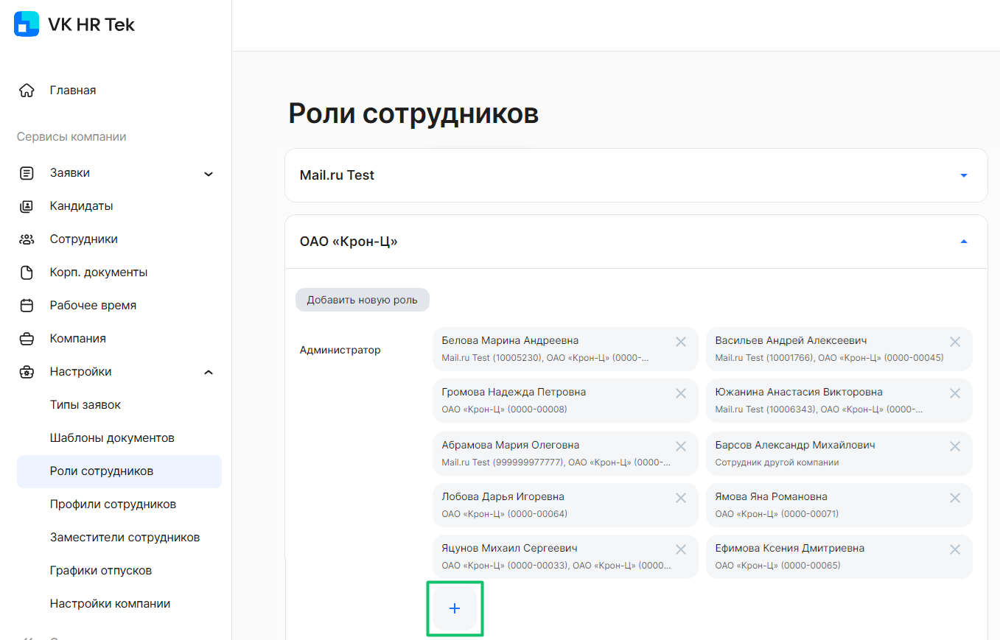
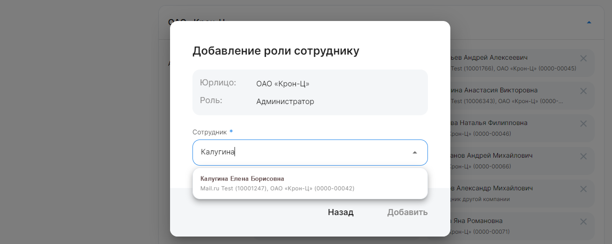
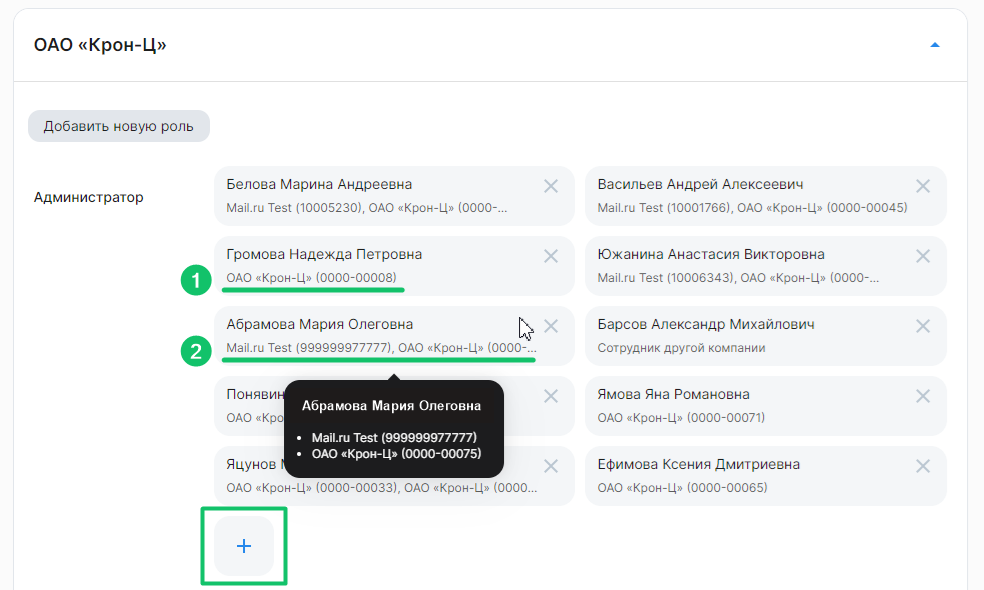
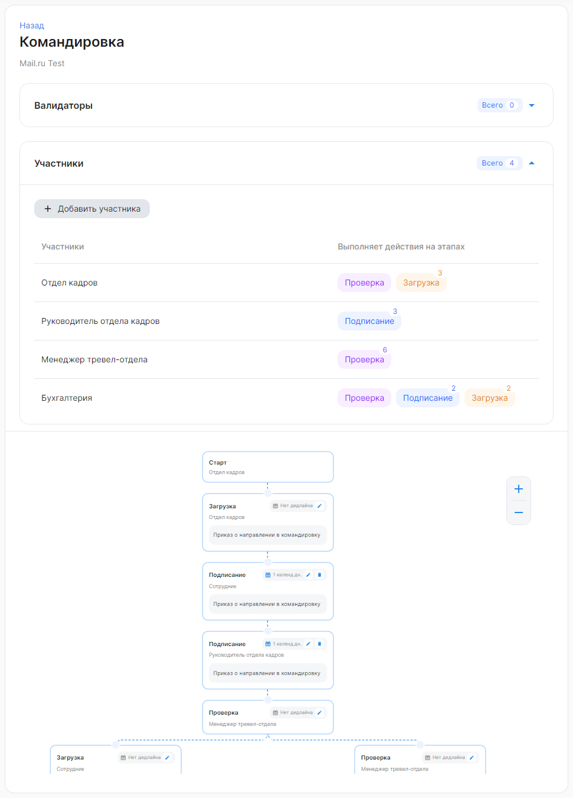

В разделе **Сервисы компании → Настройки → Роли сотрудников** перечислены все группы ролей и сотрудники, которым доступны данные роли. 

Чтобы добавить роль сотруднику, нажмите на кнопку  в нужной группе. Далее выберите сотрудника и нажмите на кнопку **Добавить**.

Если в компании подключены профили доступа, то при добавлении роли сотруднику можно выбрать один или несколько профилей из списка. Подробнее в [статье](/ru/admin_actions/access_profiles/add_role).

## **Аккаунт компаний**
Аккаунт необходимо использовать, когда компании объединены в холдинг или группу компаний, чтобы определенные функции сервиса работали в рамках аккаунта, а не в рамках компании. 

Если несколько юрлиц объединены в один аккаунт, то можно выдавать роли во всем аккаунте.

<info>
Чтобы объединить несколько компаний в один аккаунт, обратитесь к вашему менеджеру ВК.
</info>

Перейдите в **Сервисы компании → Настройки → Роли сотрудников** для добавления ролей сотрудникам компаний аккаунта. 

Карточки сотрудников содержат информацию:

1. Для одной компании, которая не входит в аккаунт — ФИО сотрудника, название компании, табельный номер.
1. Если компания состоит из нескольких юрлиц и входит в аккаунт — ФИО, перечисление названий компаний и табельных номеров сотрудника в компаниях аккаунта. 

При наведении на карточку можно просмотреть подсказку с полной информацией о юрлицах сотрудника.

При выборе сотрудника для назначения ему роли (группы), в выпадающем списке должны быть активные сотрудники всех компаний аккаунта, если текущая компания относится к какому-то аккаунту.

## **Создание новой роли**

Администратор может создавать новые роли. Для этого нажмите кнопку **Добавить новую роль**, которая расположена над списком всех ролей компании.

Далее укажите название новой роли, которой нет в списке существующих ролей. Если новая роль не привязана к родительской роли, то оставьте поле **Родительская роль** пустым. Нажмите кнопку **Добавить**. 

Роли могут быть созданы независимо друг от друга или иерархично. Например, роль «Администратор» или «Рекрутер» связывать по иерархии с другими родительскими ролями не нужно, а вот «Руководитель отдела кадров» может быть вышестоящей (родительской) ролью по отношению к «Отделу кадров».

Пользователь с родительской ролью будет видеть все заявки, доступные пользователям с подчиненной ролью. 

<warn>

Чтобы использовать роль в бизнес-процессе, нужно указать её исполнителем при редактировании типа заявки. Подробнее в [статье](/ru/admin_actions/events_types/managing_event_types/executors).

</warn>

## **Системные роли**

Каждый подключенный пользователь изначально и по умолчанию является сотрудником. Все доступные заявки, корп. документы, графики отпусков, расчетные листки сотрудник может просмотреть в Личном кабинете. 

Администратор сервиса может назначить одну или несколько ролей каждому подключенному сотруднику, чтобы в Кабинете компании пользователь смог обрабатывать заявки других сотрудников, создавать планирование графика отпусков или выполнять другие действия, предусмотренные выданными правами. 

В сервисе зафиксированы системные роли, для которых определен набор функций. Набор функций для таких ролей не изменяется.

|Системная роль|Доступные разделы|Описание роли|
| :- | :- | :- |
|Администратор|
Организационная структура

Настройки → Типы заявок

Настройки → Шаблоны документов

Настройки → Роли сотрудников

Настройки → Заместители сотрудников

Настройки → Настройки компании

Настройки → Типы ЭЦП
|
Добавление и редактирование подразделений компании с управленческой структурой.

Настройка дедлайнов, валидаторов и исполнителей в типах заявок.

Управление ролями сотрудников.

Добавление и редактирование заместителей для руководителей по отдельным бизнес-процессам.

Редактирование логотипа компании, настройка работы с оргструктурами компании, получение сотрудниками расчетных листков.

Редактирование типа УНЭП для всех и отдельных сотрудников компании.
|
|Рекрутер|Сервисы компании → Кандидаты|
Создание и отправка анкеты кандидата.

Отправка предложения о работе кандидату.

Получение личной информации и копий документов кандидата.
|
|Менеджер графика отпусков|
Настройки → Графики отпусков
|
Создание и удаление планирования графиков отпусков для сотрудников.

Настройка заполнения и согласования графиков отпусков.

Рассылка заявок планирования по сотрудникам.
|
|Редактор МЧД|
Настройки → Список МЧД

Настройки → Пользователи МЧД
|
Создание и удаление МЧД.

Создание отзыва МЧД.

Импорт и экспорт МЧД.
|
|Руководитель организации|
Настройки → Список МЧД

Настройки → Пользователи МЧД
|
Подписание МЧД.

Подписание отзыва МЧД.

Создание и удаление МЧД.

Создание отзыва МЧД.

Импорт и экспорт МЧД.
|

## **Функциональные роли**

Роли «Отдел кадров», «Бухгалтерия», «Директор» и остальные роли, предусмотренные в компании, настраиваются и получают свои права в зависимости от того, на каком этапе и в каком бизнес-процессе они указаны.

Например, в бизнес-процессе «Командировка» исполнителями на этапах являются роли «Отдел кадров», «Руководитель отдела кадров», «Бухгалтерия» и «Менеджер тревел-отдела». Поэтому чтобы сотрудники смогли обрабатывать заявки с командировками, Администратор назначает необходимые роли конкретным сотрудникам.

 

Согласующий руководитель не выделяется в отдельную роль, а получает права на основе организационной структуры, которая была настроена в модуле 1С или в веб-сервисе.