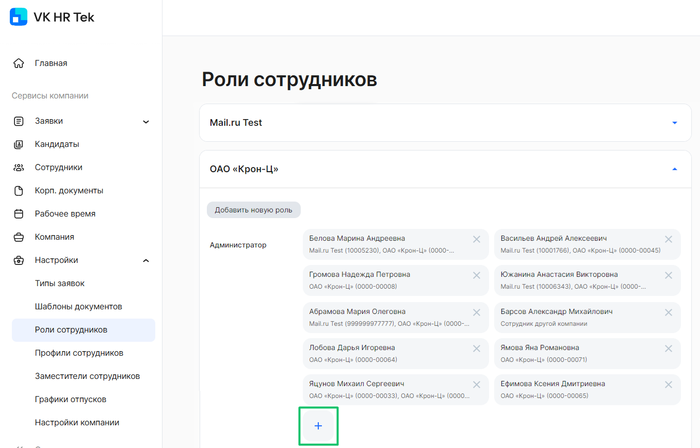
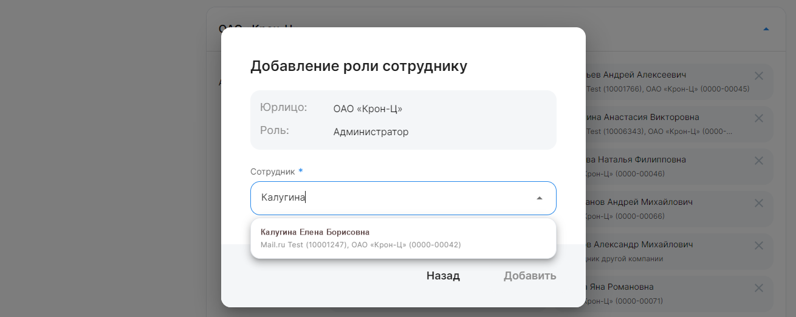
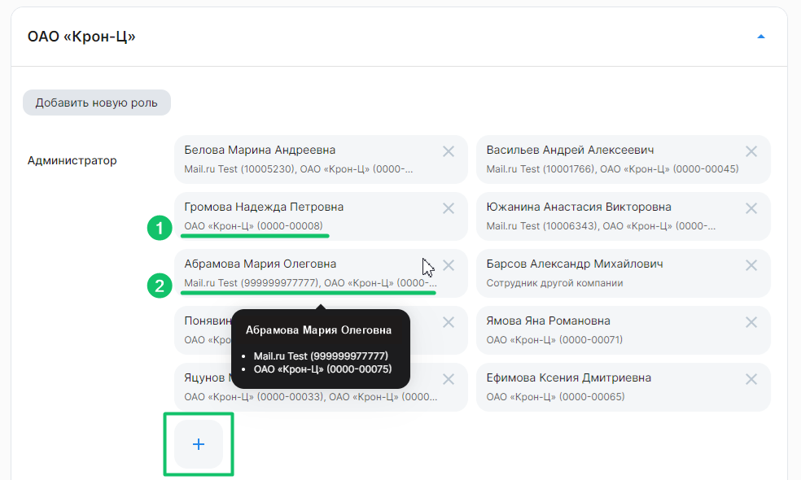
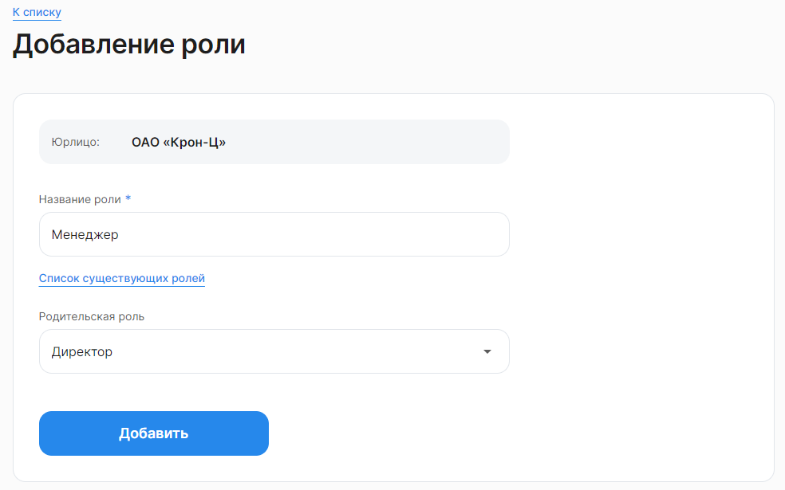
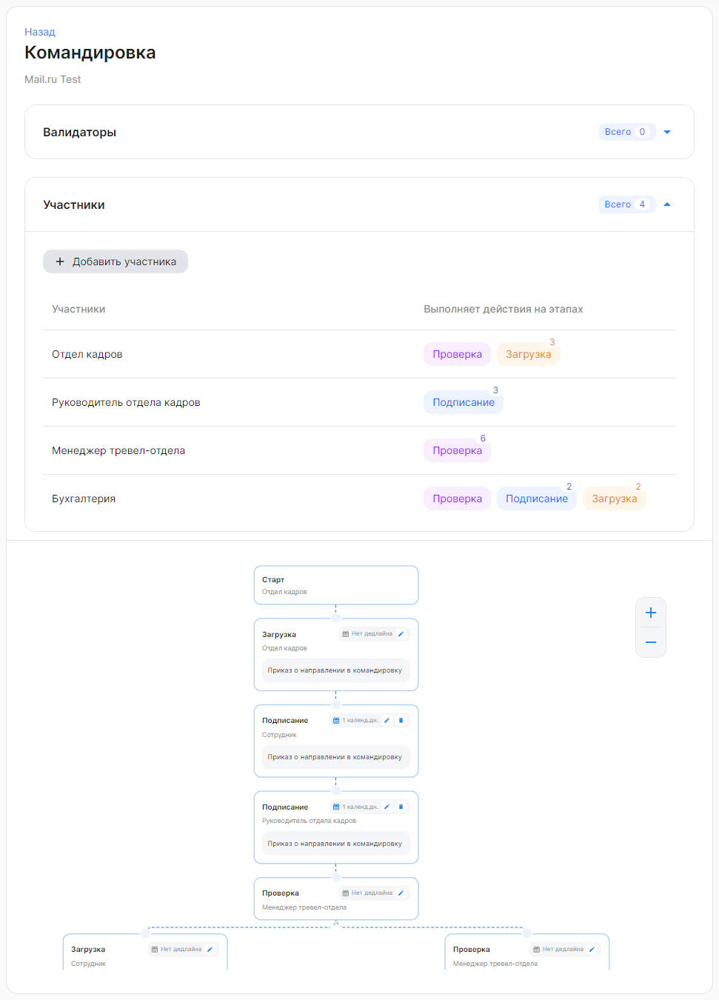

В разделе **Сервисы компании → Настройки → Роли сотрудников** перечислены все группы ролей и сотрудники, которым доступны данные роли. 

Чтобы добавить роль сотруднику, нажмите на кнопку  в нужной группе. Далее выберите сотрудника и нажмите на кнопку **Добавить**.

Если в компании подключены профили доступа, то при добавлении роли сотруднику можно выбрать один или несколько профилей из списка. Подробнее в [статье](/ru/admin_actions/access_profiles/add_role).

При увольнении сотрудника хотя бы из одной компании (даже тестовой) все выданные ему роли автоматически сбрасываются.

Если у сотрудника несколько табельных номеров, то для работы в веб-сервисе этот сотрудник должен обратиться к администратору за выдачей ролей внутри своей компании для их повторного назначения.

## **Аккаунт компаний**
Аккаунт необходимо использовать, когда компании объединены в холдинг или группу компаний, чтобы определенные функции сервиса работали в рамках аккаунта, а не в рамках компании. 

Если несколько юрлиц объединены в один аккаунт, то можно выдавать роли во всем аккаунте.

<info>
Чтобы объединить несколько компаний в один аккаунт, обратитесь к менеджеру внедрения VK HR Tek
</info>

Перейдите в **Сервисы компании** → **Настройки** → **Роли сотрудников** для добавления ролей сотрудникам компаний аккаунта. 

Карточки сотрудников содержат информацию:

1. Для одной компании, которая не входит в аккаунт — ФИО сотрудника, название компании, табельный номер.
1. Если компания состоит из нескольких юрлиц и входит в аккаунт — ФИО, перечисление названий компаний и табельных номеров сотрудника в компаниях аккаунта. 

При наведении на карточку можно просмотреть подсказку с полной информацией о юрлицах сотрудника.

При выборе сотрудника для назначения ему роли (группы), в выпадающем списке должны быть активные сотрудники всех компаний аккаунта, если текущая компания относится к какому-то аккаунту.

## **Создание новой роли**

Администратор может создавать новые роли. Для этого нажмите кнопку **Добавить новую роль**, которая расположена над списком всех ролей компании.

Далее укажите название новой роли, которой нет в списке существующих ролей. Если новая роль не привязана к родительской роли, то оставьте поле **Родительская роль** пустым. Нажмите кнопку **Добавить**. 

Роли могут быть созданы независимо друг от друга или иерархично. Например, роль «Администратор» или «Рекрутер» связывать по иерархии с другими родительскими ролями не нужно, а вот «Руководитель отдела кадров» может быть вышестоящей (родительской) ролью по отношению к «Отделу кадров».

Пользователь с родительской ролью будет видеть все заявки, доступные пользователям с подчинённой ролью. 

<warn>

Чтобы использовать роль в бизнес-процессе, нужно указать её исполнителем при редактировании типа заявки. Подробнее в [статье](/ru/admin_actions/events_types/managing_event_types/executors)

</warn>

## **Системные роли**

Администратор сервиса может назначить одну или несколько ролей каждому подключенному сотруднику, чтобы в Кабинете компании пользователь смог обрабатывать заявки других сотрудников, создавать планирование графика отпусков или выполнять другие действия, предусмотренные выданными правами. 

Каждому подключенному к системе пользователю по умолчанию назначается роль **Сотрудник**. Все доступные заявки, корп. документы, графики отпусков, расчётные листки сотрудник может просмотреть в Личном кабинете. 

Роль **Сотрудник** даёт возможность доступа к следующим разделам системы:

- **Сервисы сотрудника** → **Профиль сотрудника**;
- **Сервисы сотрудника** → **Список заявок**;
- **Сервисы сотрудника** → **Корпоративные документы**;
- **Сервисы сотрудника** → **Расчетные листки**;
- **Сервисы сотрудника** → **Мой календарь**.

В сервисе зафиксированы системные роли с определённым и неизменным набором доступных действий.

|Системная роль|Доступные разделы|Описание прав роли|
| :- | :- | :- |
|Рекрутер|
Кандидаты

Сотрудники

 Корпоративные документы

 Заявки:  &bull; все заявки,  &bull; в бумагу |
Управление заявками, к которым есть доступ

Управление Корпоративными документами 

Доступ в раздел **Сотрудники**

Управление модулем работы с кандидатами:
 &bull; создание, редактирование или отмена анкет кадидатов;   &bull; просмотр списка активных и завершённых анкет;   &bull; фильтрация списка анкет;   &bull; скачивание документов, загруженных кандидатом;   &bull; скачивание отчёта по изменениям в заявке, в формата *.pdf* |
|Администратор|
Сотрудники

 Корпоративные документы

 Заявки:  &bull; все заявки,  &bull; в бумагу

Настройки → Настройки компании:  &bull; редактирование логотипа;   &bull; часовой пояс;   &bull; получение сотрудниками расчётных листков;   &bull; Сотрудники → доступ к заявке сразу после создания;  &bull; Сотрудники → доступ к скачиванию корп. документов;   &bull; обновление заявок при смене руководителя;    &bull; работа с оргструктурами;   &bull; работа с обособленными подразделениями в оргструктуре;    &bull; валидация СМЭВ по типам ошибок;   &bull; использование ролевой модели;   &bull; профили доступа;   &bull; уровень согласования для руководителя подразделения;   &bull; юридическая информация;   &bull; виджеты на главной странице;   &bull; виджет «Ближайшая задача»

Настройки → Типы заявок

Настройки → Шаблоны документов

Настройки → Роли сотрудников

Настройки → Профили сотрудников (если в настройках  компании включена настройка **Профили доступа**)

Настройки → Заместители сотрудников

Настройки → Типы ЭЦП
|
Управление заявками, к которым есть доступ

Управление Корпоративными документами

Доступ в раздел **Сотрудники**

Создание Универсального процесса

Управление настройками компании

Настройка типов заявок

Настройка шаблонов документов

Управление группами компании

Назначение заместителей руководителям

Настройка типов ЭП
|
|Менеджер графиков отпусков|
Сотрудники

 Корпоративные документы

 Заявки:  &bull; все заявки,  &bull; в бумагу

Графики отпусков

Настройки → Графики отпусков
|
Управление заявками, к которым есть доступ

Управление Корпоративными документами

Доступ в раздел **Сотрудники**

Управление графиками отпусков:   &bull; просмотр всех графиков отпусков;  &bull; фильтрация графиков отпусков;   &bull; создание нового планирования;  &bull; скачивание отчета по графикам отпусков с учетом фильтрации, в формата *.xlsx*
|
|Редактор МЧД|
Сотрудники

 Корпоративные документы

 Заявки:  &bull; все заявки,  &bull; в бумагу

Настройки → Список МЧД

Настройки → Пользователи МЧД
|
Управление заявками, к которым есть доступ

Управление Корпоративными документами

Доступ в раздел **Сотрудники**

Управление МЧД
|
|Администратор главной страницы|
Сотрудники

Корпоративные документы

 Заявки:  &bull; все заявки,  &bull; в бумагу

Настройки → Настройки компании:  &bull; виджеты на главной странице;  &bull; боковая панель навигации
Просмотр всех настроек компании

Настройка блока навигации
|
Управление заявками, к которым есть доступ

Управление Корпоративными документами

Доступ в раздел **Сотрудники**

Управление виджетами на главной странице

Настройка боковой панели навигации

Настройка блока навигации
|
|Менеджер раздела отсутствий|
Сотрудники

Рабочее время

Корпоративные документы

 Заявки:  &bull; все заявки,  &bull; в бумагу
|
Управление заявками, к которым есть доступ

Управление Корпоративными документами

Доступ в раздел **Сотрудники**
Управление разделом **Рабочее время**

|
|Администратор модуля **Портал** (при подключенных социальных  сервисах) в рамках привязанных  компаний или аккаунта|
Социальные сервисы:  &bull; Новости,   &bull; Категории,   &bull; Опросы,   &bull; Администраторы
|
Управление группами пользователей по всем портальным сервисам

Создание объектов в сервисах (новости, опросы, сообщества, категории по всем сервисам)

Управление комментариями

Управление виджетом **Главные новости**:  &bull; закрепление новостей в виджете **Главные новости** (в рамках привязанных компаний или аккаунта);  &bull; выстраивание последовательности новостей в отображаемом виджете на главной странице;  &bull; закрепление одной новости, как супер главной

Управление виджетом **Лента публикаций**:  &bull; закрепление новости/поста в виджете **Лента публикаций**. Закрепление новости возможно только  при включенном сервисе **Новости** 
|
|Менеджер сервиса **Новости** (при подключеннном сервисе  **Новости**) в рамках привязанных  компаний или аккаунта|
Социальные сервисы:   &bull; Администраторы: Новости
|
Добавление или удаление ролей:   &bull; менеджер сервиса **Новости**,   &bull; автор новостей,   &bull; менеджер виджета **Главные новости**,   &bull; менеджер виджета **Лента публикаций**
|
|Автор новостей (при подключенном сервисе  **Новости**)|
Социальные сервисы:  &bull; Новости,   &bull; Категории
|
Управление новостями: создание, редактирование, удаление новости

Управление комментариями к новостям

Управление новостными категориями:  &bull; создание новой категории;  &bull; редактирование категории;  &bull; удаление категории
|
|Менеджер сервиса **Опросы** (при подключенном сервисе  **Опросы**)|
Социальные сервисы:   &bull; Администраторы: Опросы
|
Добавление или удаление ролей:   &bull; менеджер сервиса **Опросы**,   &bull; автор опросов.
|
|Автор опросов (при подключенном сервисе  **Опросы**)|
Социальные сервисы:  &bull; Опросы,   &bull; Категории
|
Управление опросами: создание, редактирование, удаление опроса

Управление категориями:  &bull; создание новой категории;  &bull; редактирование категории;  &bull; удаление категории
|
|Менеджер сервиса **Сообщества** (при подключенном сервисе  **Сообщества**)|
Социальная жизнь → Сообщества

Социальная жизнь → Лента

Социальные сервисы:   &bull; Администраторы: Сообщества,   &bull; Категории
|
Добавление или удаление ролей в рамках сервиса **Сообщества**

Управление категориями

Доступ к списку сообществ

Создание/редактирование сообществ
|
|Редактор виджета **Главные новости** (при подключеннном сервисе  **Новости**)|
Настройки компании → Виджеты на главной странице  (при наличии роли  «Администратор главной страницы»)

Настройки КЭДО → Контент виджетов
|
Редактирование контента виджета **Главные новости**
|
|Редактор ленты публикаций (при подключеннных сервисах  **Новости** и **Сообщества**)|
Настройки компании → Виджеты на главной странице  (при наличии роли  «Администратор главной страницы»)

Настройки КЭДО → Контент виджетов
|
Закрепление новости/поста в виджете **Лента публикаций**. Закрепление новости возможно только  при включенном сервисе **Новости** 
|

## **Функциональные роли**

Функциональные роли, предусмотренные в компании, настраиваются в зависимости от бизнес-процессов. 

Например, в бизнес-процессе «Командировка» исполнителями на этапах являются сотрудники с ролями «Отдел кадров», «Руководитель отдела кадров», «Бухгалтерия» и «Менеджер тревел-отдела». Администратор назначает необходимые роли конкретным сотрудникам, чтобы они могли обрабатывать заявки. 

 

Согласующий руководитель не выделяется в отдельную роль, а получает права в соответствии с организационной структурой, которая была настроена в модуле 1С или в веб-сервисе.