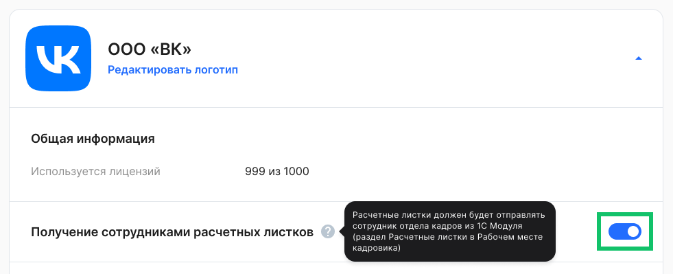
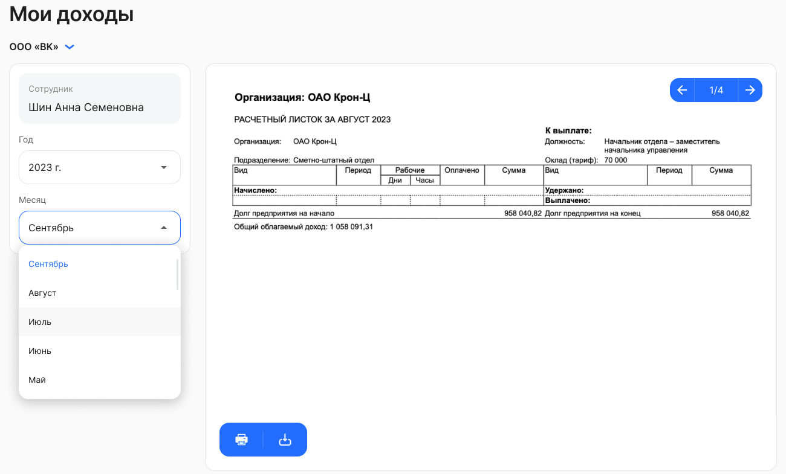

Компании могут отправлять расчетные листки своим сотрудникам. Отправкой листков управляет кадровый сотрудник в новом разделе модуля 1С:ЗУП [Публикация расчетных листков](/ru/1C/kedo_event/publication).

Подключить функцию получения расчетных листков может Администратор КЭДО в разделе **Сервисы компании → 
 Настройки →  Настройки компании**.

Для сотрудников отправленные им расчетные листки будут доступны в разделе **Сервисы сотрудника → Доходы** веб-сервиса и в мобильном приложении. Расчетные листки можно посмотреть по месяцам и годам, скачать или отправить на печать.

