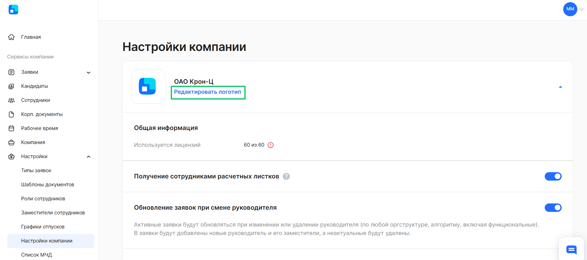
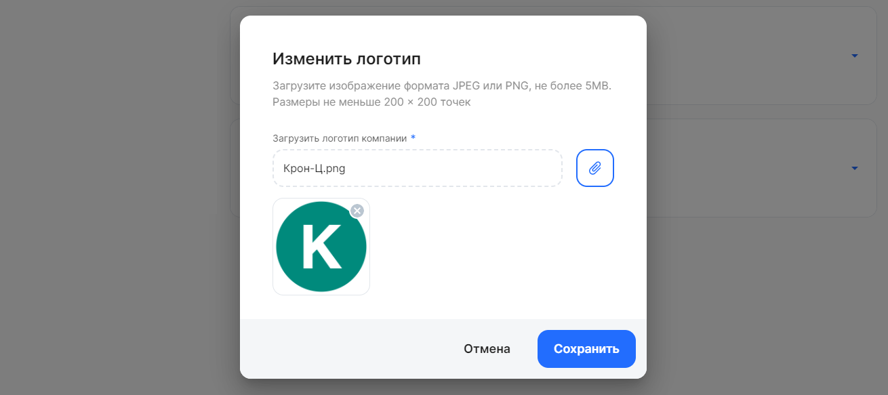

Если у компании к КЭДО подключено больше одного юрлица, то вы можете загрузить логотип для каждой из компаний. У сотрудников будет отображаться логотип компании, в котором они трудоустроены, а у представителей компании — только если группы в одном юрлице.

Если вы как представитель компании исполняете роли в разных юрлицах, то в ваших кабинетах будет отображаться логотип VK HR Tek. 

Чтобы добавить логотип компании:
1. Перейдите в **Сервисы компании → Настройки компании**. Нажмите на кнопку **Редактировать логотип** в блоке нужного юрлица.

2. Загрузите изображение формата JPEG или PNG, размером не более 5 МБ.
3. Нажмите на кнопку **Сохранить**.

