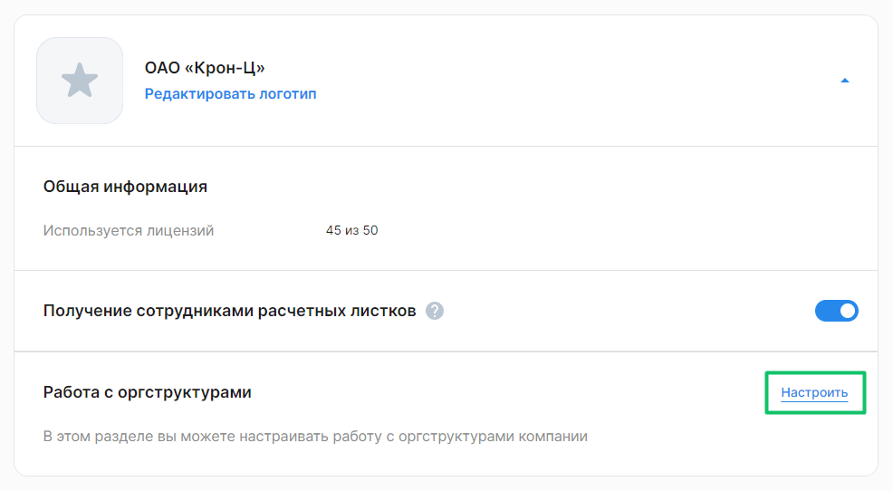
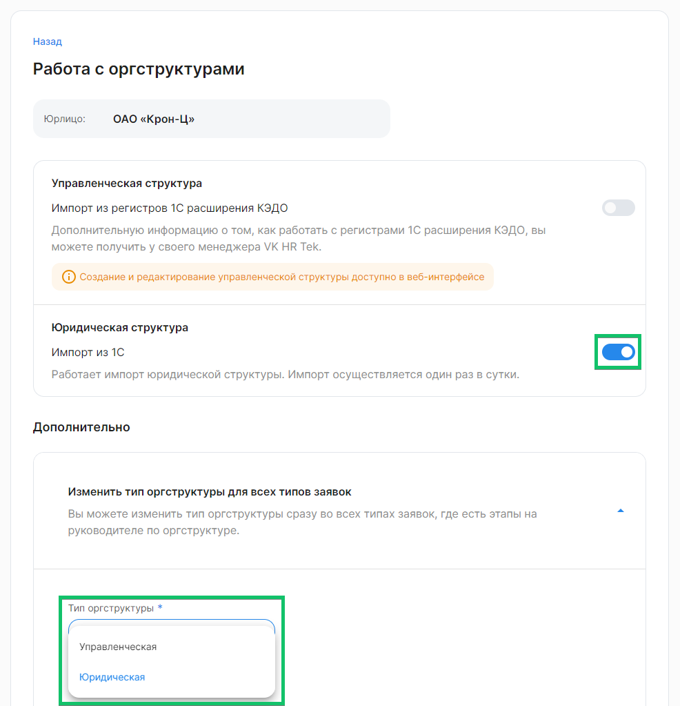
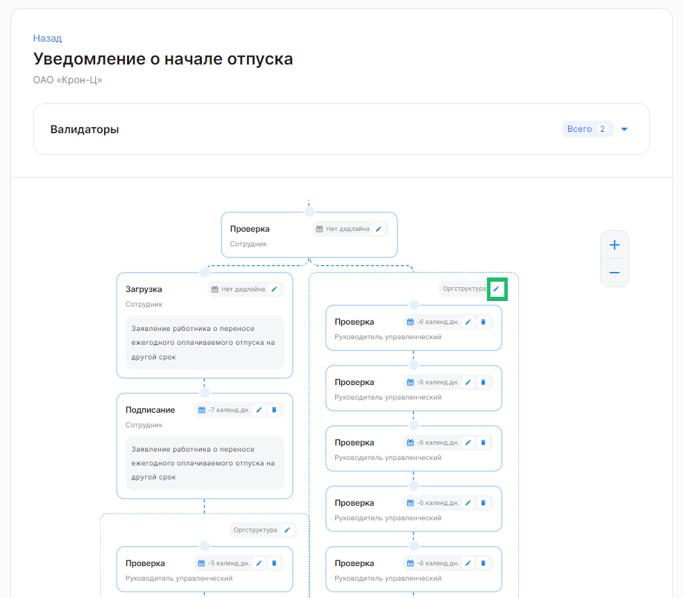
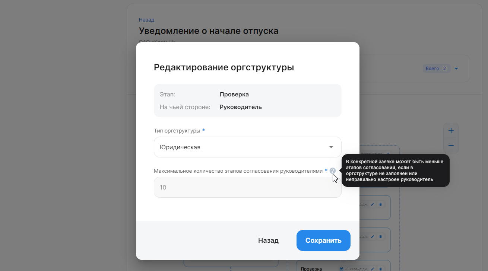

В сервисе VK HR Tek можно настроить маршрут согласования заявок одним из трех способов, чтобы заявка сотрудника перед тем, как попасть в работу к кадровому сотруднику, прошла согласование с руководителем(-ями). 
Возможные виды маршрутов согласований:
- юридическая оргструктура (штатное расписание – справочник «Структура предприятия»);
- управленческая оргструктура (необходимо заполнение регистров в расширении КЭДО);
- управленческая оргструктура (созданная в web-сервисе VK HR Tek, в разделе **Сервисы компании → Компания**).

Аналитики VK HR Tek прописывают вид оргструктуры в JSON бизнес-процесса, поэтому рекомендуем заранее определить маршрут согласований и сообщить его менеджеру VK HR Tek при интеграции КЭДО.

В разделе **Сервисы компании → Настройки → Настройки компании** можно настраивать импорт управленческой и юридической оргструктур из 1С. Для этого нажмите кнопку **Настроить** в блоке *Работа с оргструктурами*.

Чтобы включить импорт, активируйте переключатель для управленческой и/или юридической оргструктуры. Настройка доступна только компаниям с 1С интеграцией.

Обратите внимание, чтобы поменять управленческую структуру на юридическую и наоборот, необходимо включить импорт из 1С.

Менять тип оргструктуры можно как во всех типах заявок, так и в отдельном типе заявки, где есть этапы на руководителе по оргструктуре.

В первом случае, в блоке *Работа с оргструктурами → Дополнительно* нужно выбрать и подтвердить тип оргструктуры. 

Во втором случае, в разделе **Настройки → Типы заявок** нужно открыть тип заявки с оргструктурой и отредактировать тип оргструктуры. Во всех этапах измененной цепочки тип оргструктуры и руководителя изменится автоматически.

В обоих случаях тип оргструктуры не изменится в активных заявках, но будет использоваться во всех новых.

Если этап согласования проходит через руководителя подразделения 1-го/2-го/3-го уровня, то редактирование оргструктуры недоступно. Чтобы изменить на «согласование по оргструктуре», обратитесь в службу поддержки.