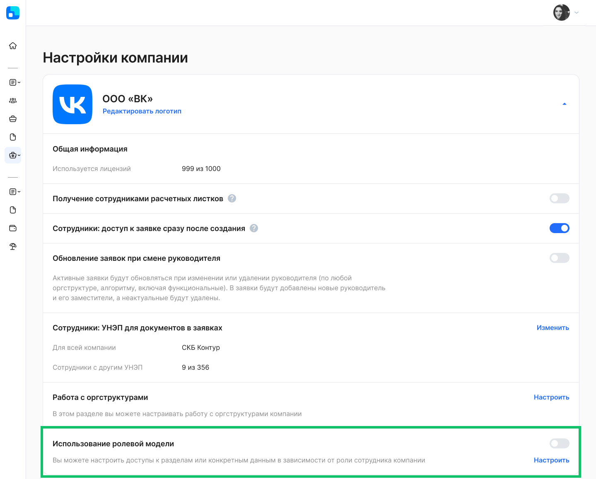
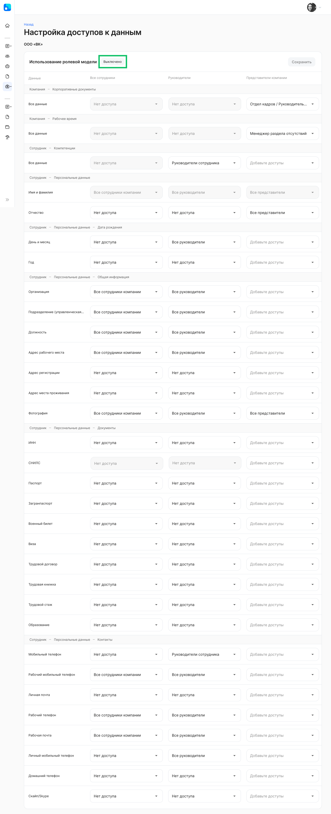
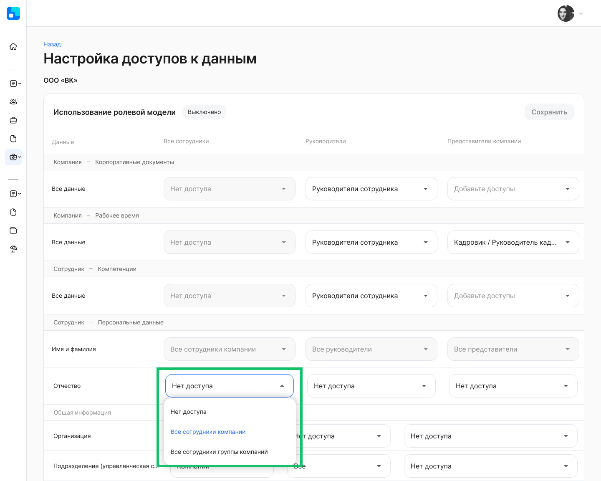
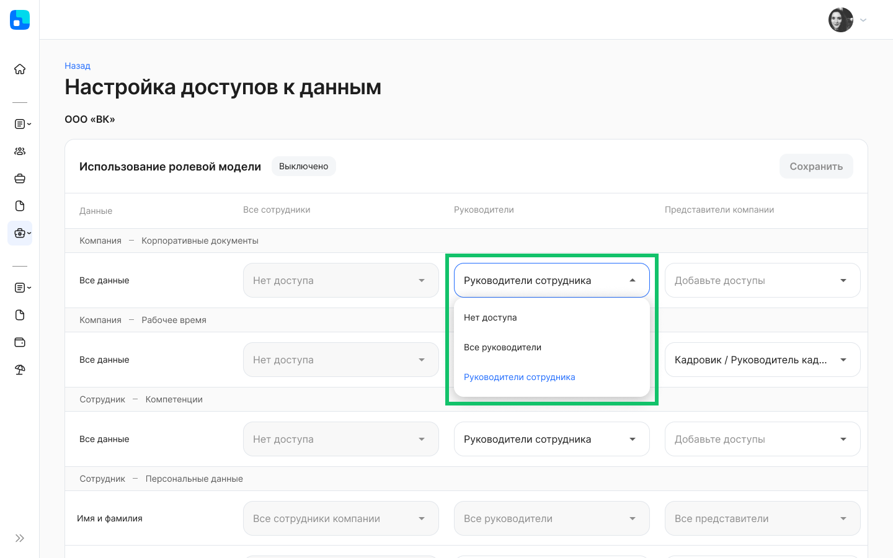
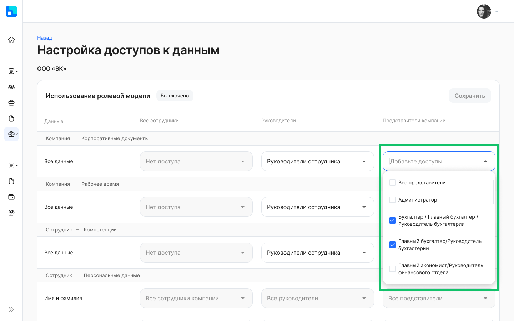
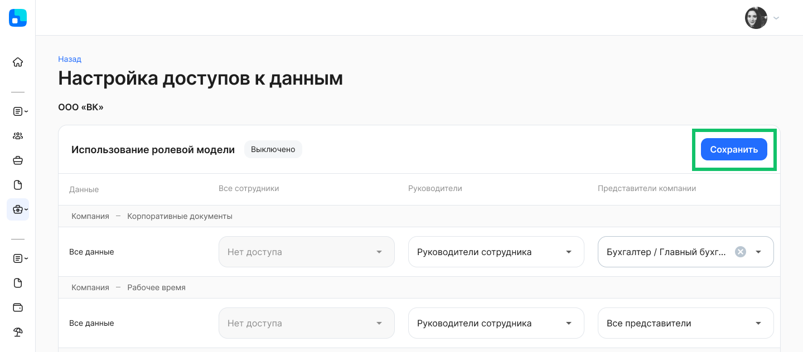
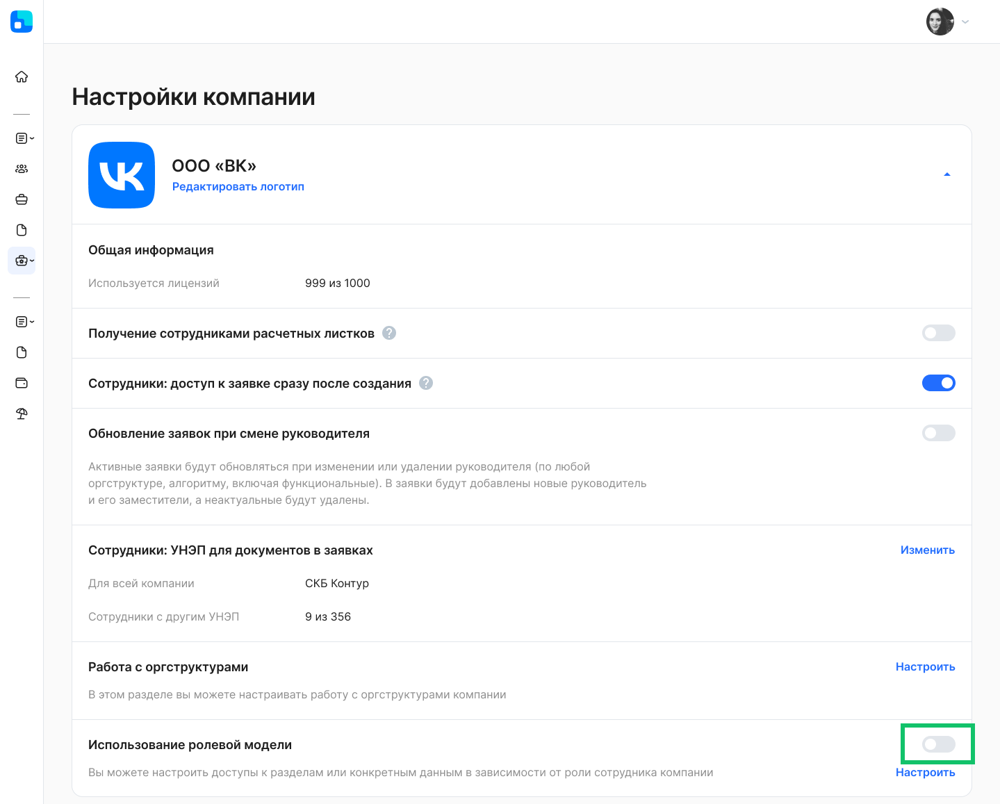
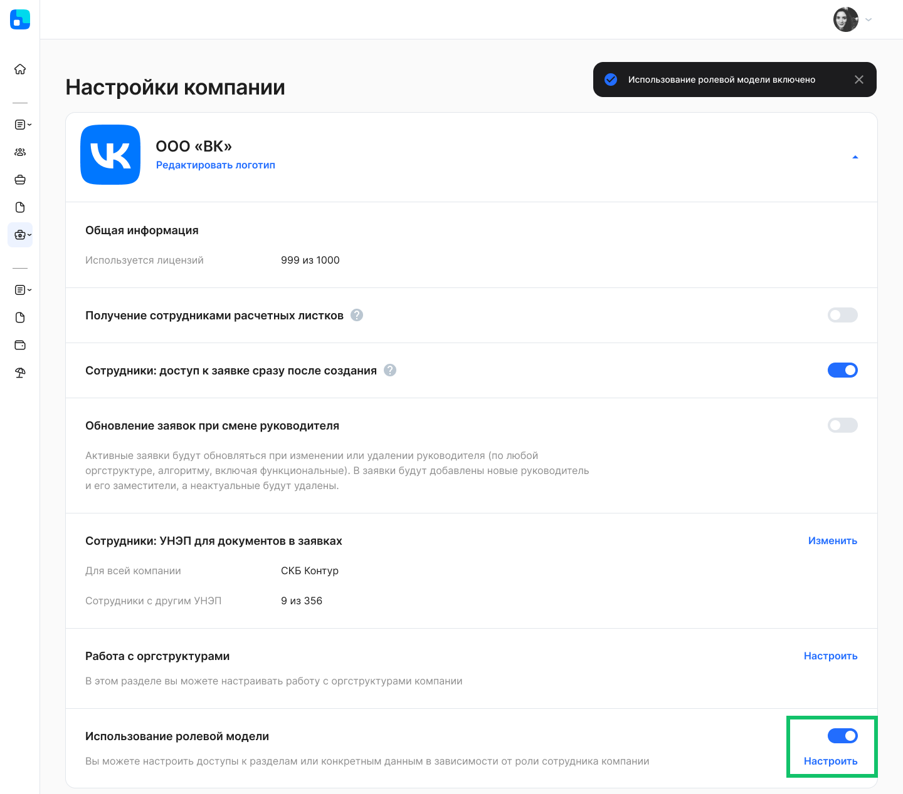
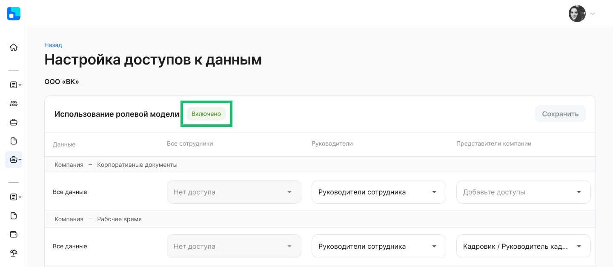

В **Сервисы компании → Настройки → Настройки компании** добавлена настройка «Использование ролевой модели». Пользователь с ролью «Администратор» может настроить доступ к разделам целиком или к конкретным данным в зависимости от роли сотрудника в компании.

## Настройка доступов к данным
Настройки можно редактировать, когда ролевая модель не используется (состояние **Выключено**), а затем включить уже настроенную модель. Для этого нажмите кнопку **Настроить**.

Доступы при выключенной ролевой модели установлены в соответствии с настройками доступа для ролей (групп) представителей компании.

По умолчанию сотрудникам, руководителям, представителям компании выданы следующие доступы к данным компании и сотрудника:

 

В таблице перечислены данные, к которым настраивается доступ, из следующих разделов сервиса VK HR Tek:

1. Общее — Оргструктура.
1. Общее — Данные сотрудников в оргструктуре компании.
1. Компания — Корпоративные документы (доступ целиком).
1. Компания — Рабочее время (доступ целиком).
1. Сотрудник — Компетенции (доступ целиком).
1. Сотрудник — Персональные данные (доступ к отдельным данным).

Некоторые данные из перечисленных разделов полностью недоступны для редактирования. Это связано с тем, что у пользователя нет роли для доступа к разделам на стороне компании.  

В рамках компании можно настроить доступ для следующих типов пользователей:

1. Сотрудники:
- все сотрудники компании — пользователи, у которых есть хотя бы один неуволенный сотрудник в компании;
- все сотрудники группы компаний — пользователи, у которых есть хотя бы один неуволенный сотрудник в любой компании аккаунта (если компания входит в группу компаний).

 

2. Руководители:
- все руководители — пользователи, которые являются руководителями по любому алгоритму;
- руководители сотрудника — пользователи, которые (по любому алгоритму) являются прямыми или выше по иерархии руководителями определенного сотрудника.

 

3. Представители компании:
- все представители компании — пользователи, у которых есть хотя бы одна роль в компании;
- представители определенной роли в компании. Если у роли есть родительская роль, то название роли в выпадающем списке выглядит: <Название группы / Название родительской группы>, например, Бухгалтер / Главный бухгалтер / Руководитель бухгалтерии. 

 

По завершении редактирования настроек нажмите на кнопку **Сохранить**.

## Включение ролевой модели
Чтобы включить настроенную ролевую модель, активируйте переключатель, а затем подтвердите действие.

 

Переключатель перейдет в активное состояние, и использование ролевой модели будет включено. 

 

Чтобы отключить использование ролевой модели, переведите переключатель в обратное направление.

После перехода по кнопке **Настроить**, вы увидите статус **Включено**.

 

<warn>

Настройка доступов к данным возможна как в состоянии **Включено**, так и **Выключено**. 

</warn>