Для корректной настройки виджетов пользователю должны быть добавлены роли «Администратор» и «Администратор главной страницы».

Для настройки расположения виджетов на главной странице, перейдите в раздел **Настройки компании → Виджеты на главной странице** и нажмите кнопку **Настроить**.

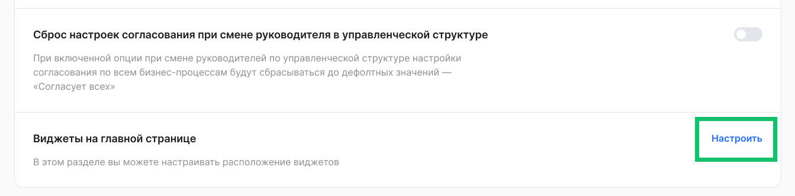

<info>

Если необходимые виджеты отсутствуют в разделе **Настройки компании → Виджеты на главной странице**, обратитесь в [техническую поддержку VK HR Tek](/ru/hr/support/contact_channels) для их добавления

</info>

## **Виджет «Быстрые действия»**
В блоке с быстрыми действиями можно оставить только те, которые действительно актуальны для вашей компании. Кроме того, вы можете разрешить сотрудникам **добавлять в этот блок свои собственные ссылки** — они будут сохраняться индивидуально для каждого пользователя.

Так быстрые действия можно настроить максимально гибко: общие ссылки задаёт компания, а персональные — сами сотрудники, подстраивая блок под свой рабочий процесс.

Для настройки виджета **Быстрые действия**: 

1. Перейдите в раздел **Настройки компании → Виджеты на главной странице** и нажмите кнопку **Настроить**.
1. Перенесите виджет **Быстрые действия** из блока **Виджеты** на основную область размещения виджетов.
1. Нажмите на виджет **Быстрые действия** и выберите значения для настроек доступности: 
- Разрешить сотрудникам отключать виджет.
- Разрешить сотрудникам добавлять собственные ссылки.
4. Нажмите кнопку **Редактировать**.

 

5\. Действие, которое было добавлено по умолчанию в список быстрых действий — **Создать заявку**. Перенесите необходимое действие из списка доступных в список быстрых действий, чтобы он отобразился в виджете. Также можно менять порядок действий внутри списка.

Чтобы добавить новые быстрые действия в список доступных, обратитесь в техническую поддержку VK HR Tek.

6\. После произведенных перестановок сохраните изменения.

## **Виджет «Список задач»**

В виджете **Список задач** собраны все задачи, где ожидается действие пользователя. В виджете собраны действия с обеих сторон, то есть пользователь сразу видит карточки, которые относятся к нему лично, как к сотруднику компании, так и те, которые он должен обработать как руководитель или представитель компании.

Для настройки виджета **Список задач**: 

1. Перейдите в раздел **Настройки компании → Виджеты на главной странице** и нажмите кнопку **Настроить**.
1. Перенесите виджет **Список задач** из блока **Виджеты** на основную область размещения виджетов.
1. Нажмите на виджет **Список задач** и выберите размер виджета и значение для настройки доступности сотрудникам.
1. Сохраните изменения. 

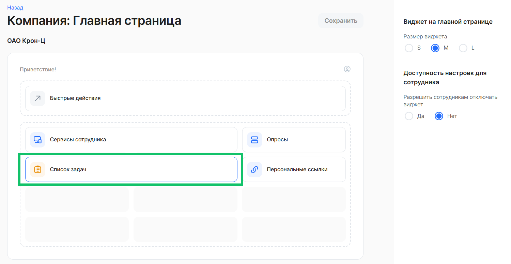

## **Виджет «Мой календарь»**

С помощью виджета **Мой календарь** пользователь быстро получает информацию о своем рабочем месяце — он видит свои фактические и запланированные на ближайший месяц отсутствия, может переключаться между месяцами.

Для настройки виджета **Мой календарь**: 

1. Перейдите в раздел **Настройки компании → Виджеты на главной странице** и нажмите кнопку **Настроить**.
1. Перенесите виджет **Мой календарь** из блока **Виджеты** на основную область размещения виджетов.
1. Нажмите на виджет **Мой календарь** и выберите значение для настройки доступности сотрудникам.
1. Сохраните изменения. 

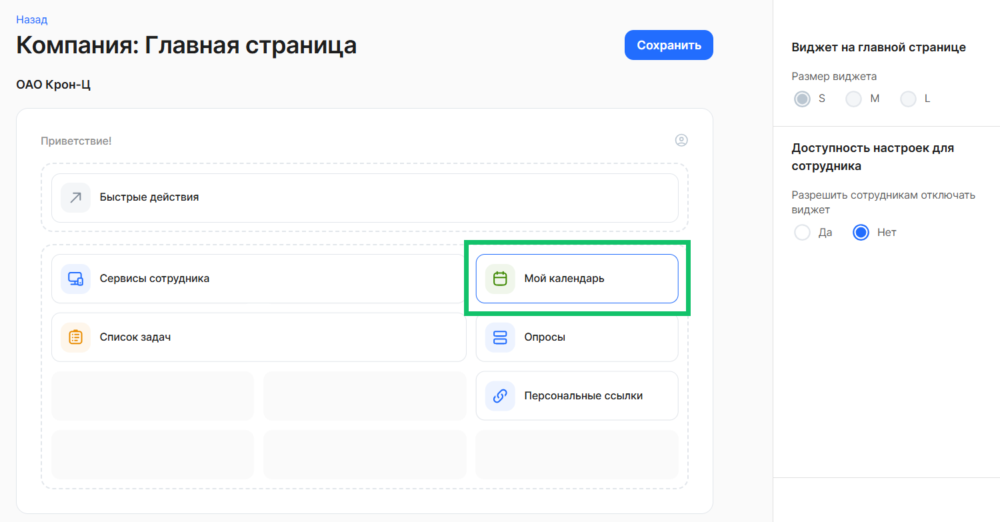

## **Виджет «Электронные сервисы»**

В виджете **Электронные сервисы** компания может разместить ссылки на другие внутренние сервисы, которые сотрудники и представители компании используют в своей работе.

Для настройки виджета **Электронные сервисы**: 

1. Перейдите в раздел **Настройки компании → Виджеты на главной странице** и нажмите кнопку **Настроить**.
1. Перенесите виджет **Электронные сервисы** из блока **Виджеты** на основную область размещения виджетов.
1. Нажмите на виджет **Электронные сервисы** и выберите размер виджета и значение для настройки доступности сотрудникам.
1. Сохраните изменения. 

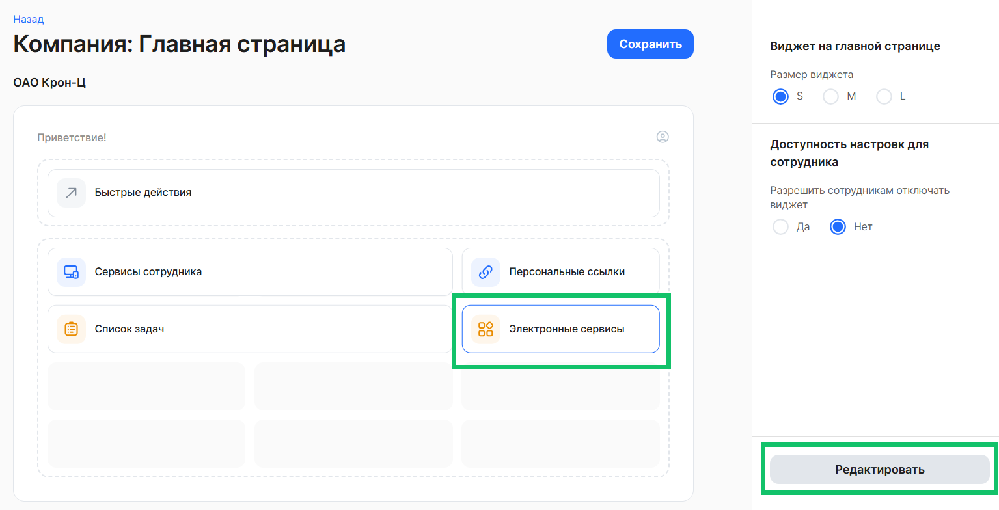

 

5. Для добавления/обновления ссылок в виджете нажмите кнопку **Редактировать**.
1. Нажмите кнопку **Добавить ссылку**. Появятся поля для заполнения: 
- **Название ссылки**.
- **Ссылка**.
- **Логотип**. Выберите изображение на своём компьютере.
- **Доступы**. Выберите один из вариантов: *Со стороны сотрудника*, *Со стороны компании*, *Руководители*, *Выбрать группы*.
- для выбранного варианта *Выбрать группы* появится поле **Группа**. 

7. При необходимости добавьте ещё одну ссылку.
8. Сохраните изменения. 

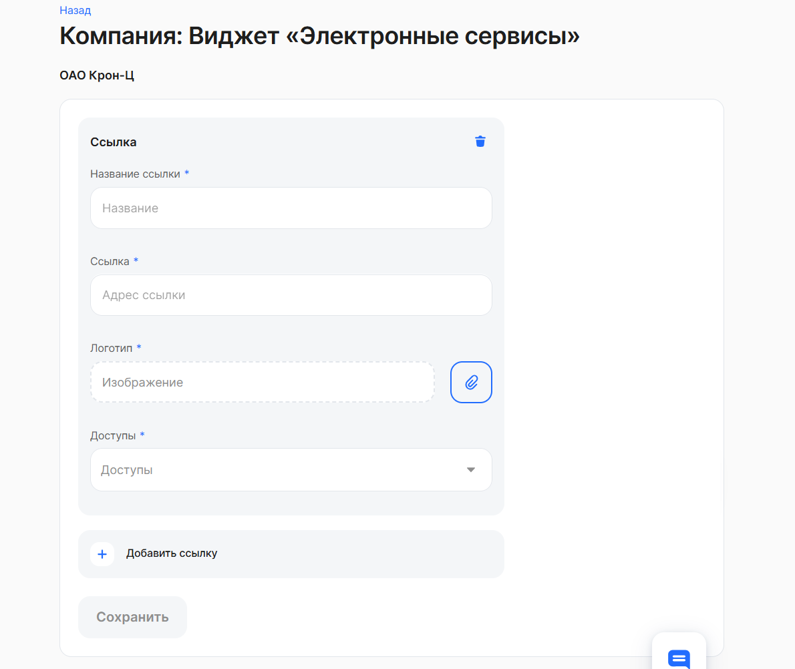

## **Виджет «Персональные ссылки»**

С помощью виджета **Персональные ссылки** пользователь может самостоятельно настроить ссылки на ежедневные рабочие задачи, которые будет удобно отслеживать на главной странице.

Для настройки виджета **Персональные ссылки**: 

1. Перейдите в раздел **Настройки компании → Виджеты на главной странице** и нажмите кнопку **Настроить**.
1. Перенесите виджет **Персональные ссылки** из блока **Виджеты** на основную область размещения виджетов.
1. Нажмите на виджет **Персональные ссылки** и выберите размер виджета и значение для настройки доступности сотрудникам.
1. Сохраните изменения. 

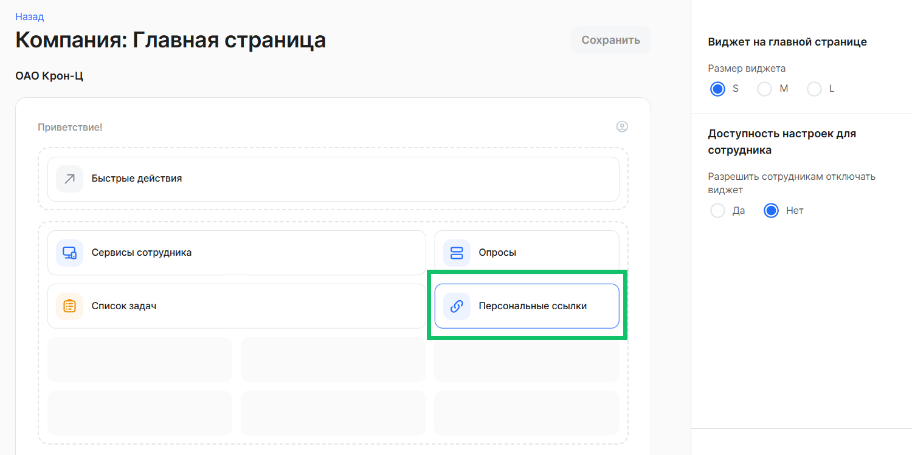

## **Виджеты сервисов — руководителям и сотрудникам**

В **виджете руководителя** собраны все сервисы, которые могут пригодиться ему в ежедневной работе:

- **организационная структура** с удобным поиском по коллегам и подчинённым;
- **заявки КЭДО** с быстрым переходом к созданию новой заявки;
- **календарь согласований**, где сразу видно, когда заявки на отпуск или командировку ждут вашего решения;
- для руководителей, участвующих в процессе найма, — **блок с ключевыми цифрами по подбору** в их команде.

 

Для настройки виджета **Сервисы руководителя**:

1. Перейдите в раздел **Настройки компании → Виджеты на главной странице** и нажмите кнопку **Настроить**.
1. Перенесите виджет **Сервисы руководителя** из блока **Виджеты** на основную область размещения виджетов.
1. Нажмите на виджет **Сервисы руководителя** и выберите значение для настройки доступности сотрудникам.
1. Сохраните изменения.
1. Нажмите кнопку **Редактировать**.

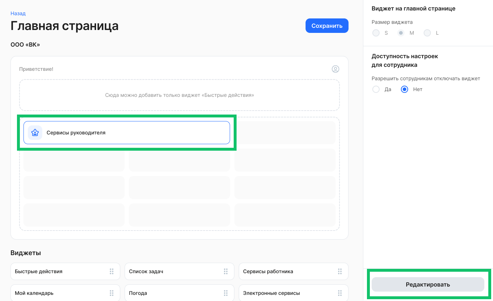

 

5\. Перенесите необходимый сервис из блока **Сервисы** на область размещения и установите любой размер карточки сервиса. Также можно менять порядок сервисов на странице или удалять сервисы со страницы, тогда они снова появятся в блоке **Сервисы**.

6\. После произведенных перестановок сохраните изменения.

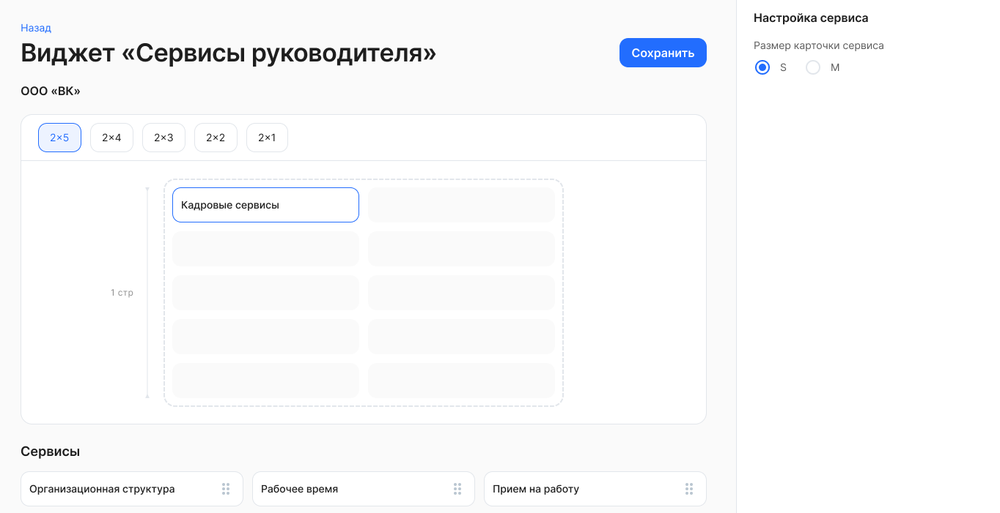

 

**Виджет для линейных сотрудников** помогает вовремя оформить нужные документы и быстро перейти к своим данным. В нём собраны самые востребованные функции:

- **оформление отпуска или командировки** — самая важная карточка, чтобы не пропустить сроки и подать заявку вовремя;
- **быстрый переход к корпоративным документам** для ознакомления, как того требует регламент компании;
- **доступ к профилю** — рекомендуем периодически проверять, что ваши персональные данные в системе актуальны;
- **заказ справок и просмотр данных о доходах** — всё в пару кликов и без лишних обращений в отдел кадров.

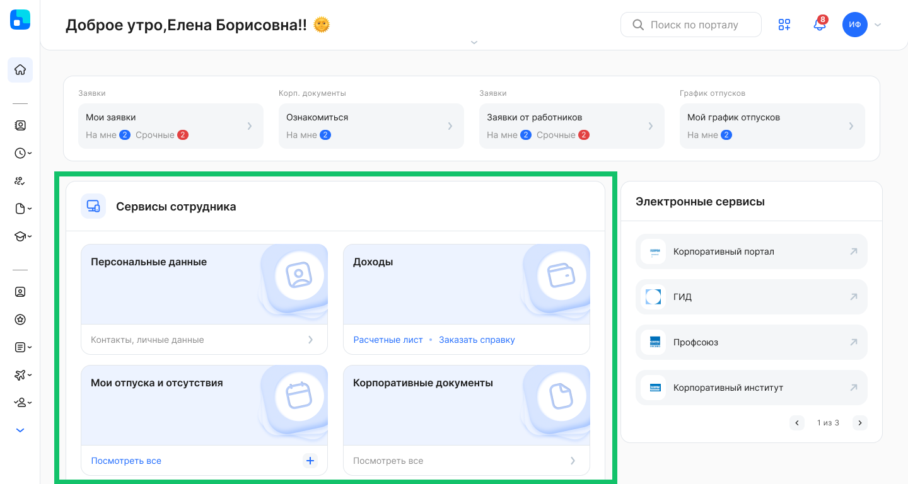

 

Для настройки виджета **Сервисы сотрудника**:

1. Перейдите в раздел **Настройки компании → Виджеты на главной странице** и нажмите кнопку **Настроить**.
1. Перенесите виджет **Сервисы сотрудника** из блока **Виджеты** на основную область размещения виджетов.
1. Нажмите на виджет **Сервисы сотрудника** и выберите значение для настройки доступности сотрудникам.
1. Сохраните изменения.
1. Нажмите кнопку **Редактировать**.
1. Перенесите необходимый сервис из блока **Сервисы** на область размещения и установите любой размер карточки сервиса. Также можно менять порядок сервисов на странице или удалять сервисы со страницы, тогда они снова появятся в блоке **Сервисы**.
1. После произведенных перестановок сохраните изменения.

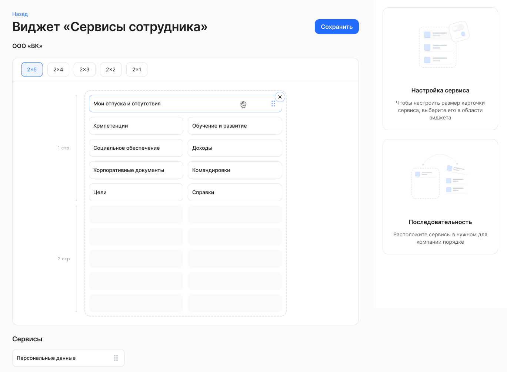

## **Виджет «Баннер»**
Новый формат виджета помогает привлечь внимание сотрудников к важным новостям или событиям компании.
Баннер можно загрузить как **готовым изображением от дизайнера**, так и **собрать самостоятельно** из элементов, доступных в настройках.

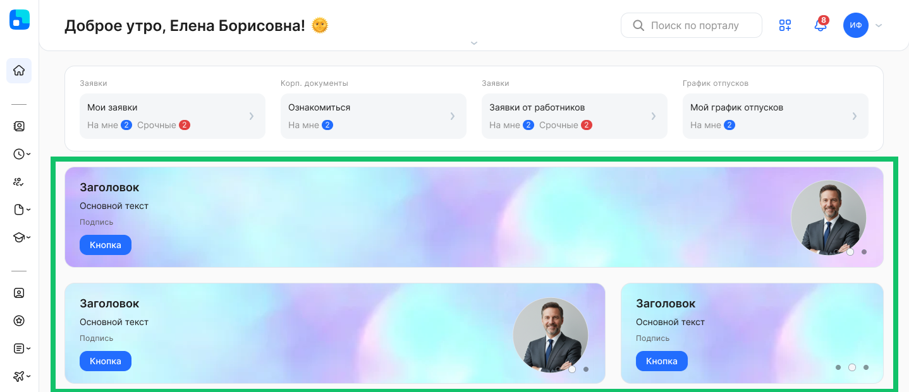

 

Для настройки виджета **Баннер**: 

1. Перейдите в раздел **Настройки компании → Виджеты на главной странице** и нажмите кнопку **Настроить**.
1. В блоке **Баннеры** нажмите кнопку **Создать баннер**.

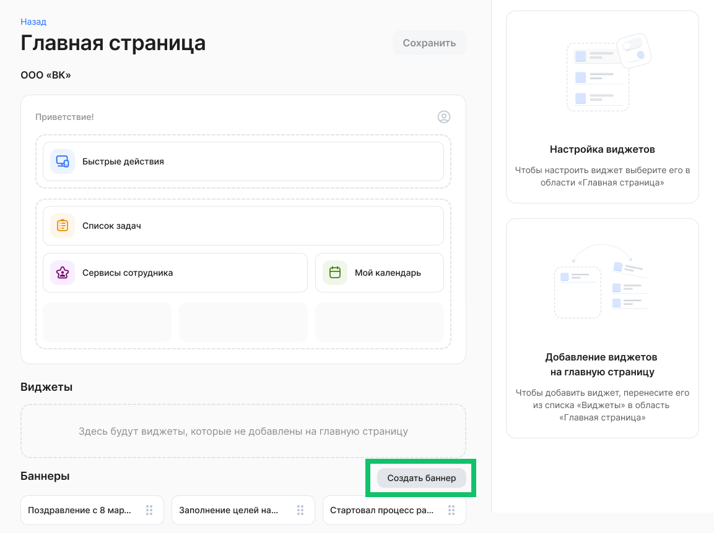

 

3\. Укажите название баннера и выберите тип баннера. 

3\.1. При выборе типа **Настроить самостоятельно** можно добавить один или более слайдов, для которых необходимо настроить:

- оформление: изображение на весь экран, дополнительное изображение;
- текст: заголовок, основной текст, подпись, цвет текста;
- кнопки: тип и текст кнопки, ссылка для перехода по кнопке.  

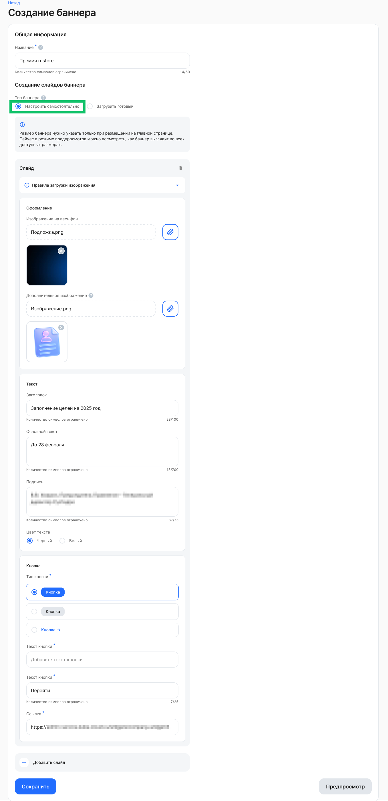

 

3\.2. При выборе типа **Загрузить готовый** можно добавить один или несколько слайдов, для которых необходимо настроить:

- изображение на весь экран;
- ссылку.

 

4\. Нажмите кнопку **Сохранить** после заполнения необходимых настроек. Новый баннер будет добавлен в блок **Баннеры**. 

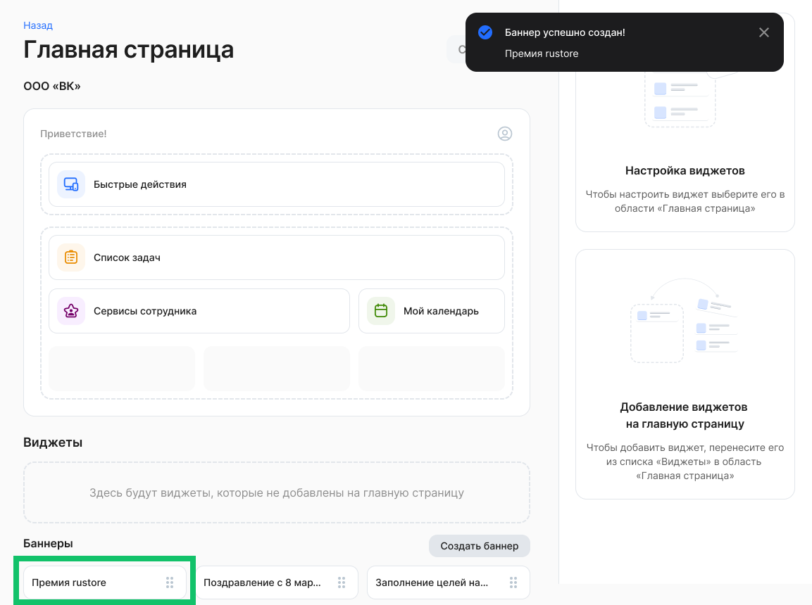

 

5. Перенесите баннер из блока **Баннеры для размещения** на основную область размещения виджетов.
1. Нажмите на перемещённый баннер и выберите размер виджета.
1. После произведенных действий сохраните изменения.
1. При необходимости можно отредактировать параметры баннеров, которые были заданы на этапе его создания (шаги 2-4). Для этого нажмите кнопку **Редактировать**.

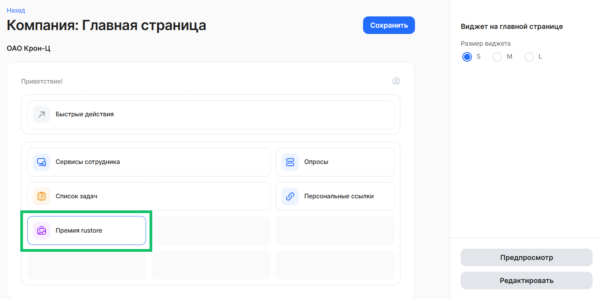

