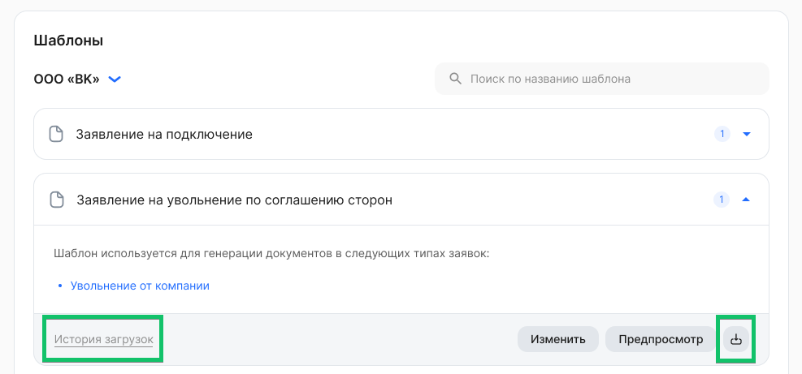
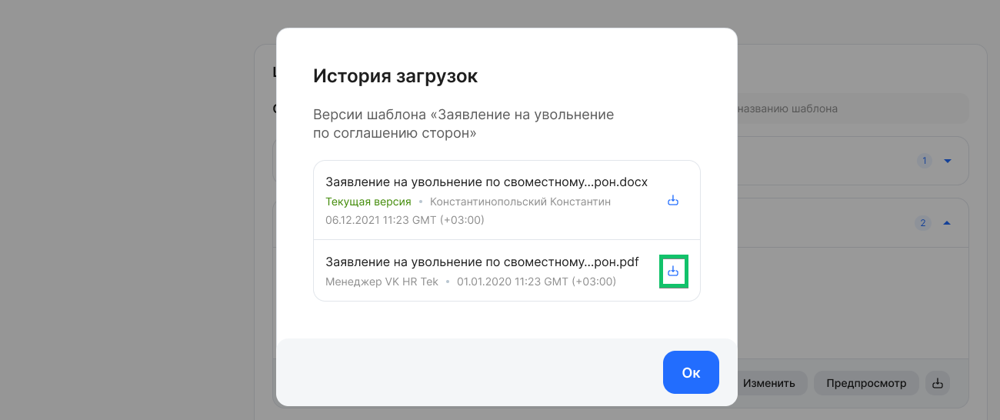

Чтобы скачать текущую версию шаблона документа в формате PDF, нажмите кнопку  в раскрытом блоке нужного шаблона.

 

Скачать текущую и предыдущие версии шаблона можно и в **Истории загрузок**. Также там можно просмотреть время загрузки и ФИО сотрудника, который загрузил шаблон через сервис VK HR Tek. Если шаблон загрузил менеджер VK HR Tek, то шаблон был загружен  через внутреннюю систему администрирования. 

