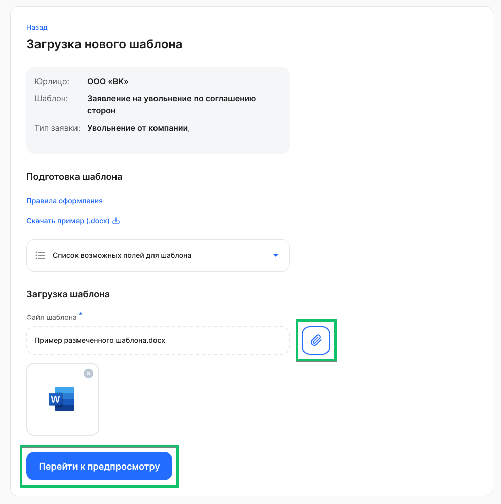
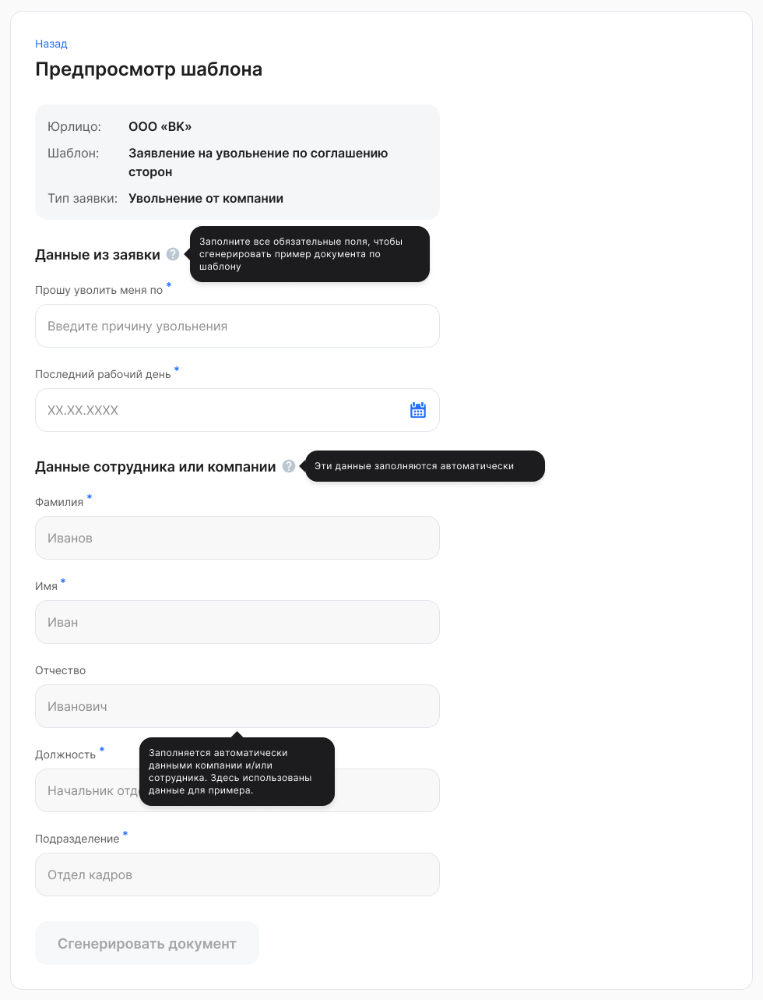
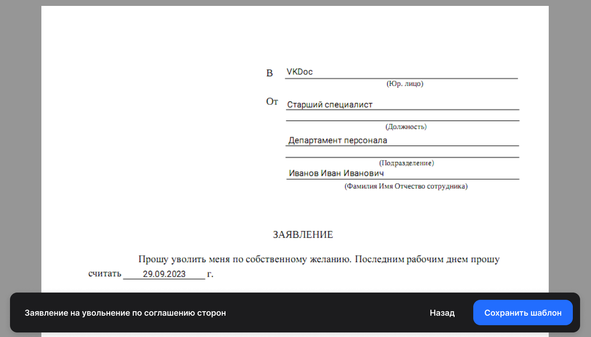

Чтобы загрузить файл шаблона, нажмите кнопку . Загрузить можно файлы в формате DOCX с максимальным размером 4 МБ.

После успешной загрузки файла, нажмите **Перейти к предпросмотру**.

 

Если загруженный шаблон содержит неизвестные поля, которые не были перечислены в **Списке возможных полей для шаблона**, то эти поля не будут заполнены при создании документа. 

Далее в блоке **Данные из заявки** заполните все обязательные поля, чтобы сгенерировать пример документа по шаблону. Это поля с динамическими данными.

**Данные сотрудника или компании** заполняются автоматически. В шаблоне указан пример полей статических данных.

Нажмите кнопку **Сгенерировать документ**.

 

Откроется пример шаблона с заполненными данными для предварительного просмотра. Если пример был подготовлен и сгенерирован верно, сохраните шаблон для дальнейшей работы с заявками.

Если созданный шаблон не устраивает, то в него можно внести изменения и сохранить еще раз. Если захотите вернуть изначальный PDF-шаблон, то обратитесь в техподдержку <support@hrtek.ru>. 

