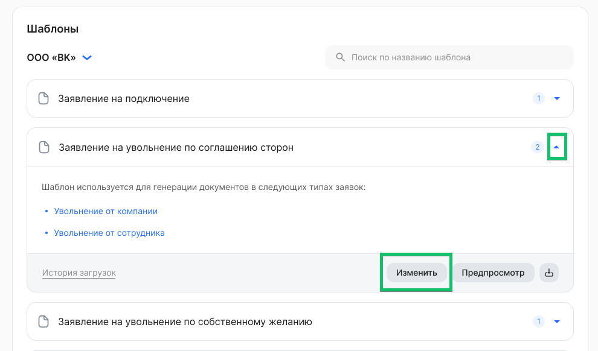

В разделе **Сервисы компании → Настройки → Шаблоны документов** появился новый инструмент для загрузки собственных шаблонов документов, с которыми сотрудники и компания работают в заявках. Пользователь с ролью «Администратор» сможет:

- раскрыть блок с нужным шаблоном для просмотра типов заявок, в которых используется шаблон для генерации документов;
- предварительно просмотреть текущий шаблон документа;
- скачать текущий шаблон в формате PDF;
- загрузить новый шаблон в формате DOCX, следуя правилам оформления;
- скачать предыдущие шаблоны в истории загрузок.

