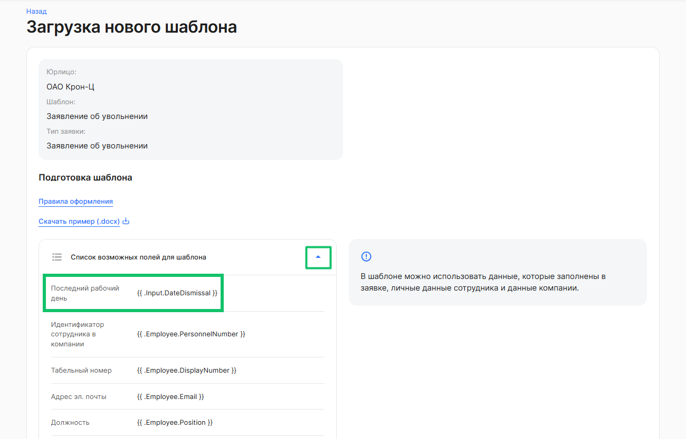
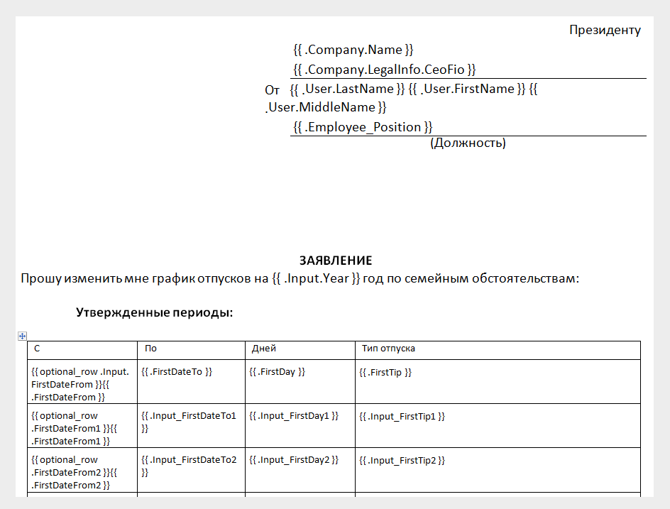
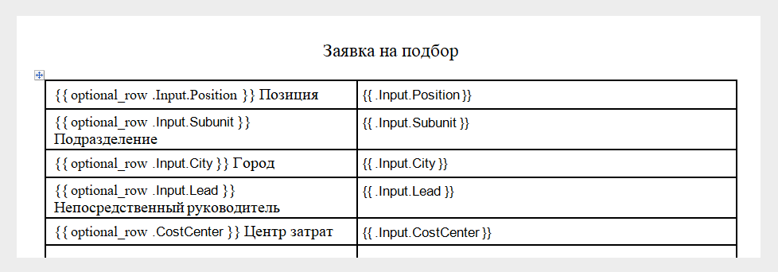
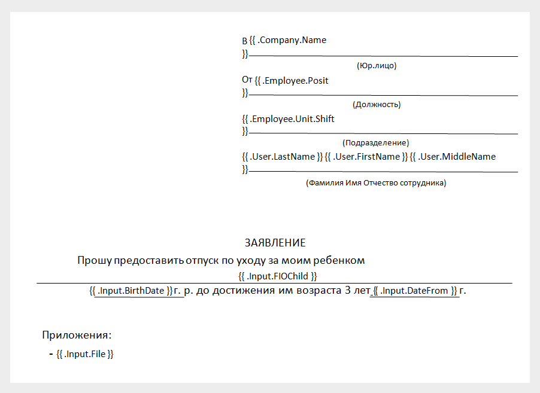

В шаблоне можно использовать данные, которые заполнены в заявке, личные данные сотрудника и данные компании. Чтобы использовать эти данные в шаблоне, раскройте **Список возможных полей для шаблона**. 

Поле для шаблона в документе заключено в двойные фигурные скобки и имеет вид **{{ .Attribute.Key }}**.

Подробнее о видах статических полей в статье [Правила подготовки шаблона](/ru/admin_actions/template/prepare/rules).

Помимо полей для статических данных (фамилия сотрудника, ФИО директора) шаблон включает поля для ***динамических данных***, которые есть в текущем типе заявки (например, дата начала отпуска, дата увольнения и т.п.). Такие поля содержат слово ***.Input*** в двойных фигурных скобках, например,  **{{ .Input.DateDismissal }}**. 

 

Поля для динамических данных могут использоваться в комбинации с динамическим полем опциональных строк таблицы **{{ optional\_row .Input.Field }}**. 

Поля для ***динамических данных***, которые есть в текущей заявке (например, дата начала отпуска, дата увольнения и т.п.). Поля включают слово ***.Input*** в двойных фигурных скобках, например,  **{{ .Input.DateDismissal }}**.

Поля для динамических данных могут использоваться в комбинации с ***динамическим полем*** опциональных строк таблицы **{{ optional\_row .Input.Field }}**.

Таблица 1 — Динамические поля, доступные для каждого шаблона

<table><tr><th><b>Название поля в заявке</b></th><th><b>Название поля для шаблона</b></th><th><b>Вид данных</b></th></tr>
<tr><td>Опциональные строки </td><td>{{ optional_row .Input.Field }}</td><td rowspan="2">Динамические данные</td></tr>
<tr><td>Список приложенных документов</td><td>{{ .Input.File }}</td></tr>
</table>
Динамические поля позволяют гибко заполнять документ исходя из переданных значений в заявке.

## 1. Опциональные строки – «optional\_row»

Использование тега «optional\_row» позволит скрыть строку в таблице, если значение для конкретного поля не было передано, конструкция использования тега: 

{{ optional\_row «поле из заявки» }}{{ «поле из заявки» }}

<warn>
Сам по себе тег не заменяется на значение, поэтому нужно указать поле для проверки, а после поле(-я) для заполнения значения(-ий). 
</warn>

Например:

|Столбец 1|Столбец 2|Столбец 3|Столбец 4|
| - | - | - | - |
|{{ optional\_row .Input.Field1 }}{{ .Input.Field1 }}|{{ .Input.Field2 }}|{{ .Input.Field3 }}|{{ .Input.Field4 }}|

В случае если поле «.Input.Field1» не заполнено, то вся строка в таблице будет скрыта. Название полей копируется на английском вместе с фигурными скобками.

 

Также в конструкции {{ optional\_row .Input.Field1 }}{{ .Input.Field1 }} вместо второй части {{ .Input.Field1 }} можно указать константное значение. Например:

 

Если «.Input.Position» будет заполнено, то для документа, полученного после обработки заявки:

- в таблицу будет добавлена строка;
- в первой ячейке первой строки будет указано «Позиция»;
- во второй ячейке первой строки будет указано значение для позиции, которую заполнил сотрудник в заявке.

Если «.Input.Position» не будет заполнено, то в документе первая строка будет отсутствовать.

## 2. Приложенные документы – «Input.File»

Использование данного поля позволит отразить в документе название атрибутов загруженных файлов, конструкция использования поля: {{ .Input.File }}.

Например: Приложения:

\- {{ .Input.File }}

\- {{ .Input.File1 }}

В случае если файл был загружен в поле {{ .Input.File }}, то в документе отобразиться название атрибута файла, в противном случае поле останется пустым. Поле возможно использовать вместе с конструкцией «optional\_row» в таблице, тогда строка будет скрываться, если файл не приложен.