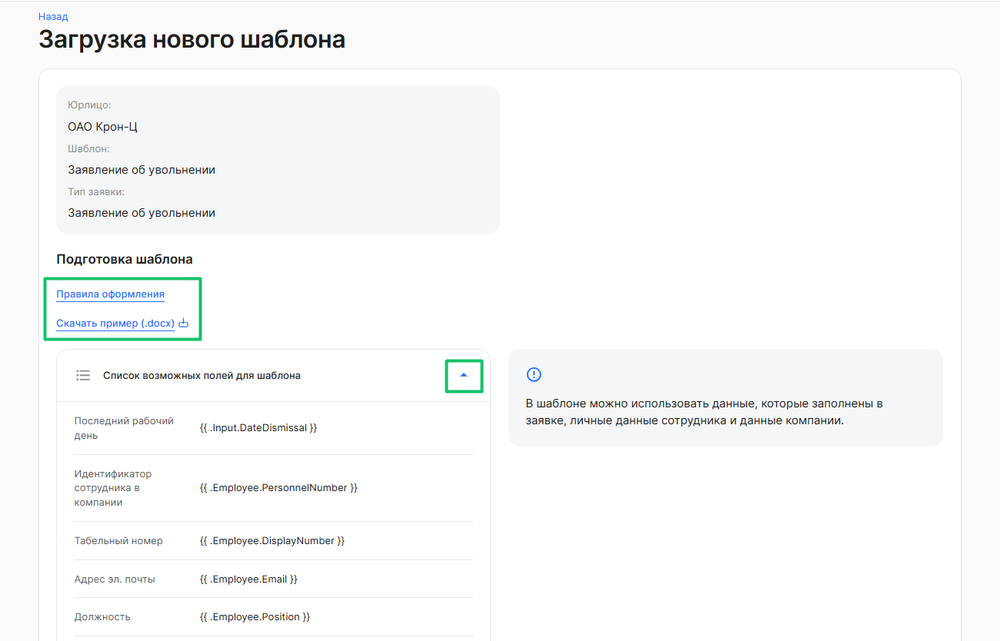
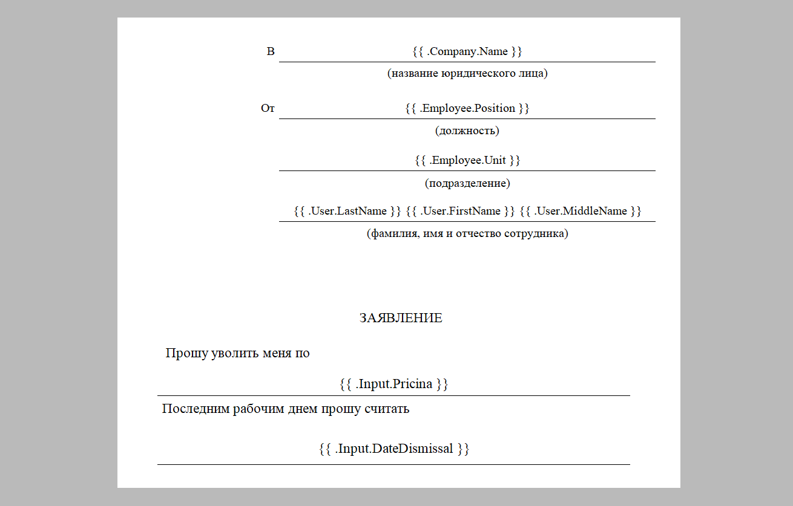
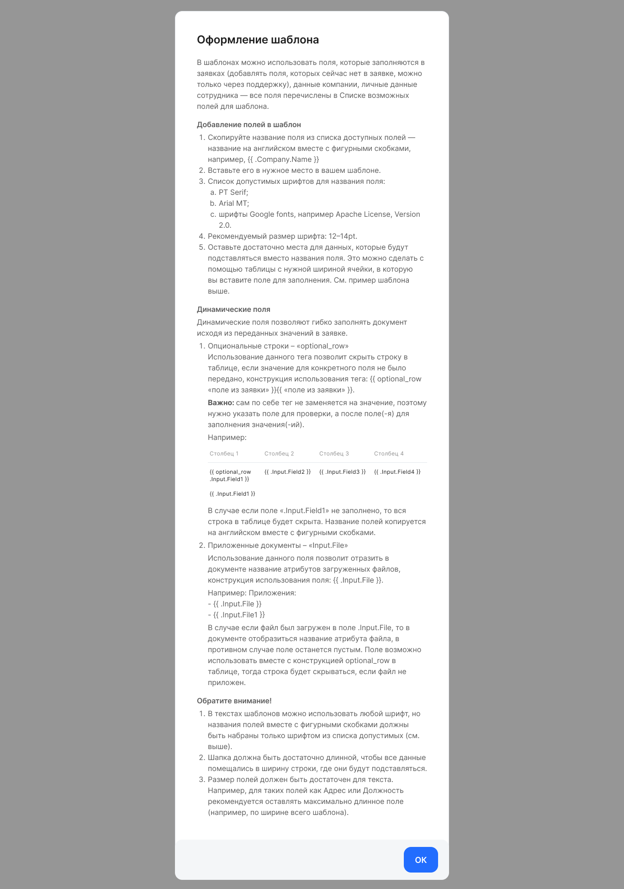

В систему можно загружать только шаблон в формате DOCX, поэтому вносить изменения в шаблон можно только в DOCX-файле. 

При подготовке шаблона пользователь может:
- добавлять/удалять поля в фигурных скобках — {{ плейсхолдеры }}, значения которых автоматически меняются в документе в зависимости от данных сотрудника, компании и бизнес-процесса;
- исправлять текст документа кроме полей.

Изменения в шаблон лучше вносить только после ознакомления с текущим шаблоном. При формировании нового шаблона ориентируйтесь на текущий шаблон, который будет служить образцом.

Текущий шаблон процесса можно скачать только в формате PDF в раскрытом блоке или в истории загрузок (см. [Скачивание шаблона](/ru/admin_actions/template/download)). Обратно в систему можно загрузить только шаблон в формате DOCX, а шаблон в формате PDF загрузить не получится.  

Чтобы загрузить новый шаблон документа, нажмите кнопку **Изменить** в раскрытом блоке нужного шаблона. 

Перед загрузкой рекомендуется ознакомиться с правилами оформления и файлом примера шаблона. Для этого нажмите на ссылки **Правила оформления** и **Скачать пример (.docx)**. 

Файл с примером также можно переиспользовать для создания нового шаблона. Пример — это образец создания шаблона в формате DOCX, пример одинаковый для всех процессов (типов зявок) компании, не является примером текущего процесса. 

В шаблоне можно использовать данные, которые заполнены в заявке, личные данные сотрудника и данные компании. Чтобы использовать эти данные в шаблоне, раскройте **Список возможных полей для шаблона**. 

Поле для шаблона в документе заключено в двойные фигурные скобки и имеет вид **{{ .Attribute.Key }}**

Шаблон включает:
- Поля для ***динамических данных***, которые есть в текущем типе заявки (например, дата начала отпуска, дата увольнения и т.п.). Поля включают слово ***.Input*** в двойных фигурных скобках, например,  **{{ .Input.DateDismissal }}**. Поля для динамических данных могут использоваться в комбинации с динамическим полем опциональных строк таблицы **{{ optional\_row .Input.Field }}**. См. статью [Работа с динамическими полями](/ru/admin_actions/template/prepare/dynamic).
- Поля для ***статических данных*** пользователя, сотрудника и компании (например, фамилия сотрудника, ФИО директора).
 Данные заполняются автоматически при генерации документа. Поля включают слова ***.User, .Employee, .Company*** в двойных фигурных скобках. Список полей для статических данных приведен в таблице 1.

Таблица 1 — Поля шаблона для статических данных

<table><tr><th><b>Название поля в заявке</b></th><th><b>Название поля для шаблона</b></th><th><b>Вид данных</b></th></tr>
<tr><td>Фамилия</td><td>{{ .User.LastName }}</td><td rowspan="29">данные пользователя</td></tr>
<tr><td>Имя</td><td>{{ .User.FirstName }}</td></tr>
<tr><td>Отчество</td><td>{{ .User.MiddleName }}</td></tr>
<tr><td>Адрес регистрации</td><td>{{ .User.RegistrationAddress }}</td></tr>
<tr><td>Номер телефона</td><td>{{ .User.Phone }}</td></tr>
<tr><td>СНИЛС</td><td>{{ .User.Snils }}</td></tr>
<tr><td>ИНН</td><td>{{ .User.Inn }}</td></tr>
<tr><td>Серия паспорта</td><td>{{ .User.Passport.Series }}</td></tr>
<tr><td>Номер паспорта</td><td>{{ .User.Passport.Number }}</td></tr>
<tr><td>Дата выдачи паспорта</td><td>{{ .User.Passport.IssueDate }}</td></tr>
<tr><td>Кем выдан паспорт</td><td>{{ .User.Passport.IssueOrganization }}</td></tr>
<tr><td>Код подразделения выдавшей организации</td><td>{{ .User.Passport.IssueOrganizationId }}</td></tr>
<tr><td>Дата рождения</td><td>{{ .User.Passport.BirthDate }}</td></tr>
<tr><td>Место рождения</td><td>{{ .User.Passport.BirthPlace }}</td></tr>
<tr><td>Фамилия (родительный)</td><td>{{ .User.Names.Last.Genitive }}</td></tr>
<tr><td>Фамилия (дательный)</td><td>{{ .User.Names.Last.Dative }}</td></tr>
<tr><td>Фамилия (винительный)</td><td>{{ .User.Names.Last.Accusative }}</td></tr>
<tr><td>Фамилия (творительный)</td><td>{{ .User.Names.Last.Creative }}</td></tr>
<tr><td>Фамилия (предложный)</td><td>{{ .User.Names.Last.Prepositional }}</td></tr>
<tr><td>Имя (родительный)</td><td>{{ .User.Names.First.Genitive }}</td></tr>
<tr><td>Имя (дательный)</td><td>{{ .User.Names.First.Dative }}</td></tr>
<tr><td>Имя (винительный)</td><td>{{ .User.Names.First.Accusative }}</td></tr>
<tr><td>Имя (творительный)</td><td>{{ .User.Names.First.Creative }}</td></tr>
<tr><td>Имя (предложный)</td><td>{{ .User.Names.First.Prepositional }}</td></tr>
<tr><td>Отчество (родительный)</td><td>{{ .User.Names.Middle.Genitive }}</td></tr>
<tr><td>Отчество (дательный)</td><td>{{ .User.Names.Middle.Dative }}</td></tr>
<tr><td>Отчество (винительный)</td><td>{{ .User.Names.Middle.Accusative }}</td></tr>
<tr><td>Отчество (творительный)</td><td>{{ .User.Names.Middle.Creative }}</td></tr>
<tr><td>Отчество (предложный)</td><td>{{ .User.Names.Middle.Prepositional }}</td></tr>
<tr><td>Идентификатор сотрудника в компании</td><td>{{ .Employee.PersonnelNumber }}</td><td rowspan="30">данные сотрудника</td></tr>
<tr><td>Табельный номер</td><td>{{ .Employee.DisplayNumber }}</td></tr>
<tr><td>Адрес эл. почты</td><td>{{ .Employee.Email }}</td></tr>
<tr><td>Должность</td><td>{{ .Employee.Position }}</td></tr>
<tr><td>Должность (родительный)</td><td>{{ .Employee.Declensions.Position.Genitive }}</td></tr>
<tr><td>Должность (дательный)</td><td>{{ .Employee.Declensions.Position.Dative }}</td></tr>
<tr><td>Должность (винительный)</td><td>{{ .Employee.Declensions.Position.Accusative }}</td></tr>
<tr><td>Должность (творительный)</td><td>{{ .Employee.Declensions.Position.Creative }}</td></tr>
<tr><td>Должность (предложный)</td><td>{{ .Employee.Declensions.Position.Prepositional }}</td></tr>
<tr><td>Подразделение/отдел сотрудника</td><td>{{ .Employee.Unit }}</td></tr>
<tr><td>Управленческое подразделение</td><td>{{ .Employee.OperationalUnit }}</td></tr>
<tr><td>Управленческое подразделение на 1 уровень вверх</td><td>{{ .Employee.OperationalUnits.Up1 }}</td></tr>
<tr><td>Управленческое подразделение на 2 уровня вверх</td><td>{{ .Employee.OperationalUnits.Up2 }}</td></tr>
<tr><td>Управленческое подразделение на 3 уровня вверх</td><td>{{ .Employee.OperationalUnits.Up3 }}</td></tr>
<tr><td>Управленческое подразделение на 4 уровня вверх</td><td>{{ .Employee.OperationalUnits.Up4 }}</td></tr>
<tr><td>Управленческое подразделение на 5 уровней вверх</td><td>{{ .Employee.OperationalUnits.Up5 }}</td></tr>
<tr><td>Управленческое подразделение на 6 уровней вверх</td><td>{{ .Employee.OperationalUnits.Up6 }}</td></tr>
<tr><td>Управленческое подразделение на 7 уровней вверх</td><td>{{ .Employee.OperationalUnits.Up7 }}</td></tr>
<tr><td>Управленческое подразделение на 8 уровней вверх</td><td>{{ .Employee.OperationalUnits.Up8 }}</td></tr>
<tr><td>Управленческое подразделение на 9 уровней вверх</td><td>{{ .Employee.OperationalUnits.Up9 }}</td></tr>
<tr><td>Юридическое подразделение</td><td>{{ .Employee.LegalUnit }}</td></tr>
<tr><td>Юридическое подразделение на 1 уровень вверх</td><td>{{ .Employee.LegalUnits.Up1 }}</td></tr>
<tr><td>Юридическое подразделение на 2 уровня вверх</td><td>{{ .Employee.LegalUnits.Up2 }}</td></tr>
<tr><td>Юридическое подразделение на 3 уровня вверх</td><td>{{ .Employee.LegalUnits.Up3 }}</td></tr>
<tr><td>Юридическое подразделение на 4 уровня вверх</td><td>{{ .Employee.LegalUnits.Up4 }}</td></tr>
<tr><td>Юридическое подразделение на 5 уровней вверх</td><td>{{ .Employee.LegalUnits.Up5 }}</td></tr>
<tr><td>Юридическое подразделение на 6 уровней вверх</td><td>{{ .Employee.LegalUnits.Up6 }}</td></tr>
<tr><td>Юридическое подразделение на 7 уровней вверх</td><td>{{ .Employee.LegalUnits.Up7 }}</td></tr>
<tr><td>Юридическое подразделение на 8 уровней вверх</td><td>{{ .Employee.LegalUnits.Up8 }}</td></tr>
<tr><td>Юридическое подразделение на 9 уровней вверх</td><td>{{ .Employee.LegalUnits.Up9 }}</td></tr>
<tr><td>Название компании</td><td>{{ .Company.Name }}</td><td rowspan="13">данные компании</td></tr>
<tr><td>ФИО руководителя компании</td><td>{{ .Company.LegalInfo.CeoFio }}</td></tr>
<tr><td>ФИО руководителя компании (родительный)</td><td>{{ .Company.LegalInfo.CeoFioCases.Genitive }}</td></tr>
<tr><td>ФИО руководителя компании (дательный)</td><td>{{ .Company.LegalInfo.CeoFioCases.Dative }}</td></tr>
<tr><td>ФИО руководителя компании (винительный)</td><td>{{ .Company.LegalInfo.CeoFioCases.Accusative }}</td></tr>
<tr><td>ФИО руководителя компании (творительный)</td><td>{{ .Company.LegalInfo.CeoFioCases.Creative }}</td></tr>
<tr><td>ФИО руководителя компании (предложный)</td><td>{{ .Company.LegalInfo.CeoFioCases.Prepositional }}</td></tr>
<tr><td>Название должности руководителя компании</td><td>{{ .Company.LegalInfo.CeoPosition }}</td></tr>
<tr><td>Название должности руководителя компании (родительный)</td><td>{{ .Company.LegalInfo.CeoPositionCases.Genitive }}</td></tr>
<tr><td>Название должности руководителя компании (дательный)</td><td>{{ .Company.LegalInfo.CeoPositionCases.Dative }}</td></tr>
<tr><td>Название должности руководителя компании (винительный)</td><td>{{ .Company.LegalInfo.CeoPositionCases.Accusative }}</td></tr>
<tr><td>Название должности руководителя компании (творительный)</td><td>{{ .Company.LegalInfo.CeoPositionCases.Creative }}</td></tr>
<tr><td>Название должности руководителя компании (предложный)</td><td>{{ .Company.LegalInfo.CeoPositionCases.Prepositional }}</td></tr>
</table>

<warn>

 При подготовке в файл шаблона можно добавлять только те поля, которые приведены в **Списке возможных полей для шаблона**. Данные поля можно удалять из шаблона. В шаблоне можно редактировать только текст, не относящийся к полям для шаблона.

 </warn>

Если требуется подготовить шаблон для нового типа заявки или шаблон с новыми полями, которых нет в списке возможных полей, обратитесь в вашему менеджеру ВК.

Правила оформления шаблона носят рекомендательный характер. Проверка по этим правилам в сервисе не производится. 

Таким образом, для изменения шаблона необходимо:

1. Скачать пример (.docx).
1. Внести в пример изменения (ориентируясь на текущий шаблон и ваши потребности):
- поля для заполнения сотрудником или для автозаполнения системой должны быть строго в двойных фигурных скобках, как указано в подсказках. Например, вы можете добавить в шапку заявления ФИО руководителя {{ .Company.LegalInfo.CeoFio }} и должность руководителя {{ .Company.LegalInfo.CeoPosition }}, эти данные будут заполняться автоматически.
- текст заявления вы можете менять на свое усмотрение, например, добавлять ссылки на законы, нормативные документы, удалять ненужные формулировки и др.
3. Сохранить изменения в файле шаблона и загрузить его в сервис.