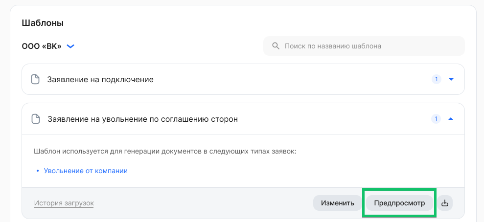
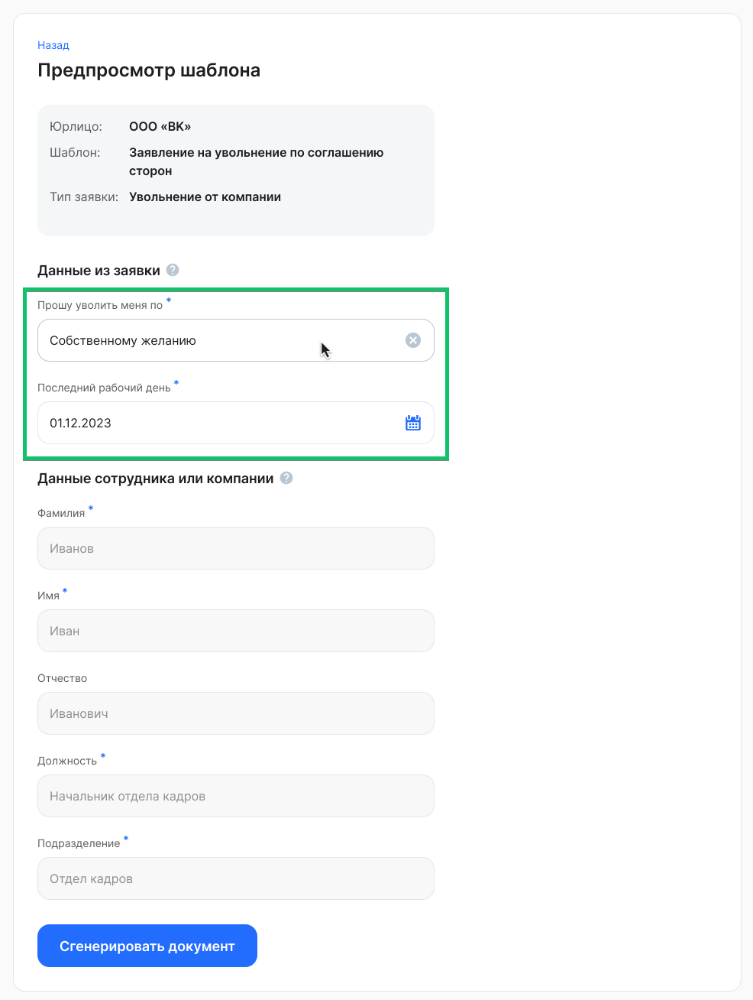
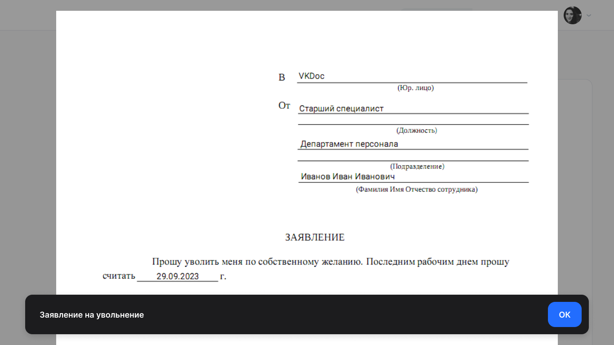

Для просмотра текущей версии шаблона нажмите кнопку **Предпросмотр** в раскрытом блоке нужного шаблона.

 

Далее в блоке **Данные из заявки** заполните все обязательные поля (это поля с динамическими данными), чтобы сгенерировать пример документа по шаблону. Можно ввести любые данные, не обязательно вводить достоверные данные. 

**Данные сотрудника или компании** заполняются автоматически. В шаблоне указан пример полей статических данных.

Нажмите кнопку **Сгенерировать документ**. 

 

Откроется пример шаблона с заполненными данными для предварительного просмотра. Чтобы закрыть пример документа, нажмите кнопку **ОК**.

