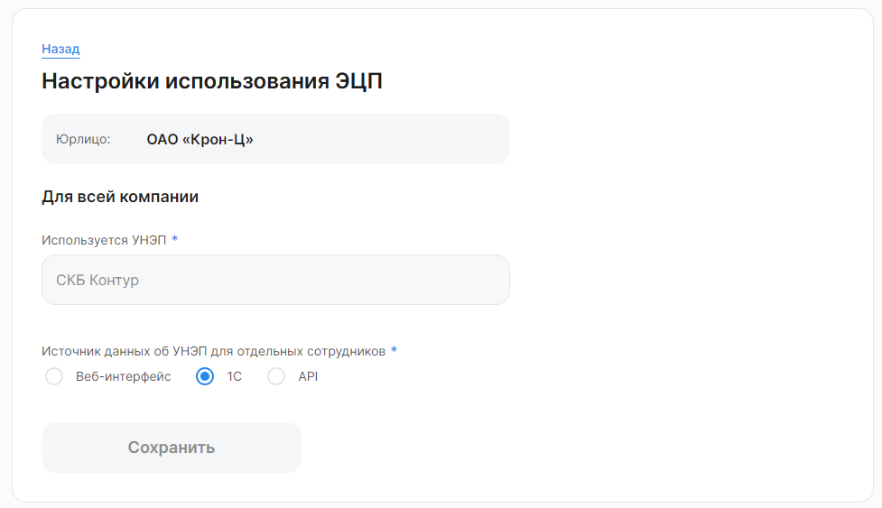

Выбор источника доступен только в веб-интерфейсе, в разделе **Сервисы компании → Настройки → Типы ЭЦП**. Выберите необходимую компанию и нажмите кнопку **Изменить**. 

УНЭП по умолчанию для всей компании задается в поле **Используется УНЭП**.

Источником данных о том, нужен ли отдельному сотруднику УНЭП или нет, может быть один из трех интерфейсов:

- Веб-интерфейс;
- 1С;
- API.

При получении нового значения настройки (к примеру, «СКБ Контур» или «Без использования ЭП») для сотрудника предыдущее значение перезаписывается, в том числе если пришло пустое значение, предыдущее значение будет удалено. В том случае, если в настройке сотрудника пусто, используется значение, выбранное для всей компании.

## Выбор типа УНЭП в веб-интерфейсе
При выборе веб-интерфейса в качестве источника данных об УНЭП для отдельных сотрудников станет доступен блок **Сотрудники без ЭЦП**.

Укажите ФИО или табельный номер сотрудника, которым не требуется выпуск УНЭП, выберите нужного сотрудника из выпадающего списка и нажмите кнопку **Сохранить**. 

Когда сотрудники, которым не требуется УНЭП, будут выбраны и сохранены, тогда это значение для сотрудников станет приоритетным над значением для всей компании.

## Выбор импорта типа УНЭП из 1С
После того, как будет выбран и сохранен вариант «1С» в качестве источника данных об УНЭП для отдельных сотрудников, в 1С:ЗУП, **КЭДО** **→ Подключение сотрудников**  станет доступен выбор типа УНЭП в столбце **Тип подписи** (см. [статью](/ru/1C/user/employees/select_unep)).

