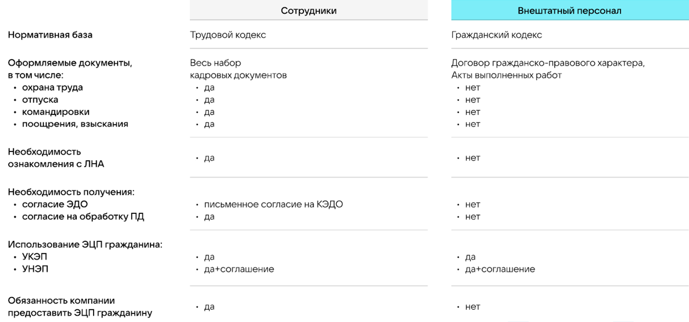
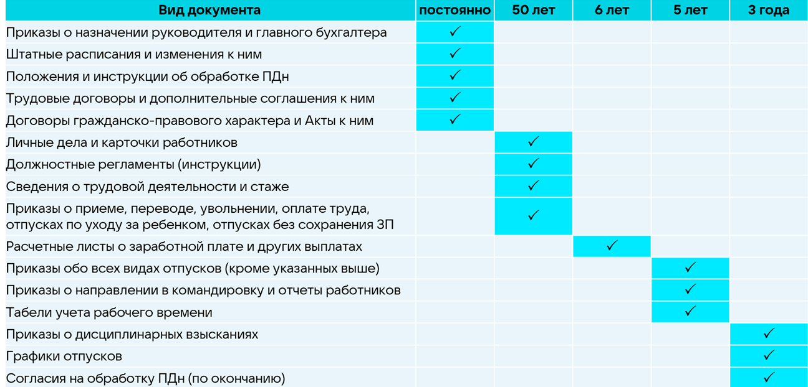

Федеральные законы в части КЭДО

Использование кадрового электронного документооборота (КЭДО) регламентируется Трудовым кодексом Российской Федерации (Федеральный закон от 30.12.2001 № 197-ФЗ) (ТК РФ).

Основные изменения в ТК РФ внесены следующими законами:

- Федеральный закон от 08.12.2020 № 407-ФЗ – внесены изменения в части регулирования дистанционной (удаленной) работы (статьи с 312.1 по 312.9);
- Федеральный закон от 02.07.2021 № 311-ФЗ – внесены изменения в части ведения электронного документооборота по охране труда (статья 214.2);
- Федеральный закон от 22.11.2021 № 377-ФЗ – внесены изменения, разрешающие ведение электронного кадрового документооборота (статьи с 22.1 по 22.3 и 312.1).

Законы, влияющие на ведение кадрового электронного документооборота:

- Федеральный закон от 06.04.2011 № 63-ФЗ «Об&nbsp;электронной подписи»;
- Федеральный закон от 27.07.2006 № 152-ФЗ «О&nbsp;персональных данных»;
- Федеральный закон от 22.10.2004 № 125-ФЗ «Об&nbsp;архивном деле в&nbsp;Российской Федерации».

 

 

Оформление документов в электронном виде без дублирования на бумаге

Положения Трудового кодекса Российской Федерации в части КЭДО не применяются в отношении:

- трудовых книжек и формируемых в соответствии с трудовым законодательством в электронном виде сведений о трудовой деятельности работников;
- акта о несчастном случае на производстве по установленной форме;
- приказа (распоряжения) об увольнении работника;
- документов, подтверждающих прохождение работником инструктажей по охране труда.

**Часть 3 статьи 22.1 ТК РФ**

 

Электронный документооборот в части охраны труда

Цифровизация охраны труда разрешает работодателю:

- использовать в целях контроля за безопасностью производства работ приборы, устройства, оборудование и (или) комплексы (системы) приборов, устройств, оборудования, обеспечивающих дистанционную видео-, аудио- или иную фиксацию процессов производства работ, обеспечивать хранение полученной информации;
- вести электронный документооборот в области охраны труда;
- предоставлять дистанционный доступ к наблюдению за безопасным производством работ, а также к базам электронных документов работодателя в области охраны труда федеральному органу исполнительной власти, уполномоченному на осуществление федерального государственного контроля (надзора) за соблюдением трудового законодательства и иных нормативных правовых актов, содержащих нормы трудового права, и его территориальным органам (государственным инспекциям труда в субъектах Российской Федерации).

**Статья 214.2 ТК РФ**

Оформление документов по охране труда, регулируемых ТК РФ, разрешено в электронном виде, за исключением:

- акта о несчастном случае на производстве по установленной форме; 
- документов, подтверждающих прохождение работником инструктажей по охране труда.

**Часть 3 статьи 22.1 ТК РФ**

Оформление некоторых документов по охране труда регулируются нормативными актами соответствующих федеральных органов исполнительной власти, в том числе:

- Минздрав России (медосмотры);
- Минэнерго России (допуски);
- Минтранс России (водители).

Возможность оформления указанных документов в электронной форме устанавливается приказами соответствующих органов.

 

Взаимодействие с дистанционными работниками

Особенности регулирования труда дистанционных работников закреплены в главе 49.1 ТК РФ.

Кроме того, трудовой кодекс предусматривает возможность распространить на взаимодействие с дистанционными работниками правил осуществления электронного документооборота в соответствии с положениями статей 22.1-22.3 ТК РФ.

**Часть 5 статьи 312.1 ТК РФ**

Вместе с тем взаимодействие дистанционного работника и работодателя может осуществляться путём обмена электронными документами с использованием других видов связи (кроме информационной системы КЭДО), в том числе по электронной почте или в иной форме, предусмотренной локальным нормативным актом работодателя, позволяющей обеспечить фиксацию факта получения работником и (или) работодателем документов в электронном виде.

**Часть 2 статьи 312.3 ТК РФ**

 

Сотрудничество с самозанятыми в рамках гражданско-правовых отношений (ГПХ)

Самозанятые – это физические лица, которые официально оформлены в качестве плательщиков налога на профессиональный доход (НПД). Такой режим налогообложения действует в России с января 2019 года.

Самозанятые работники не оформляются в штат компании. Работодатель не платит за самозанятого НДФЛ, пенсионные и социальные взносы.

При сотрудничестве с самозанятым работником можно заключить договор ГПХ. Чтобы подтвердить, что услуга оказана самозанятым в полном объеме, оформляется акт выполненных работ. Договор самозанятого с юрлицом показывает, что между сторонами нет трудовых отношений. Договор с самозанятым можно подписать дистанционно.

В таблице ниже представлены отличия в оформлении документов для штатных и внештатных сотрудников (в том числе самозанятых):

 

Сроки хранения кадровых документов

Обязанность работодателей по хранению документов по личному составу (кадровых) предусмотрена статьей 22.1 Федерального закона от 22.10.2004 № 125-ФЗ «Об&nbsp;архивном деле в&nbsp;Российской Федерации».

Приказ Росархива от 20.12.2019 № 236 «Об&nbsp;утверждении Перечня типовых управленческих архивных документов, образующихся в процессе деятельности государственных органов, органов местного самоуправления и организаций, с указанием сроков их хранения»

 

Допускается ли ознакомление в электронной форме с локальными нормативными актами (ЛНА) работодателя при устройстве на работу?

Да. При устройстве на работу допускается ознакомление с ЛНА работодателя в электронной форме.

В соответствии с частью 11 статьи 22.2 Трудового кодекса РФ ознакомление лица, поступающего на работу, с документами, предусмотренными частью 3 статьи 68 Трудового кодекса РФ, может осуществляться в электронной форме.

**Часть 11 статьи 22.2 Трудового кодекса РФ**

 

Если у работника уже есть действующая электронная подпись типа УКЭП, может ли он использовать её для подписания документов в информационной системе КЭДО и не выпускать УНЭП?

Да, может.

В соответствии с пунктом 1 части 4, пунктом 1 части 5 и пунктом 1 части 6 статьи 22.3 Трудового кодекса РФ работник может использовать свою УКЭП для подписания кадровых документов.

Вместе с тем, это накладывает некоторые неудобства при использовании УКЭП работника для работы в информационных системах КЭДО.

Подробнее

1. Для использования УКЭП на компьютерах и ноутбуках требуется установка специализированного программного обеспечения для поддержи ЭП – программного комплекса «Крипто-Про», и при определённых параметрах безопасности в операционной системе пользователя – участие системного администратора для установки (установка требует прав доступа Администратора). 

Использование УНЭП не требует установки дополнительного программного обеспечения.

2. Необходимость подключения «физического ключа УКЭП» (ключ типа флешки) для подписания УКЭП не позволяет использовать мобильные телефоны и планшеты для подписания документов (в них отсутствует стандартный разъем USB).

Вопрос можно решить, установив специальное программное обеспечение на планшет или телефон, но это требует вмешательства ИТ-специалиста в личное устройство работника. 

Дополнительно это снижает безопасность работы с документами, потому что «закрытый или секретный ключ» ЭП работника будет скопирован из «физического ключа УКЭП» в память планшета или телефона и в случае его утери может привести к непредсказуемым последствиям.

 

**Пункт 1 части 4, пункт 1 части 5 и пункт 1 части 6 статьи 22.3 Трудового кодекса РФ**

 

Справка из учебного учреждения на стандартные налоговые вычеты, справка от второго родителя об неиспользовании дней по уходу за ребёнком-инвалидом. Нужно ли запрашивать оригиналы указанных справок, которые были направлены работодателю сотрудниками через систему КЭДО?

Скан-копии бумажных документов не являются электронными документами.

Их передача работниками работодателю посредством систем электронного документооборота может рассматриваться только как информирование работодателя об их наличии у работника.

В случае проведения проверок контрольно-надзорными органами, в том числе налоговой службой и государственными инспекциями труда работодателю необходимо предоставить либо:

- оригиналы документов на бумажных носителях (с подписью должностного лица и синей печатью);
- электронные документы на цифровых носителях, сформированные в соответствии с требованиями законодательства об электронной подписи;
- бумажные копии электронных документов, заверенные соответствующим образом (штамп или надпись «Копия», подпись должностного лица и синяя печать).

В этой связи работодателю необходимо получить оригиналы скан-копий всех необходимых документов, вне зависимости от вида учёта (кадровый или бухгалтерский).

Практика ведения электронного документооборота показывает, что передача скан-копий документов посредством систем электронного документооборота повышает оперативность получения информации. 

Кроме того, сохранённые в электронном архиве скан-копии документов могут облегчить восстановление оригиналов в случае их утери.

Таким образом рекомендуем сохранить практику обмена скан-копиями документов, и вместе с тем требовать от сотрудников предоставления оригиналов документов.

 

Возможно ли подписание работником трудового договора усиленной неквалифицированной подписью (УНЭП)?

Да, трудовой договор (как и любые другие документы) работник может подписывать УНЭП, в случае подписанного с физическим лицом «Соглашения о применении УНЭП».

Пунктом 2 части 4 статьи 22.3 Трудового кодекса РФ установлено, что при заключении трудового договора, договора о материальной ответственности, ученического договора, договора на получение образования без отрыва или с отрывом от работы, при внесении в них изменений, при подписании согласия на перевод, заявления об увольнении, отзыве заявления об увольнении, а также при ознакомлении с уведомлением об изменении определенных сторонами условий трудового договора, приказом (распоряжением) о применении дисциплинарного взыскания посредством информационной системы работодателя работником может использоваться, в том числе усиленная неквалифицированная электронная подпись (УНЭП), порядок проверки которой определяется соглашением сторон трудового договора.

В соответствии с пунктом 2 статьи 6 Федерального закона от 06.04.2011 № 63-ФЗ «Об&nbsp;электронной подписи» информация в электронной форме, подписанная УНЭП, признаётся электронным документом, равнозначным документу на бумажном носителе, подписанному собственноручной подписью, в случае наличия соглашения между участниками электронного взаимодействия.

**Пункт 2 части 4 статьи 22.3 Трудового кодекса РФ**

**Пункт 2 статьи 6 Федерального закона от 06.04.2011 № 63-ФЗ «Об&nbsp;электронной подписи»**

 

Каким образом допускается наказывать работников, за несоблюдение сроков подписания или ознакомления с документами?

Наложение дисциплинарных взысканий за неисполнение или ненадлежащее исполнение требований Регламента (Положения) о КЭДО проводится в соответствии с нормами трудового законодательства Российской Федерации и действующими ЛНА работодателя.

Часть 1 статьи 189 Трудового кодекса РФ определяет, что дисциплина труда – обязательное для всех работников подчинение правилам поведения, определенным в соответствии с настоящим Кодексом, иными федеральными законами, коллективным договором, соглашениями, локальными нормативными актами, трудовым договором.

Частью 1 статьи 8 Трудового кодекса РФ разрешено работодателю приминать собственные локальные нормативные акты (ЛНА). Работодатели принимают ЛНА, содержащие нормы трудового права в пределах своей компетенции в соответствии с трудовым законодательством и иными нормативными правовыми актами, содержащими нормы трудового права.

В соответствии с пунктом 5 части 1 статьи 22 Трудового кодекса РФ работодатель имеет право привлекать работников к дисциплинарной и материальной ответственности в порядке, установленном Трудовым кодексом, иными федеральными законами.

**Часть 1 статьи 8, пункт 5 части 1 статьи 22 и часть 1 статьи 189 Трудового кодекса РФ**

 

Должна ли быть предоставлена возможность скачивания локальных нормативных актов (ЛНА) сотрудником из личного кабинета системы КЭДО?

В ТК РФ нет конкретного пункта об обязанности работодателя предоставить сотрудникам возможность «скачивания» электронных документов.

Вместе с тем частью 11 статьи 22.2 Трудового кодекса РФ предусмотрено ознакомление лица, поступающего на работу, с документами, предусмотренными частью третьей статьи 68, может осуществляться в электронной форме.

Частью 3 статьи 68 определено ознакомление работника с ЛНА при трудоустройстве.

Кроме того, частями 9 и 10 статьи 22.3 Трудового кодекса РФ указано, что заявление о выдаче документов, связанных с работой, или их заверенных надлежащим образом копий работник может подать в письменной форме, либо направить в порядке, установленном работодателем, через информационную систему работодателя или по адресу электронной почты работодателя.

При подаче работником заявления о выдаче документов, связанных с работой, или их копий работодатель обязан безвозмездно предоставить работнику не позднее чем в течение трёх рабочих дней со дня подачи указанного заявления такие документы или их заверенные надлежащим образом копии на бумажном носителе либо, если в отношении этих документов осуществляется электронный документооборот, такие электронные документы способом, указанным в заявлении работника:

- в форме копии электронного документа на бумажном носителе, заверенной надлежащим образом;
- в форме электронного документа.

**Части 9, 10 и 11 статьи 22.2, часть 3 статьи 68 Трудового кодекса РФ**

Судебная практика показывает, что копии положений о премировании и выплатах стимулирующего характера предоставлять сотруднику не нужно. Они не связаны с работой специалиста, не содержат сведений о трудовой функции и относятся к локальным актам организации.

Работодатель должен ознакомить с ними под подпись, но выдавать не обязан.

**Определение 7-ого Кассационного суда общей юрисдикции (КСОЮ) от 10.12.2024 по делу N 88-21599/2024**

Позицию разделяют и другие суды, например 1-ый КСОЮ.

 

Размещение штампа электронной подписи (ЭП) на копиях электронных документов

Жёстких требований к формату, размерам, цветам, шрифтам штампов ЭП в законодательстве нет.

Каждая организация может визуализировать штампы как ей удобно или не использовать их.

Подробнее

Некоторые органы исполнительной власти вводят собственные требования (для своих внутренних систем) к визуализации штампов. Данные нормативные акты имеют силу только внутри самих органов власти.

Требования к штампам с информацией об ЭП на визуализации электронного документа содержатся в «ГОСТ Р 7.0.97-2016. Национальный стандарт РФ. Система стандартов по информации, библиотечному и издательскому делу. Организационно-распорядительная документация. Требования к оформлению документов» (утв. Приказом Росстандарта от 08.12.2016 № 2004-ст).

В пункте 5 указанного приказа говорится о том, что «правила применения настоящего стандарта установлены в статье 26 Федерального закона от 29.06.2015 № 162-ФЗ «О&nbsp;стандартизации в Российской Федерации».

Штамп визуализации электронного документа по ГОСТ (ч. 5.23 п. 5) включает: 

- фразу «документ подписан электронной подписью»; 
- номер сертификата электронной подписи; 
- фамилию, имя, отчество подписанта; 
- срок действия сертификата.

Месторасположение штампа указано в Методических рекомендациях по применению ГОСТ Р 7.0.97-2016 «Система стандартов по информации, библиотечному и издательскому делу. Организационно-распорядительная документация. Требования к оформлению документов».

Отметка об электронной подписи располагается на традиционном месте собственноручной подписи: между наименованием должности подписывающего лица и расшифровкой подписи. Если электронный документ оформляется на бланке должностного лица, указания на наименование должности лица, подписывающего документ, не требуется (пункт 4.23).

В указанных методических рекомендациях размер штампа составляет 83 мм по горизонтали и 36 мм по вертикали.
  
В соответствии с частью 1 статьи 26 Федерального закона от 29.06.2015 № 162-ФЗ «О&nbsp;стандартизации в&nbsp;Российской Федерации» документы национальной системы стандартизации применяются на добровольной основе одинаковым образом и в равной мере независимо от страны и (или) места происхождения продукции (товаров, работ, услуг), если иное не установлено законодательством Российской Федерации.

В соответствии с данными нормативными актами ГОСТ не является обязательным к исполнению, если речь не идёт об&nbsp;оборонной продукции и защите сведений, составляющих государственную тайну или другую информацию ограниченного доступа. Так как кадровые документы не относятся к данным категориям, они могут не соответствовать требованиям ГОСТ. Это не является нарушением законодательства.

Кроме того, приказом Минтруда России от 20.09.2022 г. № 578н «Об&nbsp;утверждении единых требований к составу и форматам документов, связанных с работой, оформляемых в электронном виде без дублирования на бумажном носителе» также не установлены какие-либо требования к визуализации штампов ЭП, включая требование об обязательном наличии штампа на подписанном кадровом электронном документе.

 

**Статья 26 Федерального закона от 29.06.2015 № 162-ФЗ «Об&nbsp;стандартизации в Российской Федерации**

**Приказ Росстандарта от 08.12.2016 № 2004-ст.**

**Приказ Минтруда России от 20.09.2022 № 578н «Обб&nbsp;утверждении единых требований к составу и форматам документов, связанных с работой, оформляемых в электронном виде без дублирования на бумажном носителе»**

 

Порядок обновления редакций локальных нормативных актов (ЛНА) работодателя при замене информационной системы для ведения КЭДО

<info>

Порядок замены информационной системы, используемой для ведения КЭДО, законодательством не установлен

</info>

Положения ЛНА работодателя, определяющие порядок ведения КЭДО, должны соответствовать требованиям Трудового кодекса РФ.

При необходимости замены информационной системы для ведения КЭДО необходимо внести соответствующие изменения в ЛНА.

Подробнее

1. Необходимо утвердить новую редакцию Регламента (Положения) «Об&nbsp;ведении документооборота в сфере трудовых отношений в электронном виде» (далее – Регламент), включающую все необходимые изменения, связанные с новой информационной системой, а также ознакомить с ней всех сотрудников.

При подготовке новой редакции Регламента следует обратить внимание на следующее:

- в Регламенте прописана информационная система – она меняется;
- в Регламенте определены типы документов (приложение) – набор документов (процессов) может отличаться;
- в Регламенте установлены сроки подписания документов 
- в Регламенте утвержден порядок доступа к системе;
- в Регламенте перечислены виды ЭП, используемые в системе;
- предыдущий вендор мог включить пункты которые в новой системе не требуются.

2. В соответствии с пунктом 2 статьи 6 Федерального закона от 06.04.2011 № 63-ФЗ «Об&nbsp;электронной подписи» информация в электронной форме, подписанная УНЭП, признаётся электронным документом, равнозначным документу на бумажном носителе, подписанному собственноручной подписью, в том числе при наличии соответствующего соглашения между участниками электронного взаимодействия (Соглашение об УНЭП).

Указанное соглашение должно предусматривать порядок проверки электронной подписи. Данный порядок устанавливает Удостоверяющий центр, при этом допустимо ссылаться на общедоступные сервисы проверки подписей.

В этой связи необходимо повторно заключить с сотрудниками Соглашение об УНЭП, в тексте которого определён порядок проверки ЭП, соответствующий требованиям новой информационной системы и Удостоверяющего центра.

 

**Части 2 и 3 статьи 22.2 Трудового кодекса РФ**

**Пункт 2 статьи 6 Федерального закона от 06.04.2011 № 63-ФЗ «Об&nbsp;электронной подписи»**

 

Согласование кадровых документов

<warn>

В трудовом кодексе РФ отсутствует как само понятие «Согласование», так и какие-либо схожие процессы. Согласование является полностью самостоятельно определяемым работодателем процессом 

</warn>

Следует различать понятие «Согласие работника» и «Заявление работника».

Ключевое различие в том, что в первом случае инициатором является работодатель и соответственно никакого согласования «Согласия работника» быть не может. В качестве примера «Согласия» можно привести «Согласие на КЭДО» или «Согласие на обработку персональных данных» – согласование этих документов не имеет смысла.

Во втором случае инициатором является работник, при этом в определённых случаях требования работника, изложенные в заявлении, работодатель должен исполнить, в иных случаях работодатель имеет право отказать работнику. При этом перед принятием решения работодатель может направить заявление работника на согласование другими должностными лицами.

 

Список основных локальных нормативных актов (ЛНА) работодателя в части кадрового делопроизводства

<info>

Трудовое законодательство не утверждает чётких требований к тому, как следует оформлять ЛНА

</info>

1.	Правила внутреннего трудового распорядка (статья 189 Трудового кодекса РФ).
2.	Положение о коммерческой тайне (Федеральный закон от 29.07.2004 № 98-ФЗ «О&nbsp;коммерческой тайне»).
3.	Должностные инструкции (Письмо Роструда от 09.08.2007 № 3042-6-0) – документ нужен, если трудовые функции не прописаны в трудовых договорах.
4.	Положение об оплате труда работников, положение о премировании и материальном стимулировании работников (раздел VI Трудового кодекса РФ).
5.	Положение об обработке персональных данных работников (статья 86 Трудового кодекса РФ).
6.	Положение об охране труда (раздел X Трудового кодекса РФ).
7.	Инструкции по электробезопасности, пожарной безопасности и охране труда (раздел X Трудового кодекса РФ).
8.	Штатное расписание (Постановление Госкомстата РФ от 05.01.2004 № 1). В Письме Роструда от 15.05.2014 № ПГ/4653-6-1 говорится, что штатное расписание входит в группу ЛНА.
9.	График отпусков (статья 123 Трудового кодекса РФ).

Перечень ЛНА может быть дополнен положениями об отпусках, командировках, об аттестации персонала и пр. в соответствии с потребностями работодателя.

Статья 22 Трудового кодекса РФ обязывает работодателя ознакомить под подпись или в КЭДО работников с ЛНА, связанными с их трудовой деятельностью.

<info>

Утверждённого порядка ознакомления персонала с ЛНА нет

</info>

Работодатель может выбрать любой из вариантов ознакомления персонала с ЛНА:

- оформить отдельный журнал ознакомления работников с локальными документами;
- к каждому ЛНА в качестве приложения составить лист ознакомления;
- осуществлять ознакомление через КЭДО (ЭП на ЛНА или ЭП на листе согласования);
- в качестве приложения к трудовому договору подготовить перечень ЛНА, с которыми знакомится сотрудник.

**Разделы VI, Х ТК статьи 22, 86, 123, 189 Трудового кодекса РФ**

**Федеральный закон от 29.07.2004 № 98-ФЗ «О&nbsp;коммерческой тайне»**

**Постановление Госкомстата РФ от 05.01.2004 № 1**

**Письмо Роструда от 09.08.2007 № 3042-6-0**

**Письмо Роструда от 15.05.2014 № ПГ/4653-6-1**

 

Как реализовать требование Трудового кодекса об обязанности работодателя нести расходы на получение работником электронной подписи (в случае её отсутствия) и её использование?

Электронную подпись (ЭП) может получить только физическое лицо (часть 4 статьи 2 Федерального закона от 06.04.2011 № 63-ФЗ «Об&nbsp;электронной подписи»).

Работодатель несёт расходы на получение работником электронной подписи (в случае её отсутствия) и её использование (часть 12 статьи 22.2 Трудового кодекса РФ). При этом в кодексе не прописаны положения (методы) как работодатель это требование должен исполнить.

Законодательством не установлена обязанность работников получать ЭП в случае использования КЭДО работодателем.

В этой связи работодатель должен прописать в своих ЛНА в части КЭДО свою обязанность безвозмездно предоставить ЭП работнику и обеспечить за свой счёт её использование для подписания кадровых документов. Этим он информирует работников о своей готовности исполнить требования Трудового кодекса в части обеспечения работников электронными подписями.

**Часть 4 статьи 2, подпункт 7 пункта 1.2 статьи 13 Федерального закона от 06.04.2011 года № 63-ФЗ «Об&nbsp;электронной подписи»**

**Часть 12 статьи 22.2 Трудового кодекса РФ**

 

Возможен ли перевод документов «Карточка гражданина, подлежащего воинскому учёту» и «Направление для постановки гражданина на воинский учёт» в КЭДО?

Документы, относящиеся к КЭДО перечислены в последнем приложении «Коды документов (кадровых мероприятий) или иных сведений, связанных с работой, оформляемых в письменном виде» к приказу Минтруда России от 20.09.2022 № 578н.

Данный приказ утверждён в соответствии с частью 7 статьи 22.1 Трудового кодекса РФ и определяет перечень и форматы документов, относящихся к КЭДО.

Документы «Карточка гражданина, подлежащего воинскому учёту» и «Направление для постановки гражданина на воинский учёт», а также иные документы по воинскому учёту граждан не относятся к КЭДО. Порядок оформления указанных документов устанавливается нормативными актами Минобороны России.

**Часть 7 статьи 22.1 Трудового кодекса РФ**

**Приказ Минтруда России от 20.09.2022 № 578н «Об&nbsp;утверждении Единых требований к составу и форматам документов, связанных с работой, оформляемых в электронном виде без дублирования на бумажном носителе»**

 

