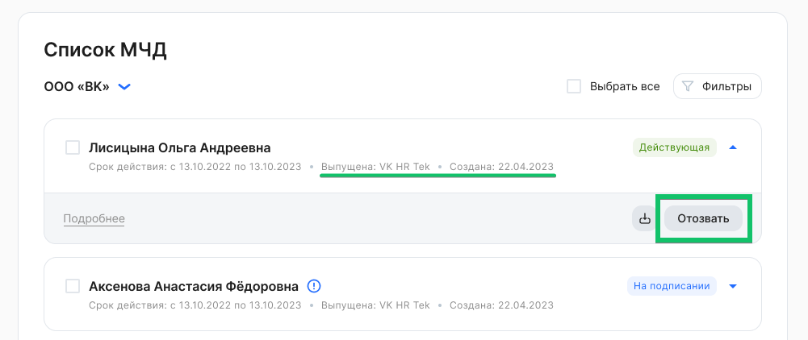
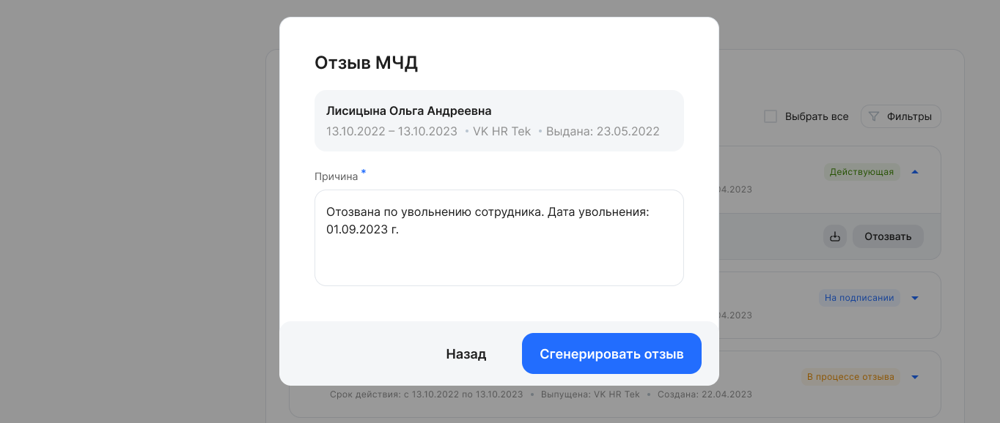

Сервис генерирует отзыв МЧД по формату B2B, аналогично используемому ФНС.

Можно сгенерировать отзыв для МЧД, которые были выпущены и хранятся в сервисе VK HR Tek. Отозвать можно только действующие МЧД.

Чтобы отозвать МЧД, необходимо:

1\. Перейти в **Сервисы компании → Настройки → Список МЧД**.

2\. В рамках компании выбрать МЧД в состоянии ***Действующая**, выпущена в VK HR Tek*. Для массового отзыва возможно выбрать несколько или все МЧД из списка.

3\. Нажать кнопку **Отозвать**.

4\. Указать причину отзыва и нажать **Сгенерировать отзыв**.

5\. При успешной генерации отзыва МЧД появится уведомление, что для выбранной МЧД отзыв создан. МЧД перейдет в состояние ***В процессе отзыва**.*