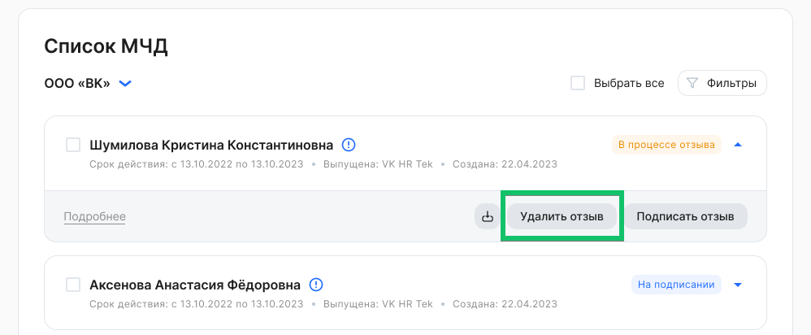

Удалять можно только неподписанные отзывы.

Чтобы удалить отзыв МЧД, нужно:

1\. В рамках компании выбрать МЧД в состоянии ***В процессе отзыва***. Для массового удаления возможно выбрать несколько или все МЧД из списка.

2\. Нажать кнопку **Удалить отзыв** и подтвердить удаление.

3\. При успешном удалении отзыва МЧД перейдет в состояние ***Действующая**.*