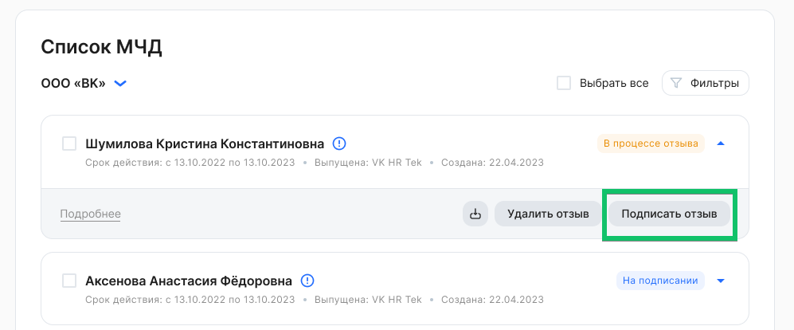

Подписание отзыва МЧД доступно только для пользователей с ролью «Руководитель организации».

Чтобы подписать отзыв МЧД, необходимо:

1\. В рамках компании выбрать МЧД в состоянии ***В процессе отзыва***. Для массового подписания возможно выбрать несколько или все МЧД из списка.

2\. Нажать кнопку **Подписать отзыв**. Отзыв подписывается УКЭПом.

3\. При успешном сохранении подписи появится уведомление, что для выбранной МЧД отзыв подписан. МЧД перейдет в состояние ***Отозвана**.*