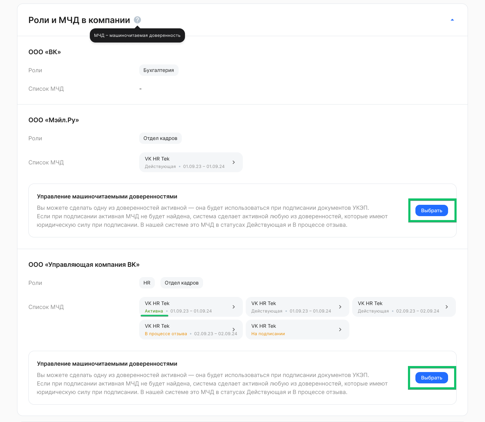
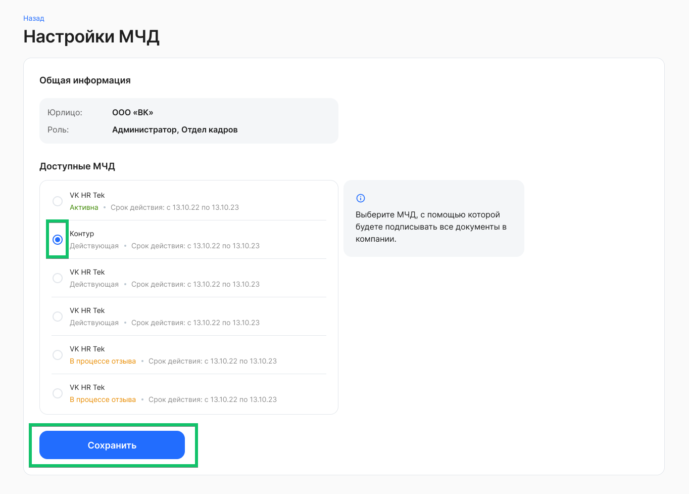

Сотрудники могут подписывать документы, используя только одну МЧД (активную), даже если у него их несколько. Активной может быть только МЧД в состоянии ***Действующая*** или ***В процессе отзыва***.

<warn>

Следите за сроком действия МЧД.

Cистема НЕ запрещает подписание документов с использованием МЧД, у которой истек срок действия.

Система может направлять уведомления о том, что у доверенности истекает срок действия, но не запретит подписание без МЧД или с МЧД, у которой истек срок действия.

</warn>

Сотрудник может сам определить, какую МЧД назначить активной. Для этого необходимо:

1\. Перейти в **Профиль** пользователя.

2\. В блоке **Роли и МЧД в компании** выбрать или сменить активную МЧД по нажатию кнопки **Выбрать**.

3\. В **Настройках МЧД** отметьте одну МЧД, с помощью которой будут подписываться все документы в компании. Сохраните выбор.

Если сотрудник не назначил активную МЧД, то при подписании документа в заявке сервис ищет действующую МЧД, помечает её «активной» и использует в следующих подписаниях.