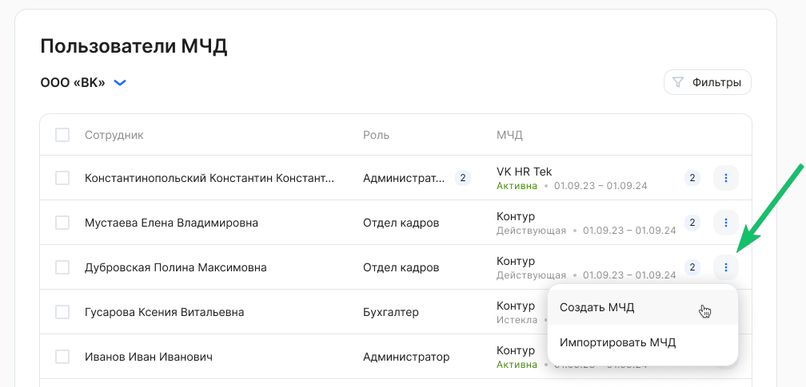
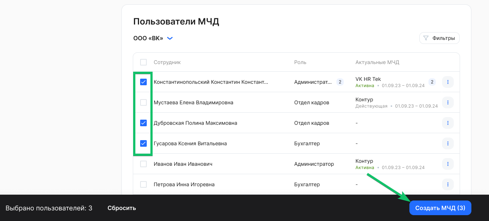
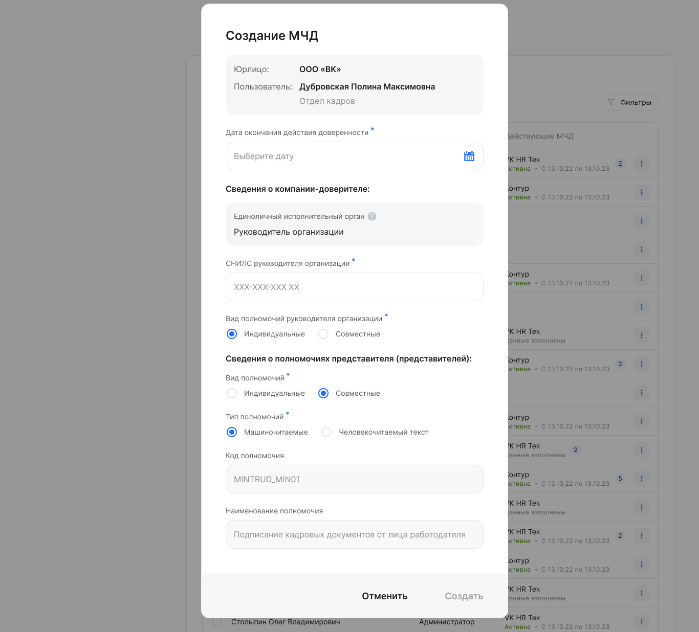
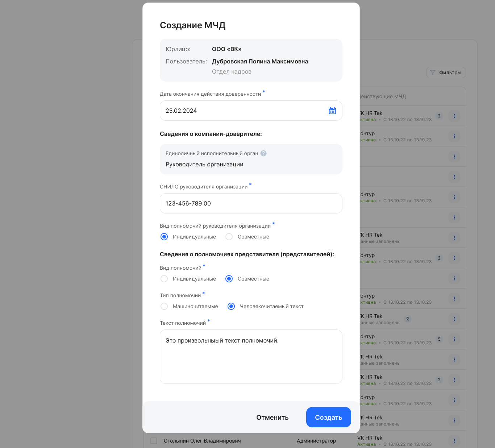
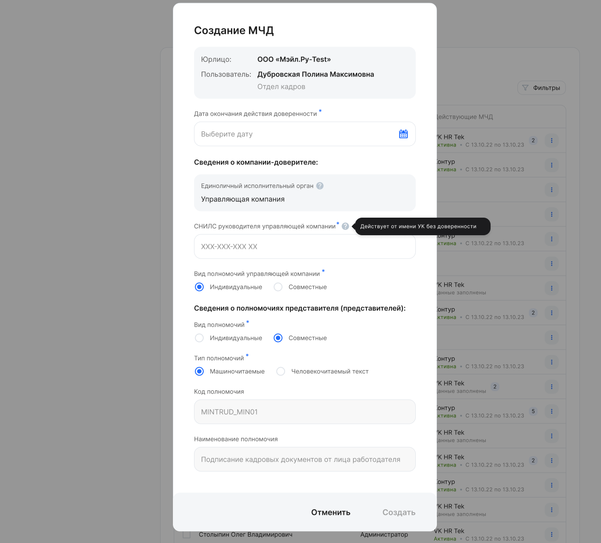
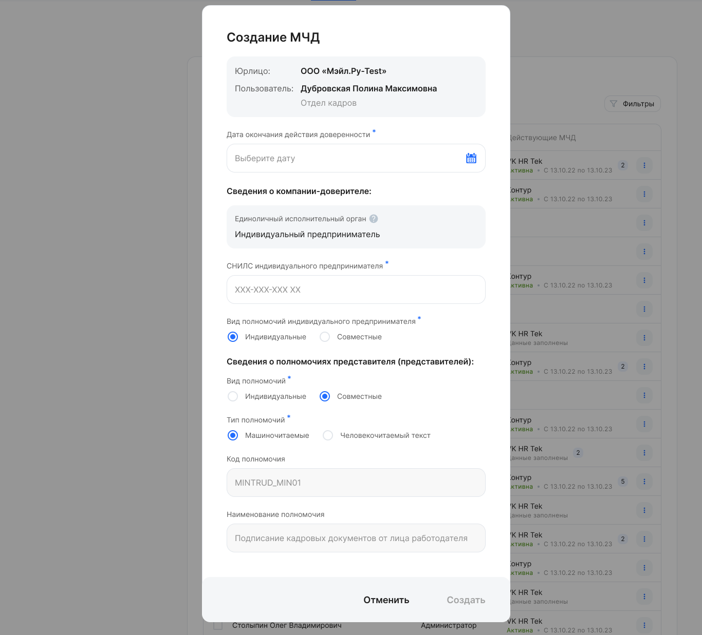
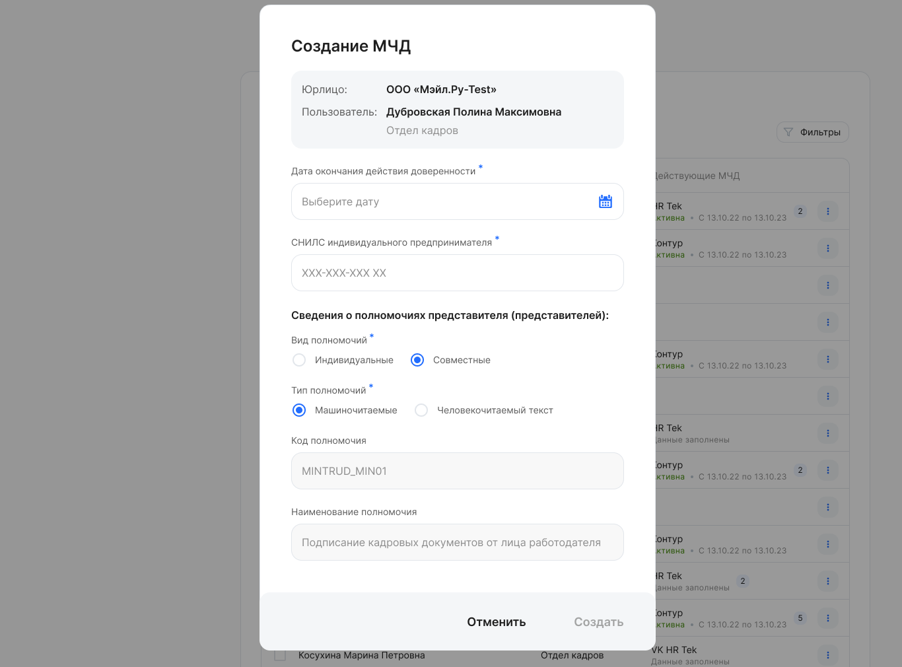
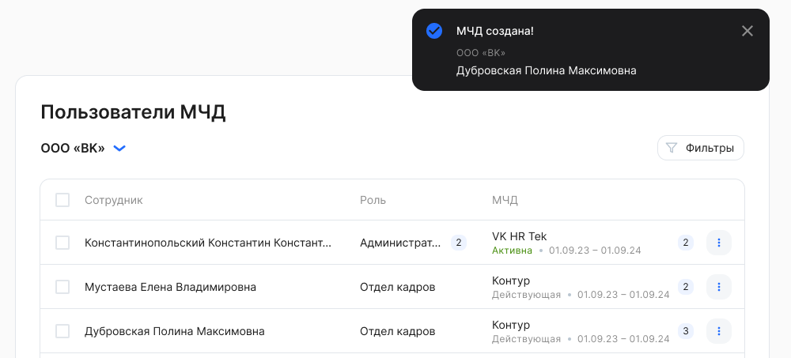

В сервисе МЧД генерируется по следующим условиям:

- Форма доверенности по формату 003 (источник – [Госуслуги ](https://partners.gosuslugi.ru/catalog/attorney)).
- МЧД без права передоверия.
- Без возможности создать безотзывную доверенность.
- Значение полномочия из справочника ЕСНСИ.

Чтобы создать МЧД, необходимо:

1\. Перейти в **Сервисы компании → Настройки → Пользователи МЧД**.

2\. В рамках компании выбрать пользователя из списка и нажать кнопку  **→ Создать МЧД**. В списке пользователей перечислены все сотрудники, у которых есть хотя бы одна роль в данной компании.

Также можно выбрать несколько пользователей и сгенерировать МЧД массово.

3\. В форме **Создание МЧД** заполнить и сохранить сведения о компании-доверителе. У разных компаний-доверителей (юрлиц) могут быть разные формы создания МЧД, в зависимости от типа Единоличного исполнительного органа (ЕИО): руководитель организации, управляющая компания, индивидуальный предприниматель. ЕИО действует от имени юридического лица без доверенности.

3.1. Если в качестве ЕИО компании выступает физическое лицо — ***руководитель организации***, заполните:

- **Дата окончания действия доверенности**. Выберите дату из календаря. Выбранная дата не может быть раньше текущей даты.
- **Сведения о компании-доверителе:** 
  - Единоличный исполнительный орган — Руководитель организации.
  - **СНИЛС руководителя организации**. Укажите СНИЛС.
  - **Вид полномочий организации руководителя организации**. Выберите вид полномочий, который принят в компании: «Индивидуальные» или «Совместные».
- **Сведения о полномочиях представителя (представителей):** 
  - **Вид полномочий.** Выберите вид полномочий, который принят в компании: «Индивидуальные» или «Совместные».
  - **Тип полномочий.** Выберите тип полномочий, который принят в компании: «Машиночитаемые» или «Человекочитаемый текст».

Если выбран тип «Машиночитаемые», то следующие поля примут значения:

- **Код полномочия**: MINTRUD\_MIN01.
- **Наименование полномочия**: Подписание кадровых документов от лица работодателя (см. справочник ЕСНСИ).

Если выбран тип «Человекочитаемый текст», то заполните поле «Текст полномочий».

3.2. Если в качестве ЕИО компании выступает ***управляющая компания***, заполните:

- **Дата окончания действия доверенности**. Выберите дату из календаря. Выбранная дата не может быть раньше текущей даты.
- **Сведения о компании-доверителе:** 
  - Единоличный исполнительный орган — Управляющая компания.
  - **СНИЛС руководителя управляющей компании**. Укажите СНИЛС.
  - **Вид полномочий управляющей компании.** Выберите вид полномочий, который принят в компании: «Индивидуальные» или «Совместные».
- **Сведения о полномочиях представителя (представителей):** 
  - **Вид полномочий**. Выберите вид полномочий, который принят в компании: «Индивидуальные» или «Совместные».
  - **Тип полномочий**. Выберите тип полномочий, который принят в компании: «Машиночитаемые» или «Человекочитаемый текст».

Если выбран тип «Машиночитаемые», то следующие поля примут значения:

- **Код полномочия**: MINTRUD\_MIN01.
- **Наименование полномочия**: Подписание кадровых документов от лица работодателя (см. справочник ЕСНСИ).

Если выбран тип «Человекочитаемый текст», то заполнить поле «Текст полномочий».

3.3. Если в качестве ЕИО компании выступает ***индивидуальный предприниматель***, заполните:

- **Дата окончания действия доверенности**. Выберите дату из календаря. Выбранная дата не может быть раньше текущей даты.
- **Сведения о компании-доверителе:** 
  - Единоличный исполнительный орган — Индивидуальный предприниматель.
  - **СНИЛС индивидуального предпринимателя**. Укажите СНИЛС.
  - **Вид полномочий индивидуального предпринимателя.** Выберите вид полномочий, который принят в компании: «Индивидуальные» или «Совместные».
- **Сведения о полномочиях представителя (представителей):** 
  - **Вид полномочий**. Выберите вид полномочий, который принят в компании: «Индивидуальные» или «Совместные».
  - **Тип полномочий**. Выберите тип полномочий, который принят в компании: «Машиночитаемые» или «Человекочитаемый текст».

Если выбран тип «Машиночитаемые», то следующие поля примут значения:

- **Код полномочия**: MINTRUD\_MIN01.
- **Наименование полномочия**: Подписание кадровых документов от лица работодателя (см. справочник ЕСНСИ).

Если выбран тип «Человекочитаемый текст», то заполнить поле «Текст полномочий».

3.4. Если компания-доверитель является ***индивидуальным предпринимателем***, заполните:

- **Дата окончания действия доверенности**. Выберите дату из календаря. Выбранная дата не может быть раньше текущей даты.
- **СНИЛС индивидуального предпринимателя**. Укажите СНИЛС.
- **Сведения о полномочиях представителя (представителей):** 
  - **Вид полномочий.** Выберите вид полномочий, который принят в компании: «Индивидуальные» или «Совместные».
  - **Тип полномочий.** Выберите тип полномочий, который принят в компании: «Машиночитаемые» или «Человекочитаемый текст».

Если выбран тип «Машиночитаемые», то следующие поля примут значения:

- **Код полномочия**: MINTRUD\_MIN01.
- **Наименование полномочия**: Подписание кадровых документов от лица работодателя (см. справочник ЕСНСИ).

Если выбран тип «Человекочитаемый текст», то заполнить поле «Текст полномочий».

4\. Нажать кнопку **Создать.** При успешной генерации XML МЧД появится уведомление, что МЧД для выбранного сотрудника создана. МЧД перейдет в состояние ***На подписании**.*

