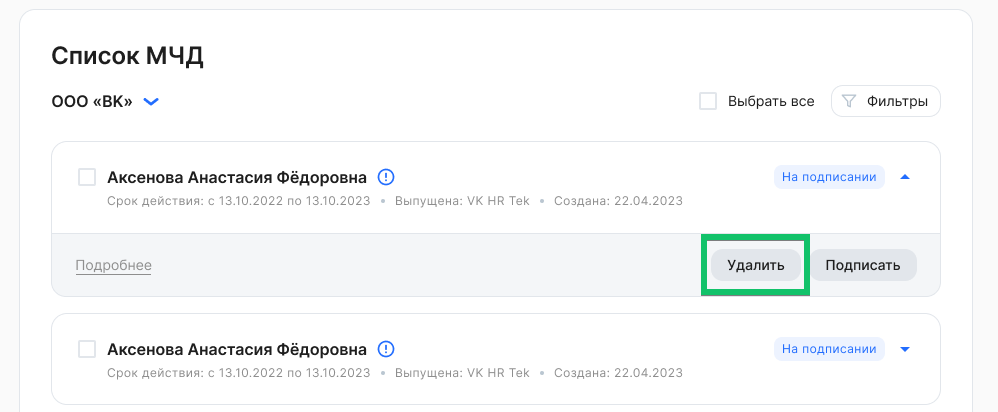

Удалять можно только неподписанные МЧД.

Чтобы удалить МЧД, нужно:

1. Перейти в **Кабинет компании → Настройки → Список МЧД**.
1. В рамках компании выбрать МЧД в состоянии ***На подписании***. Для массового удаления возможно выбрать несколько или все МЧД из списка.
1. Нажать кнопку **Удалить** и подтвердить удаление.

