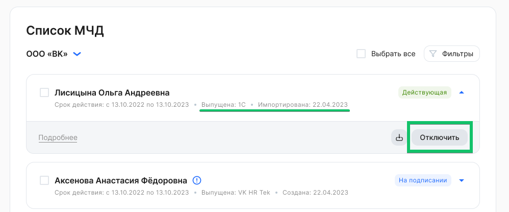
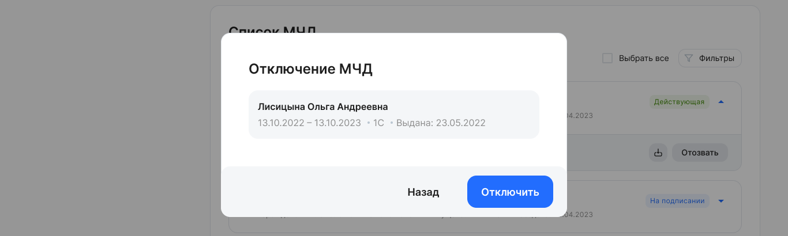

Компания может отозвать импортированные МЧД только в той системе, где их создала, и запретить к использованию в сервисе VK HR Tek.

Чтобы отключить импортированные МЧД, необходимо: 

1\. Перейти в **Сервисы компании → Настройки → Список МЧД**.

2\. В рамках компании выбрать МЧД в состоянии ***Действующая**,* *импортирована*. Для массового отключения возможно выбрать несколько или все МЧД из списка.

3\. Нажать кнопку **Отключить**.

4\. При успешном отключении МЧД перейдет в состояние ***Отключена.***