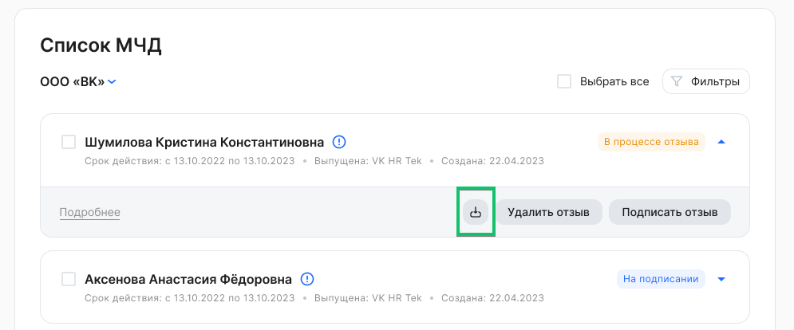

Экспортировать можно МЧД, которые находятся в состояниях:

- Действующая.
- В процессе отзыва.
- Отозвана.
- Отключена.
- Истекла.

Чтобы скачать МЧД, необходимо: 

1\. Перейти в **Сервисы компании → Настройки → Список МЧД**.

2\. В рамках компании выбрать МЧД. Для массового экспорта возможно выбрать несколько или все МЧД из списка.

3\. Нажать кнопку .

4\. Для одной МЧД сформируется архив с файлами:

- .xml МЧД + .sig МЧД — для МЧД без отзыва (в состоянии *Действующая, Отключена, Истекла*);
- .xml МЧД + .sig МЧД + .xml отзыва — для МЧД с неподписанным отзывом (в состоянии *В процессе отзыва*);
- .xml МЧД + .sig МЧД + .xml отзыва + .sig отзыва — для МЧД с подписанным отзывом (в состоянии *Отозвана*).